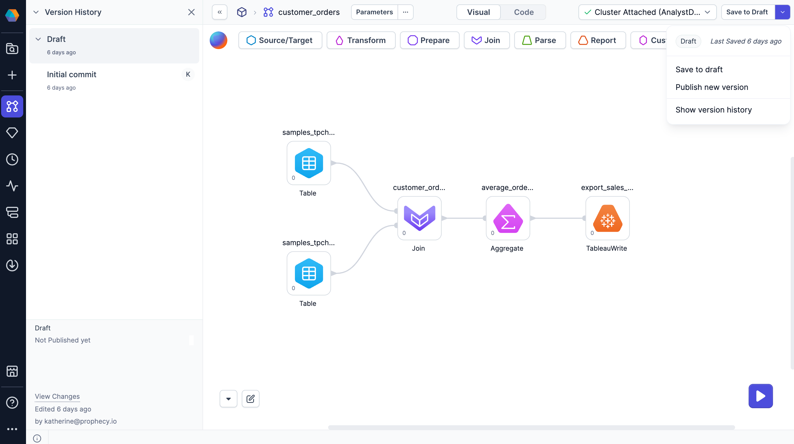
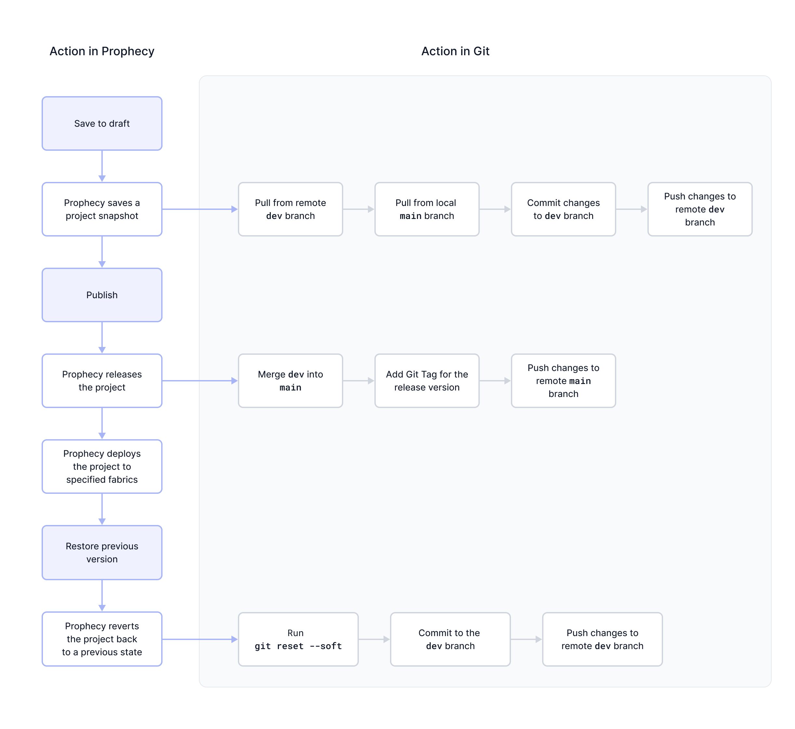

Versioning in Prophecy helps teams track changes, collaborate efficiently, and roll back when needed. It also supports auditing and compliance by keeping a clear, versioned history of all updates. This page details the different types of version control in Prophecy, the stages of the visual workflow, and its relationship to [Git](#powered-by-git).

## Version control options

When you create a SQL project in Prophecy, you will have the option to select the Git Storage Model for the project. There are a few models to choose from.

| Git Storage Model | Description                                                                                                                              |
| ----------------- | ---------------------------------------------------------------------------------------------------------------------------------------- |
| Simple            | Provides an intuitive visual workflow for project drafting and publication. Users all work on the same `dev` branch in the Git backend.  |
| Normal (no forks) | Enables the typical Git workflow aligned with DevOps best practices. Users all work in the same repository on different branches.        |
| Fork per user     | (External Git only) Enables the typical Git workflow aligned with DevOps best practices. Users work on their own copy of the repository. |

The following sections demonstrate the **visual workflow** for projects that use the Simple Git Storage Model. To view the workflow for normal Git, visit the section on [Git](/engineers/git) in the documentation.

:::note
The way you use Git will also influence how you collaborate in Prophecy. To learn more, visit [Real-time collaboration](docs/analysts/development/collaboration/collaboration-modes.md).
:::

## Workflow

The following sections describe the versioning workflow for the Simple Git Storage Model. In Simple mode, Prophecy creates a linear version history per project where you can audit changes, see collaborator activity, and revert to previous versions.

### Save to draft

As you develop your project, Prophecy automatically preserves your changes. In addition, we recommend periodically saving your changes as drafts. Click **Save to draft** on the project canvas to do so.

| Parameters               | Description                                                                                 |
| ------------------------ | ------------------------------------------------------------------------------------------- |
| Version description      | Summarizes the changes made since the last saved version.                                   |
| Changes since last saved | Lists all the entities that anyone adds, removes, or modifies since the last saved version. |

### Publish new version

When you publish a project, the new version becomes available for:

- [Scheduled pipeline runs](/analysts/scheduling) (depending on the fabric)
- [Package Hub](/engineers/package-hub) packages
- [App Browser](/analysts/business-applications) applications

To learn more, visit our page on [project publication](/analysts/project-publication).

### Show version history

Prophecy tracks different versions of your project that you save and publish. You can access the version history from the project editor or within the [project metadata](/projects#project-metadata).

From the version history, you can:

- View modifications in each version.
- View the author of each change.
- Revert to previous versions.

### Restore previous version

To restore a previous version:

1. Open the project version history.
1. Expand a version.
1. Click on a specific saved version.
1. Review the state of the project for this version and verify that you wish to restore it.
1. Click **Restore this version**.

## Powered by Git

As you move through the versioning workflow in your project, Prophecy actually maps these actions to Git processes in the backend. In other words, actions like saving, publishing, and restoring changes trigger Git commands. This is possible because all Prophecy projects are hosted on Git, regardless of the project's Git storage model (simple or normal).

The following diagram explains what each versioning action does in Git. If you connect to an external Git provider (rather than use Prophecy-managed Git), you can view how each action in is reflected in Git as you work on your project.

The table below reiterates the diagram.

| Action in Prophecy       | Action in Git                                                                                                                                                                            |
| ------------------------ | ---------------------------------------------------------------------------------------------------------------------------------------------------------------------------------------- |
| Save to draft            | <ul><li>Pull changes from the remote `dev` branch</li><li>Pull changes from the local `main` branch</li><li>Commit changes to local `dev`</li><li>Push changes to remote `dev`</li></ul> |
| Publish                  | <ul><li>Merge changes into local `main`</li><li>Add a Git Tag with the published version number</li><li>Push changes to remote `main`</li></ul>                                          |
| Restore previous version | <ul><li>Run `git reset --soft`</li><li>Commit the changes to revert in `dev`</li><li>Push changes to remote `dev` branch</li></ul> (Publish the project to merge to `main`)              |
