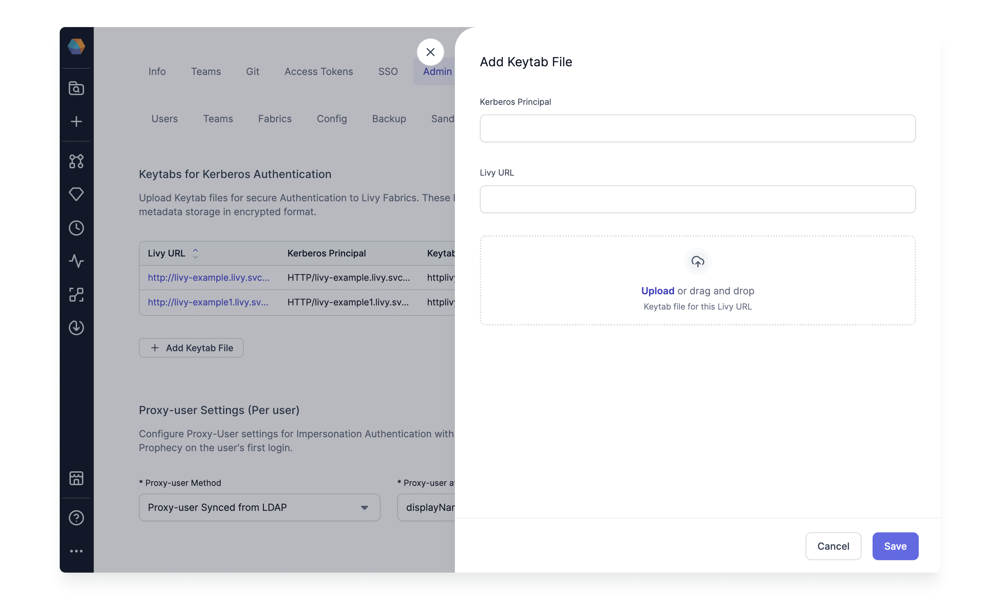

A user given Admin Permissions on the Prophecy environment would see an additional Page to access Admin Settings.
Admins can see all users, teams, fabrics, etc., in their Prophecy environment.

:::info
This is only available for Private Saas/On-prem installations of Prophecy.
:::

## Security

An admin user can configure Keytab files and Proxy User settings under the Security tab of the Admin settings.
These connect to Kerberised Livy Setup while setting up Kerberos Auth in the [Livy Fabric](/docs/Spark/fabrics/livy.md).

### Keytabs for Kerberos Authentication

Here, the Admins can upload Keytab files for secure Authentication to Livy Fabrics. These Keytabs are stored in Prophecy's metadata storage in encrypted format.
Simply click on the `Add Keytab` button and provide the Livy URL, Kerberos Principal, and Keytab File for the given Livy URL.

:::info
Any changes in the Kerberos Authentication section would require a restart of the execution service for the Prophecy Installation.
:::

### Proxy-user Settings (Per user)

If you want to use impersonation-enabled authentication to the Livy server, you can set how to obtain the proxy-user value for each user here.
Currently, Prophecy supports two ways to sync this proxy-user value from AAD or LDAP.
Note that these values will sync to Prophecy every time the user logs in.

## Log download
