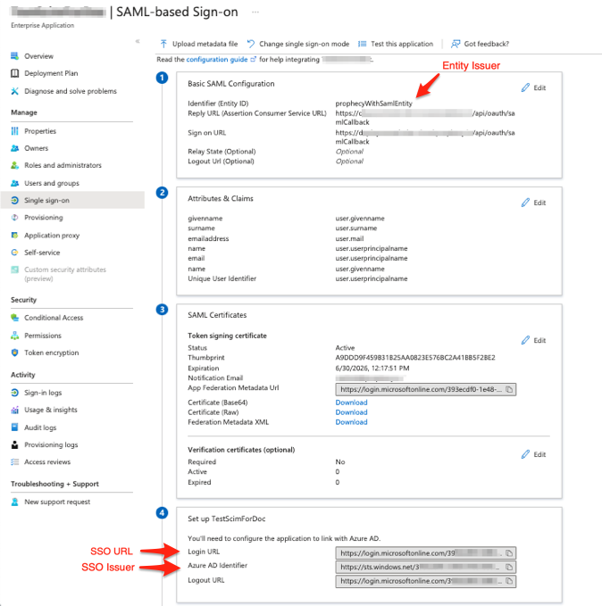
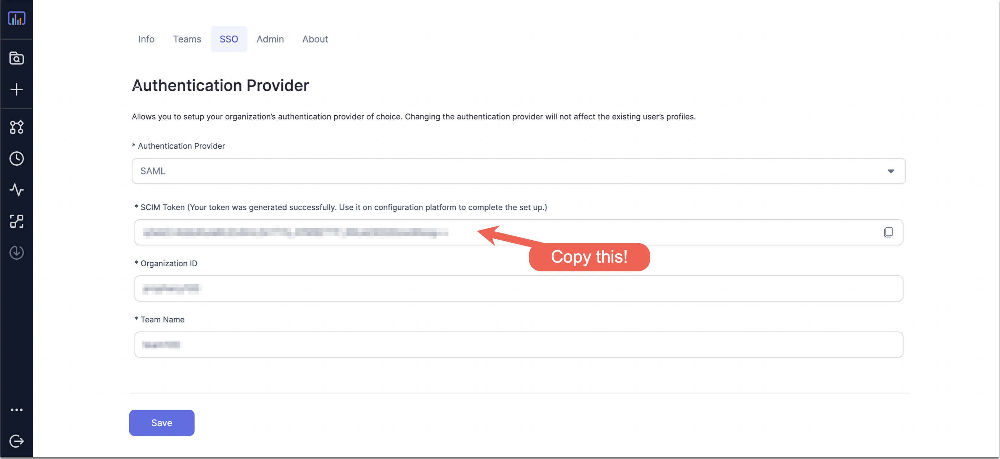

Single sign-on (SSO) enables you to authenticate your users using your organization’s identity provider.
This document focuses on using AzureAD as SAML IdP for Prophecy and enabling SCIM provisioning for syncing users and
groups.

## Configure AzureAD

1. Log into AzureAD as an administrator and create a new Enterprise Application say `ProphecyAzureADApp`.
2. In the home page search bar, search for `Enterprise Applications`
3. Click `New Application` -> `Create your own application`
4. Give name for the application say `ProphecyAzureADApp`, choose the radio button which says `Integrate any other application you don't find in the gallery (Non-gallery)`, and then click on `Create` button.
5. In Manage section on the left, click `Single sign-on`
6. Choose `SAML` as the Single sign-on method
7. Now the form for `Set up Single Sign-On with SAML` will open which will have various sections as mentioned below:
   - In `Basic SAML Configuration` section, provide `Identifier (Entity ID)` which is a unique ID to identify this application to Azure Active Directory say `prophecyWithSamlEntity`.
   - In the same section, configure `Reply URL` and `Sign on URL` with same values: `https://your-prophecy-ide-url.domain/api/oauth/samlCallback`. Then click on Save.
   - In `Attributes & Claims` section, click Edit button and then `Add new claim`. Give `Name` as `email` and `Source Attribute` as `user.userprincipalname`, and click Save.
   - Similarly, add one more claim by clicking on `Add new claim`. Give `Name` as `name` and `Source Attribute` as `user.givenname`, and click Save and go back to the page with `Set up Single Sign-On with SAML` form.
   - From `SAML certificates` section, download `Certificate (Base64)` file to be used while configuring SSO in Prophecy UI.
   - From `Set up ProphecyAzureADApp` section, copy `Login URL` and `Azure AD Identifier` to be used while configuring SSO in Prophecy UI.
8. Before configuring rest of the sections like `Users and groups` and `Provisioning` in this Enterprise Application, lets configure SSO in Prophecy UI and get the SCIM token.

## Configure Prophecy to connect to Azure AD

1. Login to Prophecy IDE as an admin user
2. Go to settings and SSO tab which will show `Authentication Provider` as `ProphecyManaged`

3. Fill in `Organization ID` and `Team Name` that you want to set for your organization and team respectively. Make sure both these fields are of the regex `[a-zA-z0-9]*` and have no spaces or special characters.
4. Click `Configure` and this will generate a SCIM Token. Make a note of this token which needs to be filled later while Provisioning SCIM in AzureAD. Also, now the Authentication Provider should show as `SAML`.

5. Click `Save`.
6. Choose IDP as `Azure Active Directory` from the drop-down.
7. Fill in `SSO URL` as the Login URL you copied from Azure AD application in step 7 of above section.
8. Upload the Base64 certificate downloaded from Azure AD application in step 7 of above section.
9. Fill in `Entity issuer` as `Identifier (Entity ID)` you chose in Azure AD application in step 7 to identify it to Azure Active Directory. Identifier as per this documentation example will be `prophecyWithSamlEntity`.
10. Fill in `SSO issuer` as `Azure AD Identifier` you copied from Azure AD application in step 7 of above section.
11. Once SCIM Provisioning is enabled for the _Prophecy Enterprise app_ in Azure AD and users/groups are assigned to it, you can logout from Prophecy IDE and the assigned users will be able to login to Prophecy IDE via AzureAD.

## Assigning Users/Groups to Prophecy in Azure AD

1. Go to `Users and Groups` tab in `Manage` section of _Prophecy Enterprise App_ in Azure AD
2. Click `Add user/group` -> `Users/Groups None Selected`. Search for your users/groups and assign them to Prophecy app.

Note: To be able to assign groups to an Enterprise Application in Azure, make sure your plan should be `Azure AD Premium P2`.

## Sync Users and Groups from Azure AD using SCIM

This section describes how to configure your Azure AD and Prophecy to provision users and groups to Prophecy using SCIM,
or System for Cross-domain Identity Management, an open standard that allows you to automate user provisioning.

### About SCIM provisioning in Prophecy

Prophecy provides a SCIM connector that lets you use Azure AD to create/update users and groups/teams in Prophecy, give them the proper level of access,
and remove access (de-provision them) when they leave your organization or no longer need access to Prophecy.

The _Prophecy Enterprise App_ in Azure AD must be assigned to users/groups in AzureAD for the SCIM connector to be triggered and
create corresponding users in Prophecy.

Note:

- Importing user/groups from AzureAD to Prophecy is supported but not vice-versa i.e. any changes made to a synced user in
  Prophecy IDE will not be synced back to AzureAD and will get overwritten whenever any update to user is synced from AzureAD.
- Any changes to user/groups in AzureAD are not immediately synced from AzureAD to Prophecy and get reflected in next synchronization cycle. If you want the changes to immediately reflect in Prophecy,
  you need to go to `Provisioning` section of _Prophecy Enterprise App_ and click `Provision on Demand`.
- Updates to primary email is not supported in Prophecy via SCIM.
- Login via secondary emails registered with AzureAD is not supported in Prophecy.
- De-provisioning of a user from Azure deletes that user from Prophecy and not deactivates it. As a result, a
  de-provisioned user will lose their personal projects in Prophecy.

#### Requirements

To provision users/groups to your Prophecy account using SCIM,

- you must be AzureAD admin
- you must be a Prophecy account admin.

### Enable SCIM Provisioning for _Prophecy Enterprise App_ in AzureAD

- Go to `Provisioning` tab in `Manage` section of _Prophecy Enterprise App_ in Azure AD and click on `Get Started`.
- Choose the `Provisioning Mode` to be `Automatic` from the drop down.
- In `Admin Credentials`, provide the `Tenant URL` as `https://your-prophecy-ide-url.domain/proscim` and `Secret Token` as the `SCIM token` copied from Prophecy IDE.
- Click `Test Connection` to check the connectivity with Prophecy's SCIM connector.
- Click `Save`.
- User Provisioning doesn't start automatically. You need to go back to `Provisioning` section of the app and click on `Start Provisioning`.
