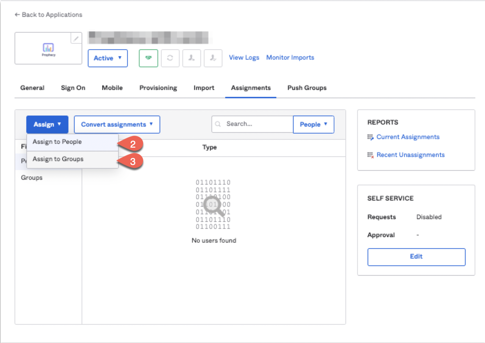

Single sign-on (SSO) enables you to authenticate your users using your organization’s identity provider. 
This document focuses on using Okta as SAML IdP for Prophecy and enabling SCIM provisioning for syncing users and 
groups.

## Configure Okta

- log into Okta as an administrator.
- In the home page, click Applications > Applications.
- Click Create App Integration.
- Select SAML 2.0 and click Next.
- Set App name to "Prophecy SAML App" and click Next.
- Single Sign On URL: https://your-prophecy-ide-url.domain/api/oauth/samlCallback
- Select Use this for Recipient URL and Destination URL
- Audience URI (SP Entity ID): Give a name which will be used as entity issuer ID. For example: `prophecyokta`
- Name ID format: Choose "EmailAddress" from drop down
- Application username: Email
- Attribute Statements: Please add two attributes name and email with the same details as given in below screenshot.

- Click Next.
- Select I’m an Okta customer adding an internal app.
- Click Finish. The "Prophecy SAML app" is shown.

## User Assignment to "Prophecy SAML App" in Okta

- Go to Assignment tab of "Prophecy SAML App" in Okta
- Click Assign -> Assign to People. Search your users and assign them to Prophecy app.

## Note down Okta params for Prophecy IDE configuration

### SSO URL

- Go to General tab of "Prophecy SAML App" in Okta and go towards the bottom of the page and find the section "App Embed Link". Note down the URL.
  

### Certificate

- Go to Sign On tab and find out "SAML Signing Certificates" section. Download the certificate by clicking on marked place in below image
  

### Entity and SSO Issuer

- Go to General tab-> SAML Settings section -> Edit
- Click Next to go to "Configure Saml" section and go to the bottom and click on "Preview the SAML assertion" button, it will open another tab in browser, and please note down the highlighted info from here to use as Entity Issuer and SSO Issuer in Prophecy IDE

## Configure Prophecy to connect with your Okta setup

- Login to Prophecy IDE using admin user
- Go to settings and SSO tab and choose "Authentication Provider" as SAML 
- Fill up Organization ID and Team Name that you want to set for your organization and team respectively.
- Click Configure and this will generate SCIM Token. Make a note of this token which needs to be filled later while Provisioning SCIM in Okta.
- Click Save.
- Fill up the information you noted down in your Okta setup and click Save.
- Once SCIM Provisioning is enabled for the "Prophecy SAML app" in Okta and users/groups are assigned to it, you can logout from Prophecy IDE and the assigned users will be able to login to Prophecy IDE via Okta.

## Sync Users and Groups from Okta using SCIM

This section describes how to configure your Okta and Prophecy to provision users and groups to Prophecy using SCIM, 
or System for Cross-domain Identity Management, an open standard that allows you to automate user provisioning.

### About SCIM provisioning in Prophecy
Prophecy provides a SCIM connector that lets you use Okta to create/update users and groups/teams in Prophecy, give them the proper level of access,
and remove access (de-provision them) when they leave your organization or no longer need access to Prophecy.

The 'Prophecy SAML App' in Okta must be assigned to users/groups in Okta for the SCIM connector to be triggered and 
create corresponding users in Prophecy. 

Note:

- Any app assignments made to a group in Okta will only create new users in Prophecy which belonged to this 
group in Okta. 'Push Group' operation should be triggered by admin in Okta to create a new team/group in Prophecy.

- 'Push Group' operation only creates group/team in Prophecy and not users. To create users, the app must be assigned 
to the group

- Importing user/groups from Okta to Prophecy is supported but not vice-versa i.e. any changes made to a synced user in
Prophecy IDE will not be synced back to Okta and will get overwritten whenever any update to user is synced from Okta.  

- Update to primary email is not supported in Prophecy via SCIM.

- Login via secondary emails registered with Okta is not supported in Prophecy.

- De-provisioning of a user from Okta deletes that user from Prophecy and not deactivates it. As a result, a 
de-provisioned user will lose their personal projects in Prophecy. 

#### Requirements

To provision users/groups to your Prophecy account using SCIM,
- you must be Okta admin
- you must be a Prophecy account admin.

### Enable Scim Provisioning for "Prophecy SAML App" in Okta

- Go to General tab of "Prophecy SAML App" in Okta and click 'Edit' in "App Settings" section.
- Select the checkbox in Provisioning sub-section which says 'Enable SCIM provisioning'.
- Click Save.

#### Choose provisioning options

- From the app integration's settings page, choose the 'Provisioning' tab. The SCIM connection settings appear under 'Settings > Integration'.
- Click Edit.
- Specify the SCIM connector base URL as https://your-prophecy-ide-url.domain/proscim
- Specify the field name of the Unique identifier for users as 'userName'.
- Under Supported provisioning actions, choose the following provisioning actions:
  - Push New Users
  - Push Profile Updates
  - Push Groups
- For Authentication Mode, choose HTTP Header from dropdown box and in Authorization, provide the scim token as generated in Prophecy IDE above.
- Click on Test Connector Configuration to check the connectivity to SCIM server. 
- If connectivity is fine, click Save. A new tab will appear on app integration's settings page named 'Push Groups'.

#### User/Group Assignment to "Prophecy SAML App" in Okta

- Go to Assignment tab of "Prophecy SAML App" in Okta
- To assign to individual people, click Assign -> Assign to People. Search your users and assign them to Prophecy app.
- To assign to groups, click Assign -> Assign to Groups. Search your groups and assign them to Prophecy app.

As mentioned earlier, assigning app to Group only creates new users in Prophecy IDE belonging to this group but doesn't create a group in Prophecy. To create group, 
- Go to Push Groups tab of "Prophecy SAML App" in Okta
- Click Push Groups -> Find groups by name/rule, enter name/rule.
- Select the checkbox to push group memberships immediately.
- In dropdown of Create/Link Group, select Create Group (leave as is if already selected)
- Click Save.

