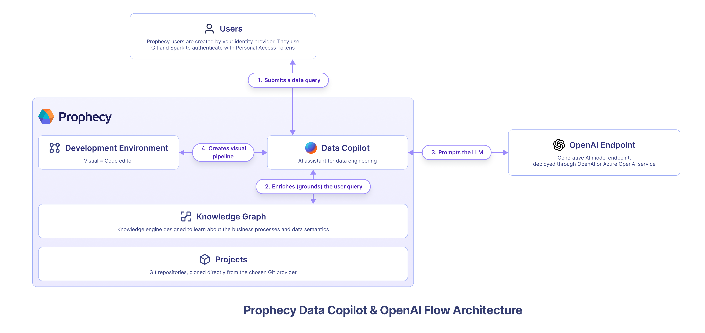

**Prophecy Data Copilot** is an AI-powered assistant that delivers intelligent suggestions and automates repetitive tasks for visual data transformations. You can read more about it [here](/concepts/copilot.md).

Data Copilot leverages OpenAI's generative AI models to understand user intent, and enriched by the organizations' [knowledge graph](/concepts/copilot#knowledge-graph), automate repetitive data engineering tasks. By default, Data Copilot leverages **Prophecy's managed OpenAI subscription and is entirely free** for existing Prophecy customers. Prophecy uses user queries and metadata when communicating with OpenAI. It never sends any customer data! 

However, for the most security conscious organizations, it is possible to configure Prophecy to use your own OpenAI endpoint. This page describes how to enable Prophecy Data Copilot for private VPC SaaS environments and configure it to use your own OpenAI or Azure OpenAI endpoint. 

## Architecture




## Installation

From the kubernetes cluster where Prophecy services are running:

1. The `prophecy-operator`, `edweb`, `metagraph`, and other Prophecy services must be running version `3.1.0.0` or greater.
2. The above services should all be running the same release-version as the `copilot` service defined in the image below, eg `3.1.0.0`
3. The `athena` Prophecy service should be running version `3.1.0.0` or greater. This is only required if using the Pipeline approach to the upgrade.
4. In the `ProphecyCluster` CR, do the following:

- add `copilot` to `enabledapps`
- add `image` section as below, providing the version
- add the `copilot` section as below in the same level as other enabled apps

```
copilot:
    image:  gcr.io/prophecy-share/copilot:<release-version>
```

5. Once deployed, wait for the `copilot-cm` to be created. Then edit the default values in the configmap to match the ENVs required.
6. Supply the API keys for the appropriate endpoint and ENV as below. The suggested model is `gpt-3.5-turbo`.

OpenAI

```
NUM_WORKERS: "< add value here >"
OPENAI_MODEL: "< add value here, optional >"
OPENAI_API_KEY: "< add value here >"
NUM_WORKERS: "< add value here >"
PORT: "< add value here >"
```

Azure's OpenAI

```
AZURE_DEPLOYMENT_NAME: "< add value here >"
AZURE_OPENAI_API_KEY: "< add value here >"
AZURE_OPENAI_ENDPOINT: "< add value here >"
AZURE_OPENAI_VERSION: "< add value here >"
NUM_WORKERS: "< add value here >"
PORT: "< add value here >"
```

7. Enable the below variable on the common CP config map
   `COPILOT_ENABLED: "true"`
8. The app pod, especially `copilot`, may redeploy itself. If not, restart the app pod.
