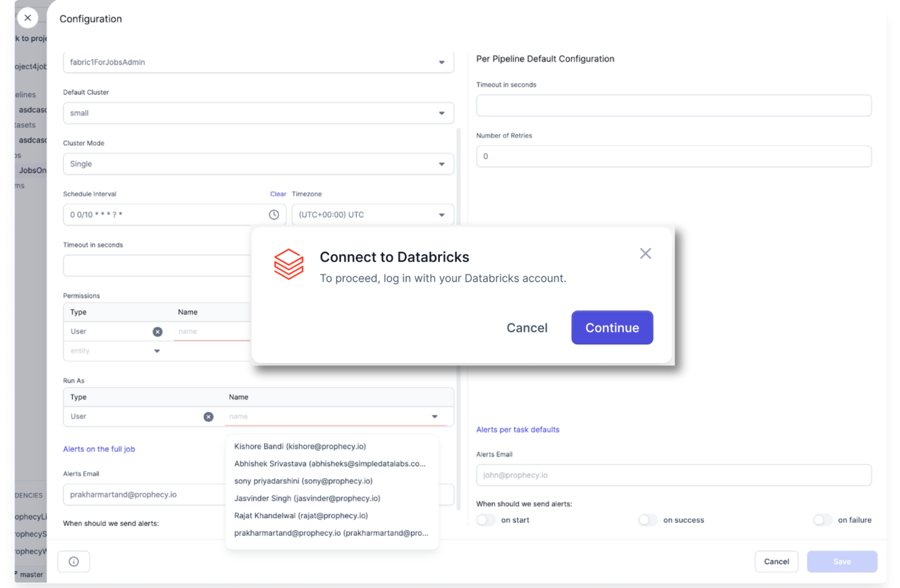

Prophecy has integrated with Databricks OAuth in order to provide you with increased security via industry-standard authentication flows. This support allows for more granular access control, making it a good alternative to Personal Access Tokens (PATs).

## OAuth use cases supported by Databricks

Databricks supports the following OAuth use cases:

- Supports Databricks acting as the Identity Provider (IdP) or 3rd party IdPs (Okta, Entra ID, Azure AD, Ping, etc.) integrated with both Databricks and Prophecy.
  - Any user within your organization can use Databricks OAuth during Pipeline development and Job configuration using their own personal identity. Individual user authentication via Databricks through an IdP can be determined by your organization.
- Works with Spark (clusters) as well as SQL (warehouses).
- Works with one or more Prophecy Fabrics.
  - Allow users to quickly establish multiple Prophecy Fabrics, each linked to a separate Databricks schema, leveraging the same OAuth connection/tokens.
- Supports authentication with Service Principals, allowing Prophecy to perform release tasks without requiring user interaction.
- Enables fields for OAuth configuration (Service Principal Client ID and Client secret) when creating Fabrics, supporting environments that need automated administration.

## How it works

The OAuth user authentication flow includes a three-step OAuth flow to generate tokens, using Proof Key for Code Exchange (PKCE) for enhanced security.

The authentication flow then uses Prophecy-hosted callback URL to capture and process authorization codes, issuing and storing access tokens.

### Token storage

Prophecy stores the refresh token, which is used to renew the refresh token itself, and also gets a new access token to maintain authenticated connectivity to Databricks.

The tokens are stored securely, with access limited to authorized Prophecy processes. This includes encrypting tokens before storing them in our database, in the same way that we encrypt other credentials that Prophecy stores.

### Pipeline and Job interactions

As mentioned previously, members of your team developing Pipelines and Jobs can leverage their own personal identity via OAuth to gain access to all Databricks resources from within Prophecy. That means that whatever permissions they have within Databricks (including permissions governed by Unity Catalog) will be enforced in Prophecy as well.

You will see a login overlay at the following points in Prophecy where Databricks API interactions are required:

- Pipeline IDE - Select Fabric
- Jobs IDE - Select Fabric
- Jobs IDE - Setting page, in order to fetch list of users and Service Principals

To proceed through the login overlays, complete the following steps:

1. Click **Continue**. A separate browser tab opens, and Databricks redirects you to the IdP registered in Databricks.

2. Log in with the IdP (or directly with Databricks if there is no IdP). The tab closes and you can proceed with activities such as Pipeline test execution.

:::note

You only need to perform this authentication periodically, depending on the OAuth timeout settings within Databricks. Your Databricks Account Administrator can adjust the timeout setting.

:::

#### Run Job configuration

When configuring a Job for SQL, the the Service Principal specified during Fabric creation will be used instead of the user specified under Run As.

A warning display will include the name or ID of the Service Principal that will be used.

### Project Release and Deployment

Your Prophecy Team Admin is the only member of your team able to perform deployment of the Pipelines and jobs created by the team. Prophecy uses a Databricks Service Principal via Databricks OAuth, to perform this task on behalf of the Team Admin. The Team Admin is the only user who can use this Service Principal, and only for the purpose of deploying team projects.

## OAuth Setup

The Databricks OAuth setup must be completed by both your Databricks Account Admin and your Prophecy Team Admin.

### Databricks Account Admin tasks

Your Databricks Account Admin must complete a one-time procedure on the Databricks side to register Prophecy as an OAuth App available in your account. A registration is required for each private SaaS (on-prem) customer Databricks account.

As the Databricks Account Admin, complete the following steps:

1. On Databricks, navigate to **Account Settings > App connections**.

2. Create a new App connection for Prophecy. This process generates Databricks OAuth Application fields in the Prophecy side for your Prophecy Team Admin to complete.

3. Under Client ID, copy your **OAuth Client ID** for the application, and share it with your Prophecy Team Admin.

4. Under Client secret, select **Generate a client secret**. Share it with your Prophecy Team Admin.

5. Click **Save**.

### Prophecy Team Admin tasks

Your Prophecy Team Admin must paste the credentials obtained by your Databricks Account Admin into the Prophecy Admin Setting. Also, they must configure new Spark and SQL Fabrics within Prophecy with OAuth details.

This will enable all users on the Prophecy instance to use Databricks OAuth authentication.

As the Prophecy Team Admin, complete the following steps:

1. Navigate to **Admin Settings > Security**.

2. Under **Databrick OAuth Application (U2M)**, paste the **Client ID** and the **Client Secret** into the respective fields.

   

3. When creating new Fabrics, select **OAuth**, and enter the **Service Principal Client ID** and **Service Principal Client Secret** into the respective fields.

   
