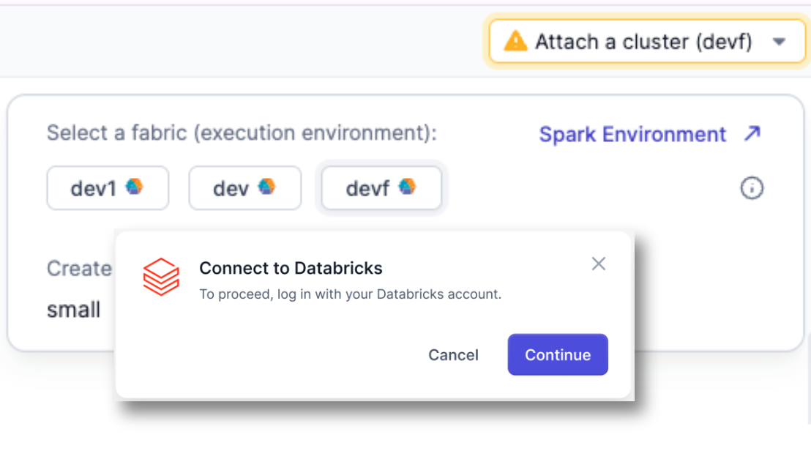
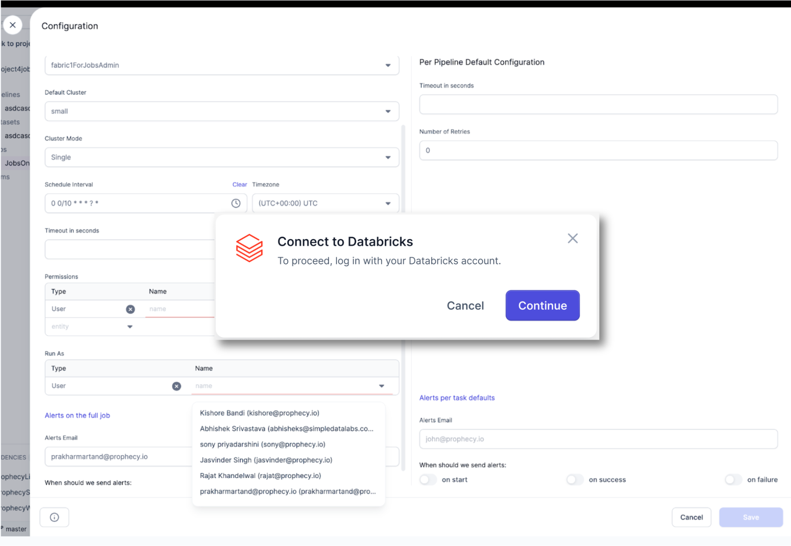
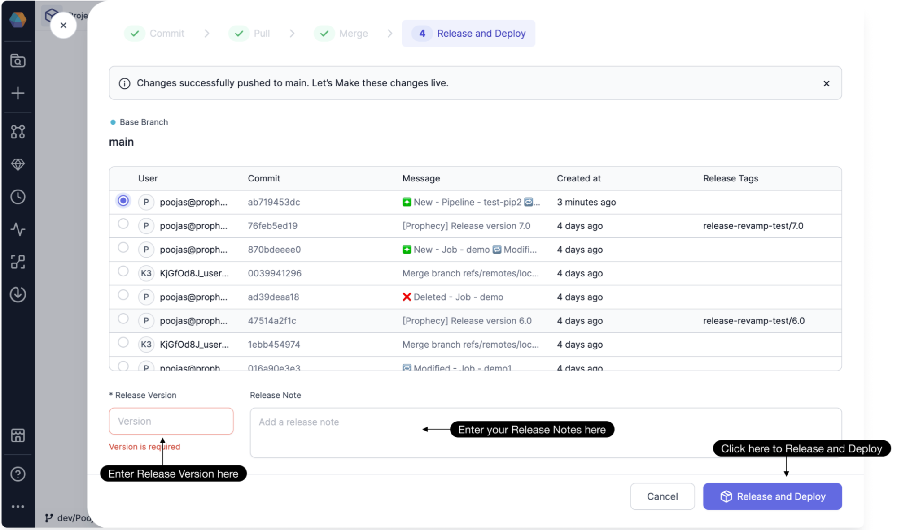
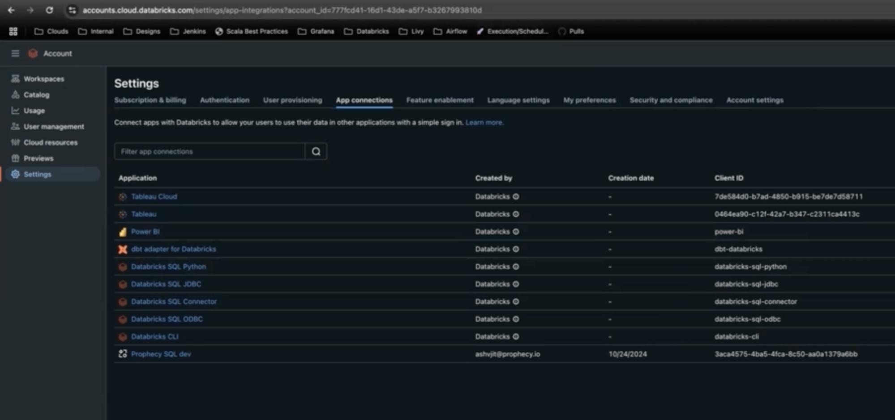
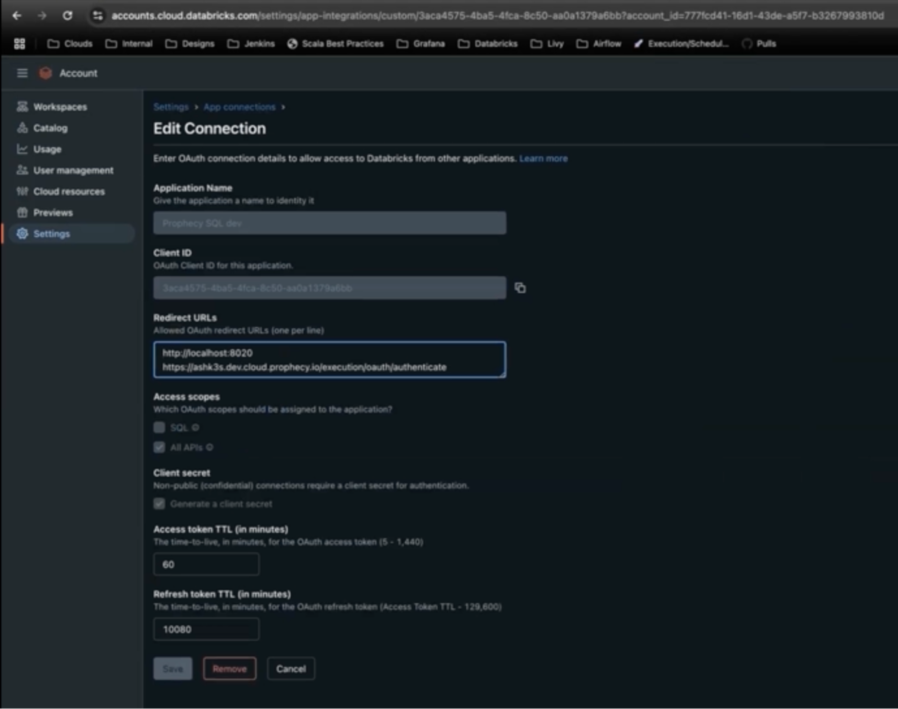
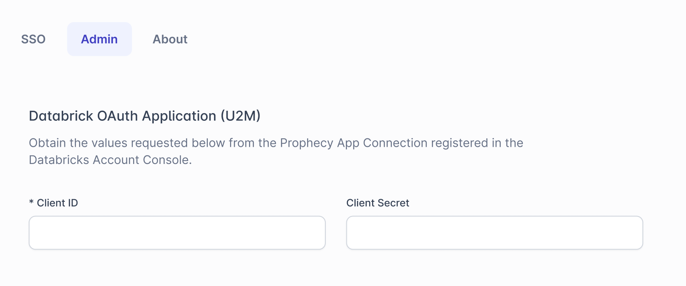
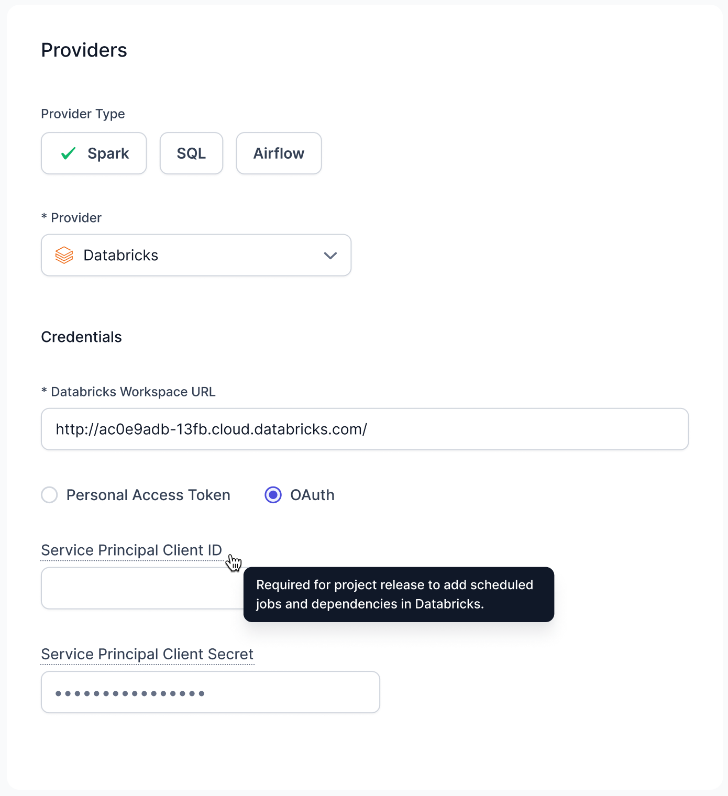

Databricks has documented these flows and precisely how partner companies should integrate with their OAuth. Prophecy is implemented based on their specifications with support from Databricks’ team.

## OAuth use cases supported by Databricks

a

- Pipeline development and Job configuration
- Used by any user
- Individual user authentication via Databricks/IDP (Okta, Entra ID, Ping, etc)

## How it works

a

### Pipeline and Job Configuration / Scheduling

Members of a team developing Pipelines and Jobs leverage their own personal identity via OAuth U2M to gain access to all Databricks resources from within Prophecy. That means that whatever permissions they have within Databricks (including permissions governed by Unity Catalog) will be enforced in Prophecy as well.

1. When Prophecy needs to connect to Databricks on a user’s behalf, they see this:

   

2. Next, a separate browser tab opens, and Databricks redirects the user to the identity provider registered in Databricks - Okta, Entra ID, PingID, etc. After done logging in with the IDP (or directly with Databricks if no IDP), this tab closes and they can proceed with activities such as Pipeline test execution.

3. Similarly, at Job configuration time, Prophecy also connects to Databricks on behalf of the user:

   

:::note

They will only need to perform this authentication periodically, depending on the OAuth timeout settings within Databricks - which can be edited by a Databricks Account Administrator.

:::

### Project Release and Deployment

The Team Admin is the only member of the team able to perform deployment of the Pipelines and jobs created by the team. Prophecy uses a Databricks Service Principal via Databricks OAuth M2M, to perform this task on behalf of the Team Admin. The Team Admin is the only user who can use this Service Principal, and only for the purpose of deploying team projects.

## OAuth Setup

a

1. One time: Databricks Account Admin adds Prophecy as an OAuth App available in their account. This process generates fields that are then pasted into Prophecy by a Prophecy Admin.

   

   

   

2. Prophecy Team Admins select “OAuth” when creating Fabrics and adds a Service Principal ID and secret to the Fabric (if the Fabric will be used for deploying projects)

   
