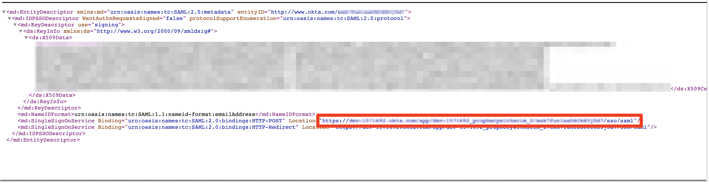

Single sign-on (SSO) enables you to authenticate your users using your organization’s identity provider.
This document focuses on using Okta as SAML IdP for Prophecy and enabling SCIM provisioning for syncing users and
groups.

## Configure Okta

1. Log into Okta as an administrator.
2. In the home page, click `Applications` > `Applications`.
3. Click `Create App Integration`.
4. Select `SAML 2.0` and click `Next`.
5. Set `App name` to _Prophecy SAML App_ and click `Next`.
6. Single Sign On URL: `https://your-prophecy-ide-url.domain/api/oauth/samlCallback`
7. Select `Use this` for Recipient URL and Destination URL
8. `Audience URI (SP Entity ID)`: Give a name which will be used as entity issuer ID. For example: _prophecyokta_
9. `Name ID format`: Choose `EmailAddress` from the drop dow
10. Set `Application username` to `Email`
11. Attribute Statements: Add two attributes, `name` and `email`, with the same details. For example:

12. Click `Next`.
13. Select `I’m an Okta customer adding an internal app`.
14. Click `Finish`. The _Prophecy SAML app_ is shown.

## Configure Prophecy to connect to Okta

### Information required from Okta

#### Certificate

Go to the `Sign On` tab of _Prophecy SAML App_ in Okta and find the `SAML Signing Certificates` section. Download the certificate by clicking on the button marked in the example below:

#### SSO URL

In the `Sign On` tab itself under `SAML Signing Certificates`, click on `View IdP metadata` in the above image. It will open up an XML file like below in another tab in browser. Copy the red highlighted text in Location section as `SSO URL` in Prophecy IDE.

#### Entity and SSO Issuer

- Go to the `General` tab-> `SAML Settings` section -> `Edit`
- Click `Next`, go to the `Configure Saml` section, go to the bottom and click on `Preview the SAML assertion` button. It will open another tab in browser. Copy the highlighted info from here to use as `Entity Issuer` and `SSO Issuer` in Prophecy IDE.

### Configuring Prophecy

1. Login to Prophecy IDE as an admin user
2. Go to settings and SSO tab and choose "Authentication Provider" as SAML

3. Fill in `Organization ID` and `Team Name` that you want to set for your organization and team respectively.
4. Click `Configure` and this will generate a SCIM Token. Make a note of this token which needs to be filled later while Provisioning SCIM in Okta.

5. Click `Save`.
6. Fill in the information you noted down in your Okta setup and click Save.
7. Once SCIM Provisioning is enabled for the _Prophecy SAML app_ in Okta and users/groups are assigned to it, you can logout from Prophecy IDE and the assigned users will be able to login to Prophecy IDE via Okta.

## Assigning Users to Prophecy in Okta

1. Go to `Assignment` tab of _Prophecy SAML App_ in Okta
2. Click `Assign` -> `Assign to People`. Search for your users and assign them to Prophecy app.

## Sync Users and Groups from Okta using SCIM

This section describes how to configure your Okta and Prophecy to provision users and groups to Prophecy using SCIM,
or System for Cross-domain Identity Management, an open standard that allows you to automate user provisioning.

### About SCIM provisioning in Prophecy

Prophecy provides a SCIM connector that lets you use Okta to create/update users and groups/teams in Prophecy, give them the proper level of access,
and remove access (de-provision them) when they leave your organization or no longer need access to Prophecy.

The _Prophecy SAML App_ in Okta must be assigned to users/groups in Okta for the SCIM connector to be triggered and
create corresponding users in Prophecy.

Note:

- Any app assignments made to a group in Okta will only create new users in Prophecy which belonged to this
  group in Okta. A `Push Group` operation should be triggered by admin in Okta to create a new team/group in Prophecy.

- A `Push Group` operation only creates group/team in Prophecy and not users. To create users, the app must be assigned
  to the group

- Importing user/groups from Okta to Prophecy is supported but not vice-versa i.e. any changes made to a synced user in
  Prophecy IDE will not be synced back to Okta and will get overwritten whenever any update to user is synced from Okta.

- Updates to primary email is not supported in Prophecy via SCIM.

- Login via secondary emails registered with Okta is not supported in Prophecy.

- De-provisioning of a user from Okta deletes that user from Prophecy and not deactivates it. As a result, a
  de-provisioned user will lose their personal projects in Prophecy.

#### Requirements

To provision users/groups to your Prophecy account using SCIM,

- you must be Okta admin
- you must be a Prophecy account admin.

### Enable SCIM Provisioning for _Prophecy SAML App_ in Okta

- Go to `General` tab of _Prophecy SAML App_ in Okta and click `Edit` in the `App Settings` section.
- Select the checkbox in Provisioning sub-section which says `Enable SCIM provisioning`.
- Click `Save`.

#### Choose provisioning options

1. From the app integration's settings page, choose the `Provisioning` tab. The SCIM connection settings appear under `Settings` > `Integration`.
2. Click `Edit`.
3. Specify the SCIM connector base URL as `https://your-prophecy-ide-url.domain/proscim`
4. Specify the field name of the Unique identifier for users as `userName`.
5. Under Supported provisioning actions, choose the following provisioning actions:

- `Push New Users`
- `Push Profile Updates`
- `Push Groups`

6. For Authentication Mode, choose `HTTP Header` from the dropdown box and in `Authorization`, provide the SCIM token as generated in Prophecy IDE above.
7. Click on `Test Connector Configuration` to check the connectivity to the SCIM server.
8. If the connection test succeeds, click Save. A new tab will appear on app integration's settings page named `Push Groups`.

#### User/Group Assignment to _Prophecy SAML App_ in Okta

1. Go to the `Assignment` tab of _Prophecy SAML App_ in Okta
2. To assign to individual people, click `Assign` -> `Assign to People`. Search your users and assign them to the Prophecy app.
3. To assign to groups, click `Assign` -> `Assign to Groups`. Search your groups and assign them to the Prophecy app.

As mentioned earlier, assigning app to Group only creates new users in Prophecy IDE belonging to this group but doesn't create a group in Prophecy. To create a group:

1. Go to the `Push Groups` tab of the _Prophecy SAML App_ in Okta
2. Click `Push Groups` -> `Find groups by name/rule`, enter the name/rule.

3. Select the checkbox to `Push group memberships immediately`.
4. In dropdown of Create/Link Group, select `Create Group` (leave as is if already selected)
5. Click `Save`.

