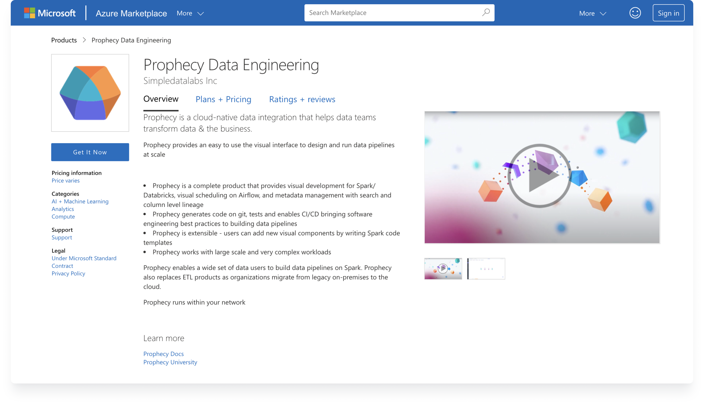

This page outlines how to install Prophecy via Azure Marketplace.

## Requirements

To complete this process, you need:

- The `Contributor` or `Owner` role in Azure. A new resource group will be created as part of the installation and all the Prophecy resources will be created inside it.
- A minimum of 6 Standard_DS4_v2 family types of VMs. You'll need to assign an appropriate quota in your Azure subscription for a region where you are planning to deploy Prophecy.

:::note
Contact Prophecy to discuss future scaling needs.
:::

## Open Azure Marketplace

To get started:

1. Open the [Prophecy](https://azuremarketplace.microsoft.com/en-us/marketplace/apps/simpledatalabsinc1635791235920.prophecy-data-engineering) product page in Azure Marketplace.
2. Click **Get It Now**.
3. In the **Create this app** in Azure window, click **Continue**. You will be directed to the Azure portal.
4. In the portal, click **Create** to begin the Prophecy IDE setup.

## Create Prophecy

Next, fill out the required fields of the **Basics** tab.

For the **Configure Base Domain and TLS** option, note these two choices:

- Use Prophecy's Base Domain. If you choose this option, Prophecy manages the certificates and domain for you.
- Use your own Base Domain and Certificate. If you choose this option, you can deploy your own TLS certificates and manage the domain for the Prophecy IDE using your own DNS zones.

When you have finished filling out the **Basics** tab, click **Review + create**. Then, agree to the terms and conditions and click **Create**.

## Go to resource

It takes around 20 to 30 minutes to finish the installation. Once installation is complete:

1. Click on **Go to resource**.
2. Click on **Parameters and Outputs**.
3. If you are using the Prophecy domain, you will be able to access the cluster with the **prophecyURL**, **adminUser**, and **credentials**.
4. If you are using your own domain:
   - Note down **prophecyURL**, **loadBalancerIP**, **adminUser** and **credentials**.
   - Reach out to your DNS admin and request to add a Type A entry for the prophecyURL and the loadBalancerIP address.

## Launch the Prophecy IDE

1. Open the Prophecy IDE with the prophecyURL that you noted.
2. Login using the adminUser and credentials that you noted.

Now, you are free to get started with Prophecy!
