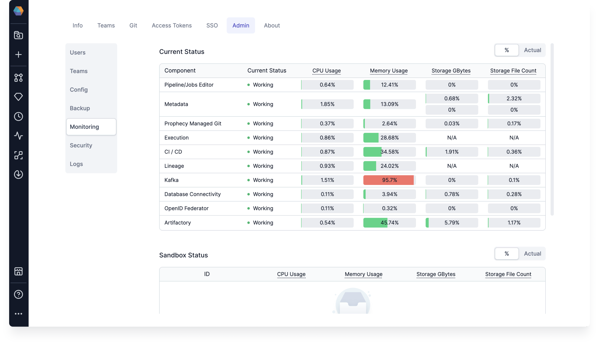

This page provides an overview of resource monitoring, alert configuration, and scaling recommendations for effectively managing Prophecy deployments.

## Monitoring

To have a better understanding of how Prophecy is using resources, you can find an overview in **Settings > Admin > Monitoring**.

## Alerts

To set up automated alerts about your resource usage, visit the page on [Alerts Configuration](docs/architecture/self-hosted/configurations/configure-alerts.md).

## Scaling

Scaling is taken care of by the **Autoscaler** component in our platform. Therefore, if something happens like the number of
users increases by 10 times, the Prophecy deployment can be scaled appropriately.

The following are estimated recommended cluster sizes depending on the number of concurrent users:

| Number of users           | 25       | 50       | 100       |
| ------------------------- | -------- | -------- | --------- |
| CPUs                      | 56 vCPUs | 96 vCPUs | 180 vCPUs |
| Memory                    | 128 GB   | 256 GB   | 440 GB    |
| Disk space (with backups) | 360 GB   | 720 GB   | 1440 GB   |

:::info
The recommended resource may vary based on the intensity of the usage of each developer. The numbers
presented above are based on the average recorded usage of Prophecy customers.
:::
