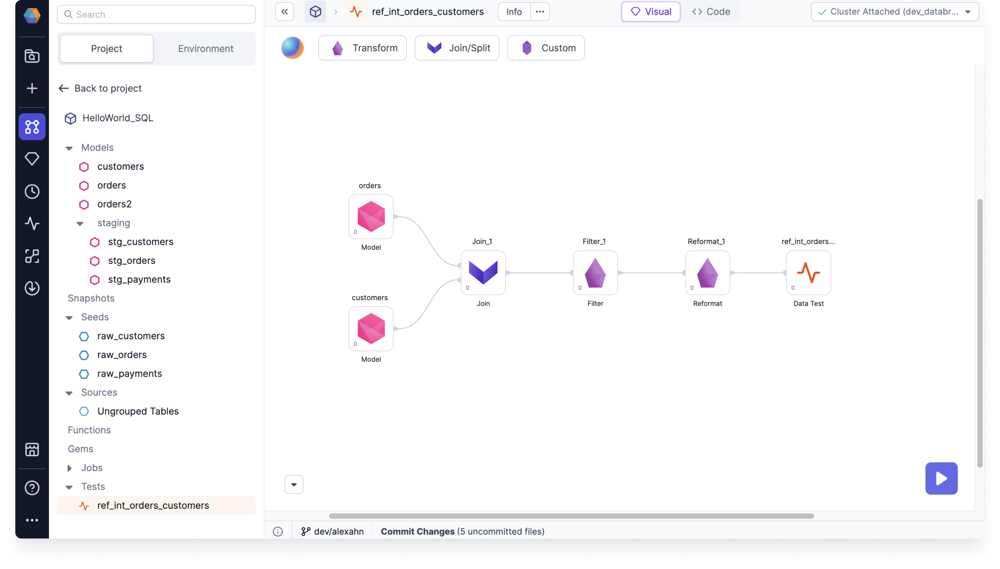

You can use data tests to ensure that your business data is generated reliably over time. As a data engineer, data analyst, or business user, you can run data tests so that you don’t have to manually check every dataset every time you run a job or model. The data test checks the validity of the SQL in your project.

A data test is an assertion you make about a dataset in your project. The dataset can be the output from a series of transformations, or the dataset can be a particular data source, seed, or model.

For example, the following test named `ref_int_orders_customers` checks the validity of the SQL in the `HelloWorld_SQL` project. In particular, the referential integrity check for orders and customers asserts that every `customer_id` entry in the `orders` table is present in the `customers` table.

This test starts with several models from the `HelloWorld_SQL` project, combines their data with a series of transformation steps, and feeds the resulting table into the Data Test gem.

If there are `customer_id` entries in the `orders` table that are not present in the `customers` table, then the `ref_int_orders_customers` test fails.

You can test any series of transformations with a Data Test gem. The following sections include more details about data tests.

## What you'll need to know

Data tests use [dbt](https://docs.getdbt.com/docs/build/data-tests) for the underlying test execution, but you don’t need to know dbt or how to write your own tests. Prophecy simplifies the test definitions that are normally defined in `.sql` and `.yaml` files.

You can create data tests in Prophecy using the visual canvas.

### Supported database objects

Supported database objects include:

- Models
- Snapshots
- Seeds
- Sources

:::note

Data tests can accept input data from any table, no matter if the table is defined by a model, snapshot, seed, or source.

:::

### Supported test types

Supported test types include:

- Project tests: Singular use tests that depend on the model that they were created for
- Generic tests: Generic use test that are not tied to a specific model, and can be reused repeatedly
  - Model tests
  - Column tests

### When to use each test type

See a few recommendations in the following table to get an idea of when to use each test type.

| General situations &nbsp; &nbsp; &nbsp; &nbsp;&nbsp; &nbsp; &nbsp; &nbsp;&nbsp; &nbsp;&nbsp; &nbsp;&nbsp; &nbsp;&nbsp; &nbsp;&nbsp; &nbsp;&nbsp; &nbsp;&nbsp; &nbsp;&nbsp; &nbsp;&nbsp; &nbsp;&nbsp; &nbsp;&nbsp; &nbsp;&nbsp; &nbsp;&nbsp; &nbsp;&nbsp; &nbsp;&nbsp; &nbsp;&nbsp; &nbsp;&nbsp; &nbsp;&nbsp; &nbsp;&nbsp; &nbsp;&nbsp; &nbsp;&nbsp; &nbsp;&nbsp; &nbsp;&nbsp; &nbsp;&nbsp; &nbsp;&nbsp; &nbsp;&nbsp; &nbsp;&nbsp; &nbsp; &nbsp; &nbsp; | Project test              | Model test                | Column test               |
| :----------------------------------------------------------------------------------------------------------------------------------------------------------------------------------------------------------------------------------------------------------------------------------------------------------------------------------------------------------------------------------------------------------------------------------------------------- | :------------------------ | :------------------------ | :------------------------ |
| Test a single Model                                                                                                                                                                                                                                                                                                                                                                                                                                    |    |  |  |
| Test multiple Models                                                                                                                                                                                                                                                                                                                                                                                                                                   |  |    |    |

| Specific situations                                                        | Project test              | Model test                | Column test               |
| :------------------------------------------------------------------------- | :------------------------ | :------------------------ | :------------------------ |
| Test for referential integrity                                             |    |  |  |
| Test for late arriving data                                                |    |  |  |
| Test for data consistency verification                                     |    |  |  |
| Test for model size and aggregations                                       |  |    |  |
| Test for column data format and data presence (nulls, empty strings, etc.) |  |  |    |

## What's next

To set up a project test, see [Use project tests](/docs/ci-cd/data-tests/use-project-tests.md).

If you need to reuse a test that is defined by a parametrized query, see [Use model tests](/docs/ci-cd/data-tests/use-model-tests.md).
