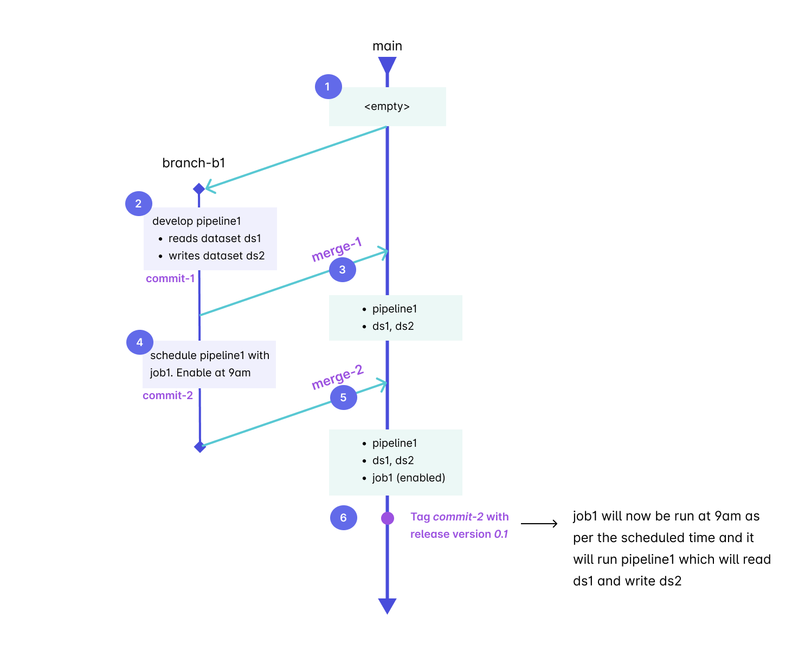
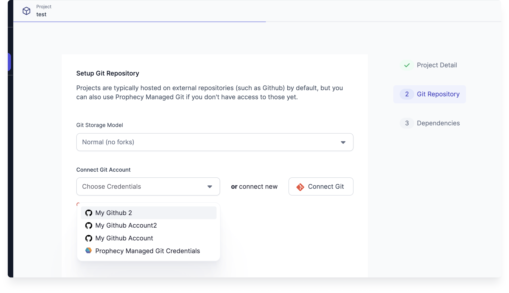
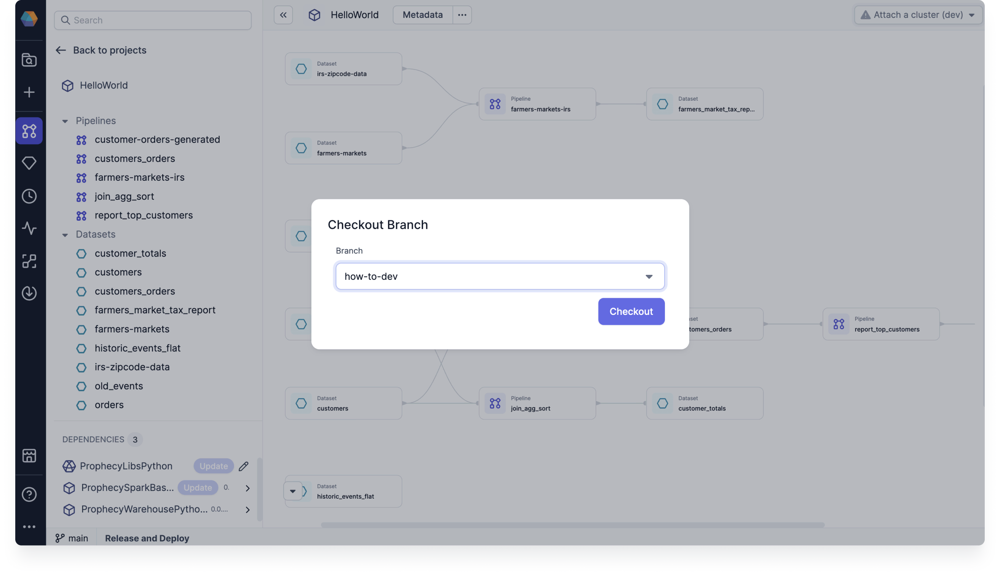
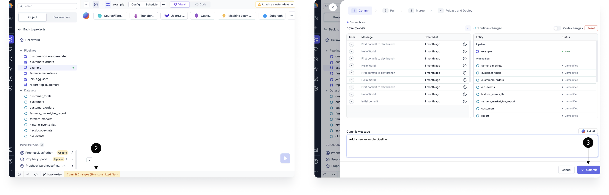
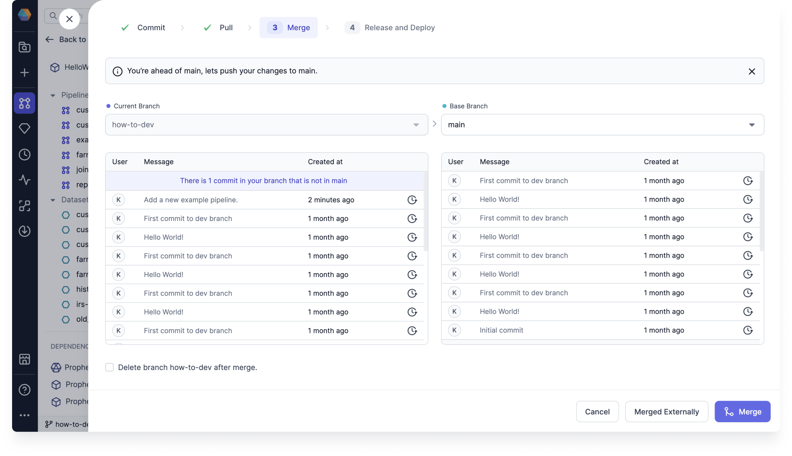
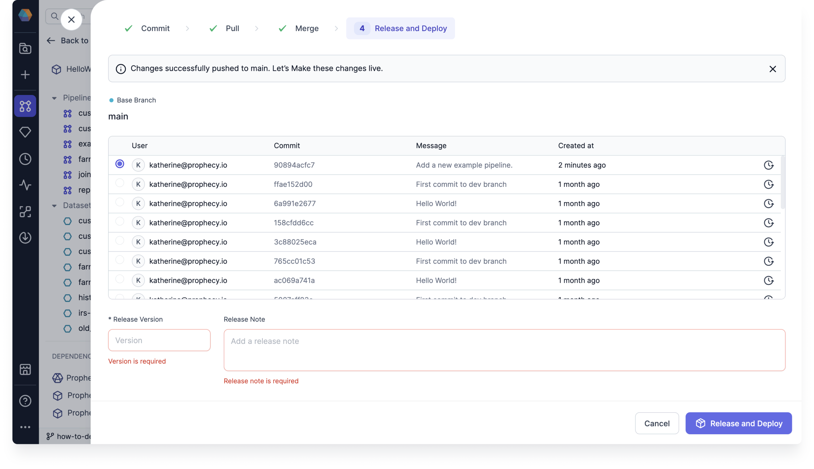

Prophecy provides a recommended mechanism for using Git based development. The four main phases of integrating your changes are **Commit**, **Pull**, **Merge**, and **Release**. A standard development pattern looks like this, though other mechanisms like forking are also supported:

Let's develop and deploy a project to illustrate these phases.

## Create a project

1. Open the **Create Entity** page from the left sidebar.
1. Click **Project**
1. Create a new project or import an existing project.
1. Choose existing Git credentials or connect new Git credentials.
1. Specify the desired repository and path accessible to your Git user to store the project.

For new projects, specify an empty repository or an empty path within an existing repository. For imported projects, select a repository, forked repository, or repository path that already contains the relevant project code.

## Checkout branch

A branch in Git is like a separate version of your project where you can make changes without affecting the main version. It lets you work on new features or fixes independently, and you can later merge your changes back into the main project.

Let's checkout (or switch to) a different branch.

1. Open a project in the editor.
1. Select the **Git** tab in the bottom bar.
1. Click **Checkout branch**.
1. Choose an existing branch from the dropdown or create a new branch by typing a new name.
1. Click **Checkout**.

## Make changes on the branch

A **commit** represents changes to one or more files in your project that let you keep and view project history. When you make changes to the pipeline, you will want to commit them. Let's see how to commit pipeline changes to preserve them in Git.

1. Make a change in your project, such as creating a new pipeline.
1. Click **Commit Changes** to open the Commit window.
1. Write a commit message or let our Copilot write one for you.
1. Review the change and click **Commit**.

Once you have commited your changes, you have the option to continue developing your pipelines or to **merge** your changes. In this case, choose **Continue**.

## Merge changes

**Merge** will take the changes in the _current branch_ and merge them into a _base branch_. Your changes will become part of the base branch and will be available to anyone else whose can access the base branch.

1. Ensure that you are merging to the correct base branch.
1. Review the commits that you are merging.
1. If everything looks right, click **Merge**.

:::note

In this how-to, we have not discussed the **Pull** section of the Commit window. **Pull** brings changes that have occurred in [remote branches](https://git-scm.com/book/ms/v2/Git-Basics-Working-with-Remotes) into the Prophecy-local branches.

If you have any upstream changes that need to be pulled into the local branches, you'll see that option in the **Pull** section before moving on to **Merge**.

:::

## Release and Deploy

When you **Release and Deploy** your project, a particular commit is tagged in the base branch with a user-specified version. This allows you designate a new version as ready for production, or inform users who may be subscribed to datasets defined within your project that there might be changes in the published dataset.

1. Select the commit you wish to deploy.
1. Specify the release version. This is usually a number, using a strategy like [semantic versioning](https://semver.org/).
1. Fill in the release notes to describe the release.
1. Click **Release and Deploy**.

At this point, you have worked through one iteration of your project's lifecycle! To learn more about different deployment options, visit [Deployment](/engineers/deployment).
