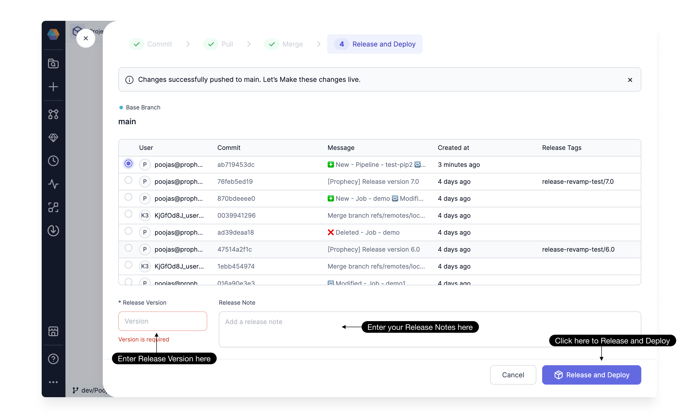
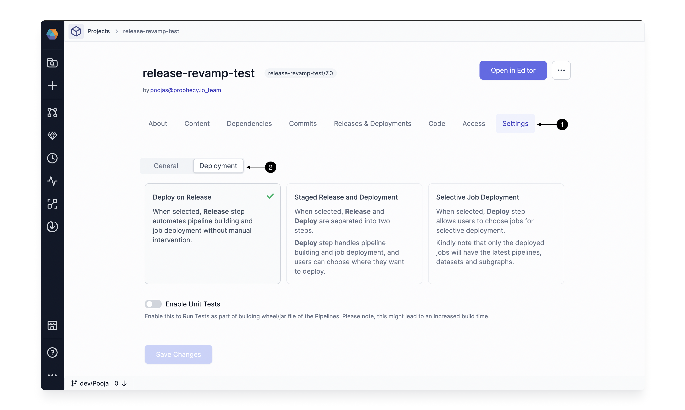
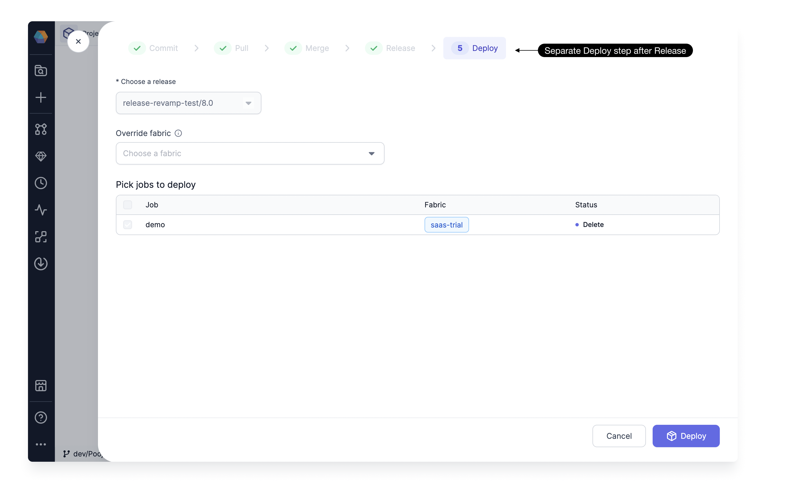
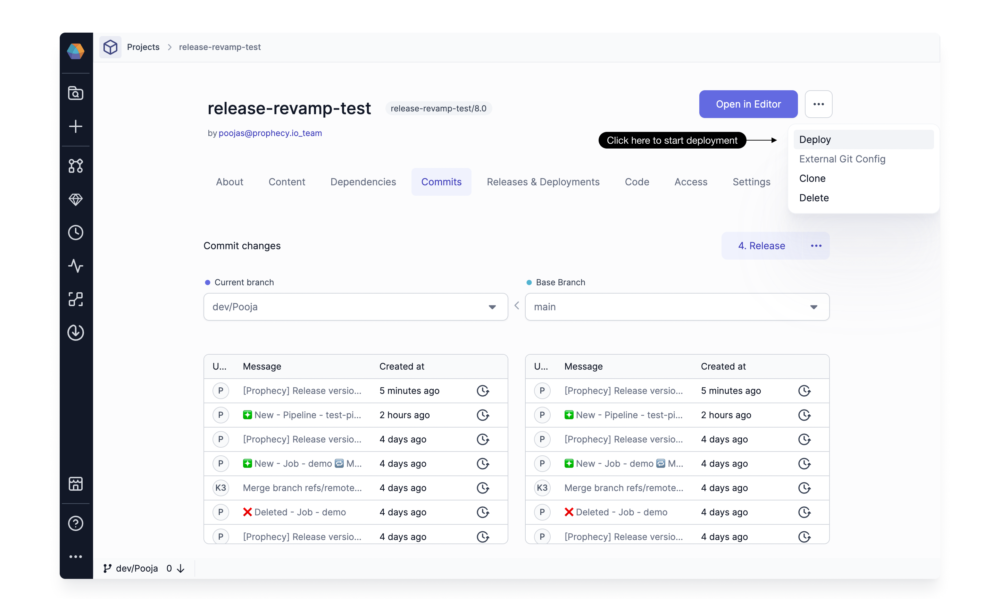
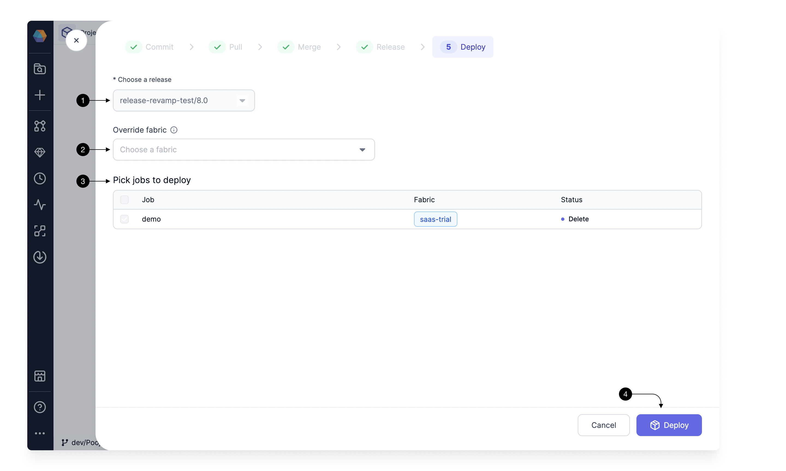
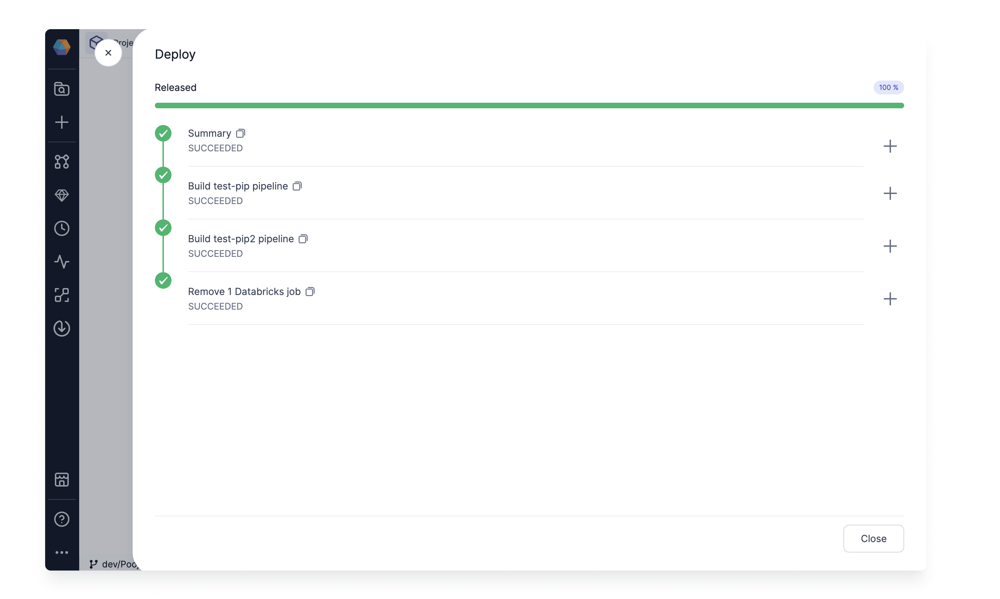
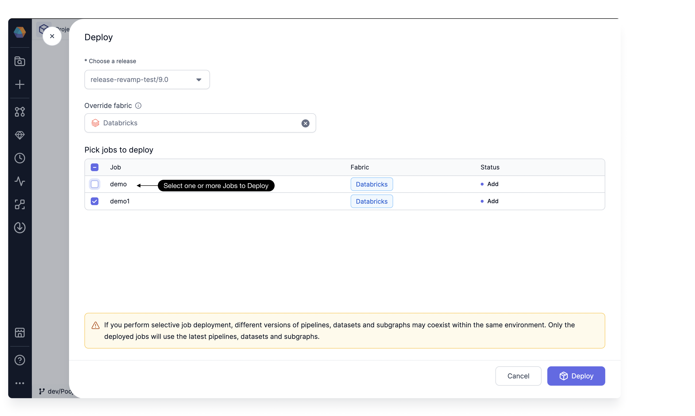
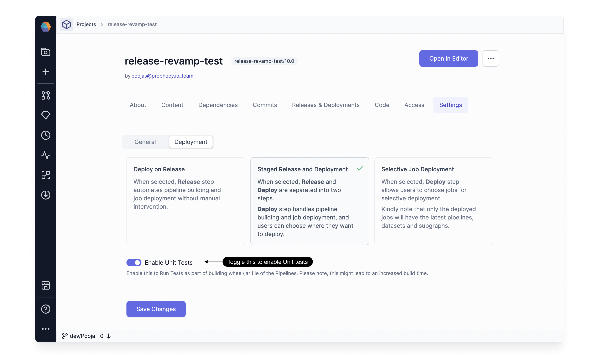
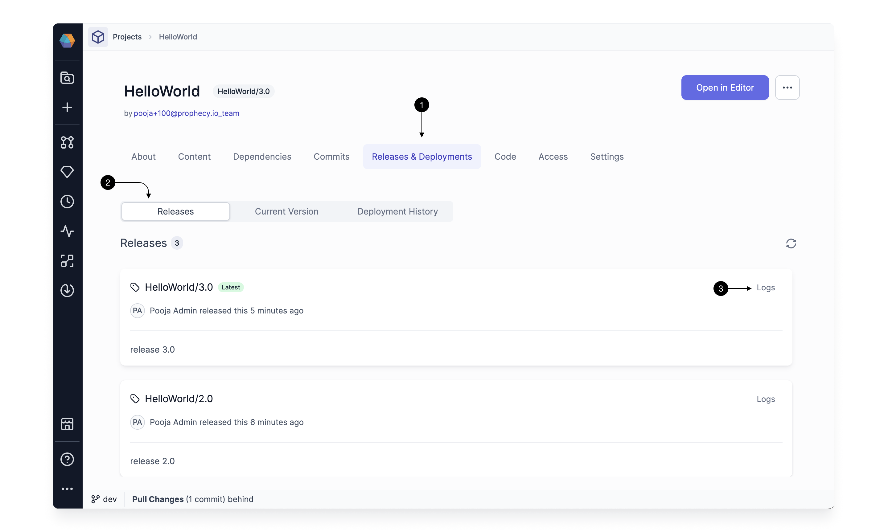
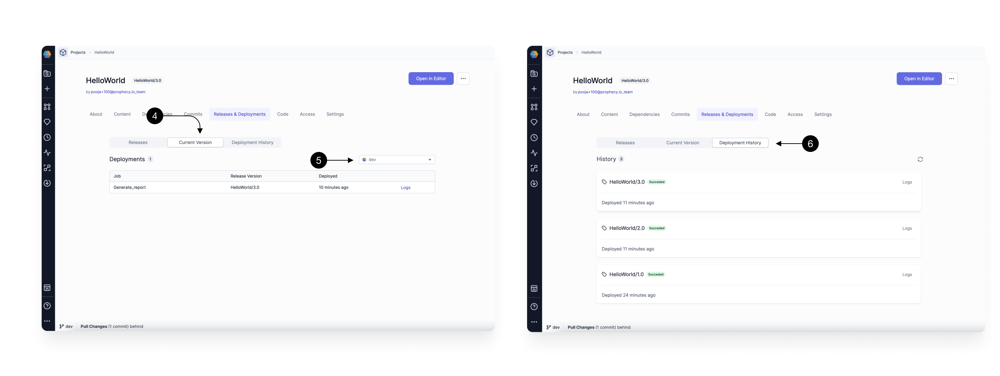

Once you have developed and tested your custom components like gems, pipelines, models, or jobs in Prophecy, the next step is to make them available for use. This involves Releasing and Deploying them to the respective environments.
You can Release and Deploy via Prophecy UI or you can use [Prophecy Build Tool](/docs/ci-cd/prophecy-build-tool/prophecy-build-tool.md) CLI to integrate with any other CI-CD tools.
Lets see how you can do it via the Prophecy UI below.

## Overview

As part of the release process, we start by creating a [Git Tag](https://git-scm.com/book/en/v2/Git-Basics-Tagging) with a specified version. This tag is then pushed to your configured Git repository. Following this, the pipelines, gems, and jobs in the Project are built and deployed to the respective environments.
Here's a breakdown of what deploying means for each component:

- **Gems**: With Prophecy 3.2, you can create [custom gems](docs/extensibility/gem-builder/spark-gem-builder.md) and use in your pipelines. During the release, these gems are built and uploaded to an internal Artifactory. They aren't directly copied to your environments, as they are used in generating code for the pipelines, not during job/pipeline execution. Note, the code for gems do get committed to your Git repo as part of the Project.

- **Pipelines**: Each pipeline in the project is compiled and built into an artifact (Wheel file for Python and Jar file for Scala). These artifacts are then uploaded to your environment as part of the release process.

- **Jobs**: Depending on the type of Job (Databricks or Airflow), the Job is copied to the respective environments as a Json file for Databricks Jobs and as a Python DAG for Airflow.

There is no specific deployment step needed for other entities.

## How to Release a Project

Once you've committed and merged your changes, you're ready to release them. To do this, Simply proceed with the [Release and Deploy](/docs/concepts/git/git.md#release-a-branch), which takes care of both the release and deployment of pipelines, gems, and jobs to respective environments.



:::info
Only an Admin user of the team can initiate a Project Release and Deployment.
:::

## Advanced Release Settings

For most users, a regular project release takes care of both the release and deployment of pipelines, gems, and jobs to respective environments. However, for users who want more control over their deployment process, we offer some advanced options in Project Settings.

To access these settings, go to the **(1) Settings page** in your Project, and click on **(2) Deployment**.



:::info
Only an Admin user can modify these Deployment settings for a project.
:::

When you navigate to Settings and Deployment, you'll find the following options:

### Deploy on Release

This option is enabled by default, meaning the release and deployment happen in a single step. The **Release and Deploy** button handles building and deploying all pipelines, gems, and jobs, and uploading the required artifacts to the respective environments.
You can switch the selection to **Staged Release and Deployment** to break down the process into two steps: **Release** and **Deploy**.

### Staged Release and Deployment

When you switch to Staged Release and Deployment, you would start seeing a new step for Deploy separately after Release.



#### Release

With Auto-deploy turned off, the Release step only creates a [Git Tag](https://git-scm.com/book/en/v2/Git-Basics-Tagging) and pushes the tagged code version to your Git repository. At this step, artifacts are not built. This speeds up the release process for larger projects with numerous pipelines and jobs.

#### Deploy

After the release, you can directly proceed to deploy or choose to deploy later from the Deploy option in the dropdown shown below.



This Deploy step builds all the pipelines and gems, uploads the artifacts, and schedules all the jobs in the project to the respective environments.



Start with **(1) Choose a release**, where you would select a version created in Release step. This would be prefilled with the version you created, if you continue to Deploy from the release step directly.
In **(2) Override Fabric** , you have the option to choose a specific environment (Fabric) for deploying the Jobs. This is useful for testing purposes, allowing you to deploy all Jobs to a designated test environment.
:::note
This is an optional step and overrides the environment for this particular Job deployment. Leave it blank to use the fabrics pre-configured in Jobs.
:::

**(3) Pick Jobs to Deploy** table provides an overview of the deployment status for each Job, indicating the targeted Fabric, and any actions taken, such as addition, deletion, or modification.
In the **Staged Release and Deployment** setting, the ability to select or deselect specific Jobs is disabled. For more information on enabling this functionality, continue reading or directly jump [here](#selective-job-deployment).

Click on **(4) Deploy** to start the deployment process. This will now build your pipelines, gems and update the Jobs as shown below. You would be able to see logs for each step in this screen.



### Selective Job Deployment

If you activate **Selective Job Deployment** in the advance settings [here](#advanced-release-settings), you would be able to select specific Jobs during the Deploy step. This is helpful when you have many pipelines and Jobs in the same project and only want to deploy a few at a time. It also speeds up the overall process by only building the pipelines used in the selected Jobs.

:::caution
Different versions of pipelines, datasets, and Subgraphs may coexist within the same environment when selectively deploying jobs. Only the deployed jobs will use the latest versions of pipelines, datasets, and subgraphs.
:::



### Enable Unit Tests

Writing good [Unit tests](/ci-cd/tests) is a key component for data pipeline quality and management. Prophecy makes the process of writing unit cases easier by giving an interactive environment via which unit test cases can be configured across each component.
This setting enables running Unit tests as part of pipeline builds.

:::note
Enabling unit tests might lead to a slight increase the Build time
:::



## Releases and Deployment History

Click on **(1) Releases and Deployments** tab in the Project Metadata to access the history and the currently deployed Jobs.



### Releases

In the **(2) Releases** tab, you'll find a list of all tags, who created them, when they were created, and the latest tag. Also find **(3) logs** of the latest deployment associated with that tag.



### Current Version

In the **(4) Current Version** tab, you can view the current state of all deployed Jobs per environment. Select the **(5) Fabric** environment you want to see the deployed Jobs for, and see the list for all the Jobs deployed in that environment, along with their versions and deployment logs.

### Deployment History

In **(6) Deployment History** tab, you can view the history of all past deployments, along with the time that it was deployed and related logs.

## What's next

To continue with your Prophecy deployment, see the following pages:

```mdx-code-block
import DocCardList from '@theme/DocCardList';
import {useCurrentSidebarCategory} from '@docusaurus/theme-common';

<DocCardList items={useCurrentSidebarCategory().items}/>
```
