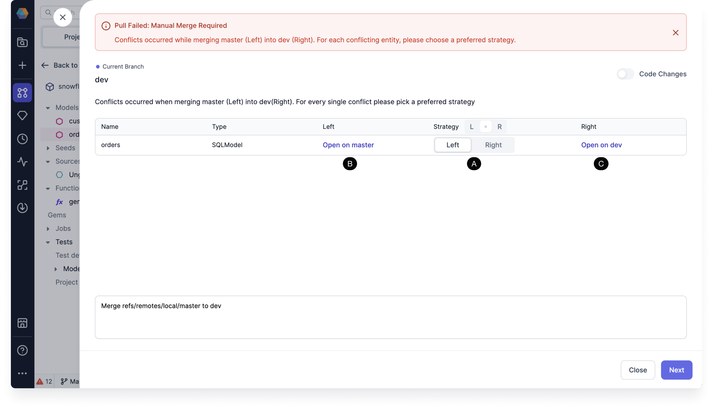
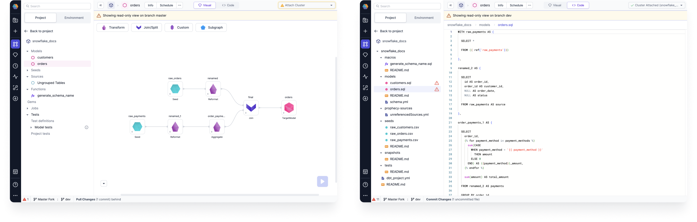
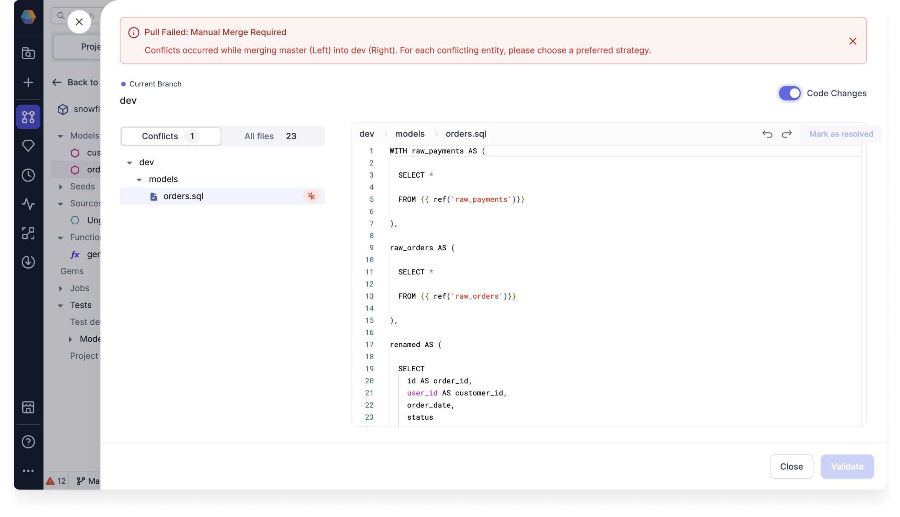
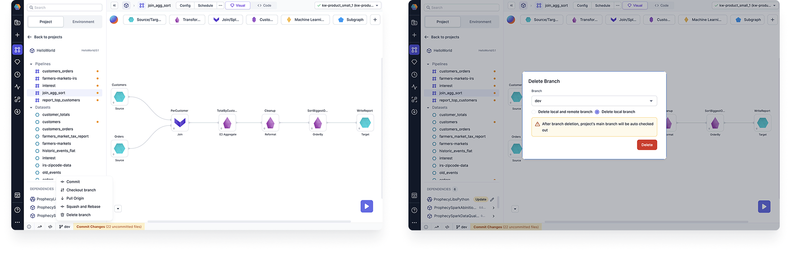

This page describes how to resolve conflicts that you may run into while merging your changes. There are two ways to resolve merge conflicts when they arise:

- Merge using the Prophecy interface
- Merge in your external Git interface

## Merge in Prophecy

There are a couple of ways to manually resolve merge conflicts in Prophecy.

### Left or right merge strategy

The Left or Right merge strategy gives you a the option to resolve the conflict by choosing one version of your code to keep. After choosing, you can click **Next** to continue the merge process.

- **(A)** **Strategy**: You must choose a preferred strategy to resolve the conflict. Here the Left strategy keeps the version on branch `master`, while the Right strategy keeps the version on branch `dev`.
- **(B)** **Open on master**: Clicking this opens the model on branch `master` for you to view.
- **(C)** **Open on dev**: Clicking this opens the model on branch `dev` for you to view.

Here are the read-only views on branch `master` on the left and branch `dev` on the right:

### Code changes merge strategy

For SQL, you can also toggle on **Code Changes** to view and edit the code before validating. You can resolve conflicts by making code changes directly on the files.

Once you've made the changes that you want to keep, click **Next**. The merge process will compile the files.

:::info Errors caused by conflict resolution
In rare cases, your merge attempt may result in an error after the compile completes. You'll be asked to fix the error before proceeding. See **Diagnostics** at the bottom for details on what the error is and how you might go about fixing it. Once you've fixed the error, click **Try Again**.

If you're confident that the errors are fine to leave as is, click **Ignore Errors**.
:::

## Remote and local branch conflicts

If your commit history differs between a remote and local branch (due to actions like rebasing and reverting), one way to resolve this is to delete one of the branches.

To delete the local branch:

1. Open the **Git** menu from the project footer.
1. Choose **Delete branch**.
1. Select the branch you wish to delete.
1. Click the **Delete local branch** button.
1. Click **Delete** to confirm deletion.

To delete the remote branch, do so from your external Git provider.
