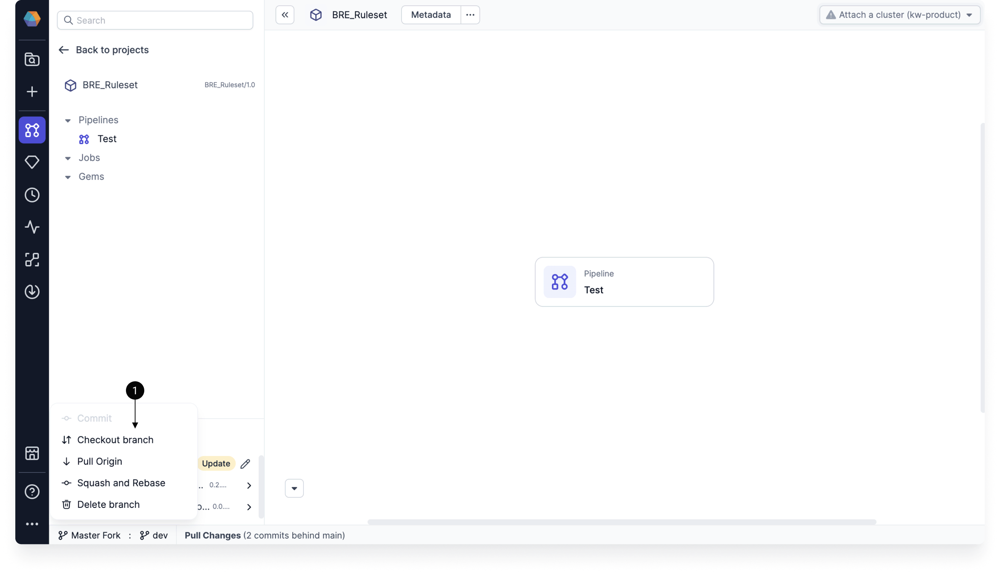
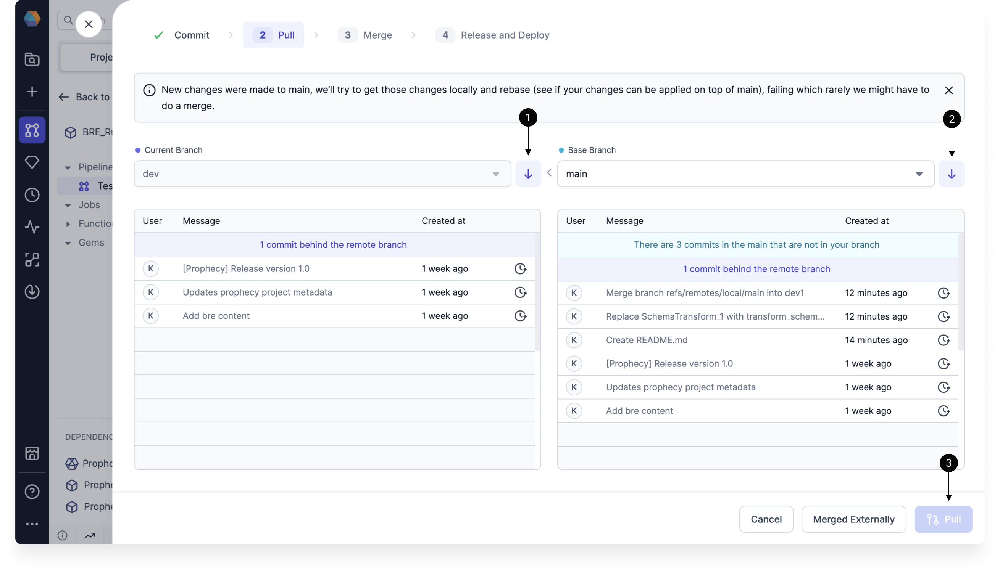

You can interact with a project's Git workflow from the project metadata page or within the project editor.

## Checkout

In Prophecy, you cannot make edits directly on the `main` branch of your project. Instead, you have to make changes on a development branch and merge those changes into the main branch.

Therefore, the Git workflow begins by creating and checking out a new branch.

When you are selecting a branch to checkout, you might be able to select branches that have been created remotely. Once you checkout a remote branch, it will be cloned locally, and it will no longer show up in the list of remote branches.

## Commit

When you make changes to your pipeline, you need to commit these changes to save them. You can view these changes either visually, or using the **Code changes** view.

| **Feature**          | **View** | **Description**                                                                              |
| -------------------- | -------- | -------------------------------------------------------------------------------------------- |
| Branch history       | Visual   | Shows previous commits on the branch.                                                        |
| Entities changed     | Visual   | Explains which entities were modified.                                                       |
| Code changes toggle  | Code     | Allows you to view the code differences, with highlighted lines for additions and deletions. |
| Code changes tab     | Code     | Displays all of the files with changes.                                                      |
| Metadata changes tab | Code     | Displays all of the Prophecy metadata files with changes.                                    |
| Reset                | Both     | Reverts the changes.                                                                         |
| Commit Message       | Both     | Explains the changes that will be saved in this commit.                                      |

## Pull

Sometimes, you will be able to go straight from committing your changes to merging your changes. However, there are a few steps you might need to complete before merging your changes:

1. Pull **remote** changes into the **local** current branch.
1. Pull **remote** changes into the **local** base branch. Note that the base branch will be `main` by default.
1. Pull changes from the **local** base branch into the **local** current branch. You will not be able to complete this step before pulling remote commits.

Once you complete these steps, you might run into merge conflicts. If that happens, you can [use the Prophecy interface](git-resolve) to resolve them.

:::note
Before you pull remote changes into local branches, you will have to commit (or discard) your local changes.
:::

## Merge

Once you have committed your changes, you have the ability to **merge** them to a different branch. If you merged your branch in your external repository, you can tell Prophecy that you did so.

## Release and Deploy

Once the changes are merged, you can [release and deploy](/ci-cd/deployment/) a branch from the Prophecy user interface.

## Rollback or restore

If you have changes that you do not want to commit, there are a few ways to discard them.

1. Click the Reset button in the commit stage of the Git workflow. This discards all changes in your project since the last commit.
1. Restore a particular component from the the Project Browser.
1. Rollback changes to a particular component in the Git workflow.
1. Rollback to a specific commit in the Git workflow.

