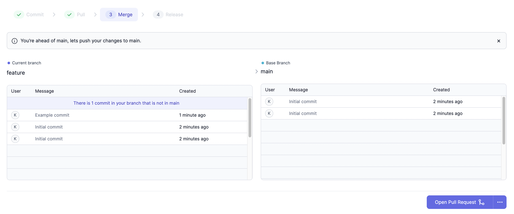

Prophecy supports opening pull requests on your external Git provider to merge
development branches to a base branch on a remote repository.

:::note
You will not see this option if using Prophecy-managed Git for your project.
:::

## Enable Pull Request Template

To enable pull requests:

1. Open your project metadata.
1. Open the **Settings** tab.
1. Next to **Pull Request Template**, toggle on the **Enabled** button.
1. Review the template URL.


The PR template URL requires two variables which are used to build a URL string. The `{{source}}` variable represents the active development branch, and the `{{destination}}` variable represents the base branch to which the development branches need to be merged to, like `main`.

## Examples

````mdx-code-block
import Tabs from '@theme/Tabs';
import TabItem from '@theme/TabItem';

<Tabs>

<TabItem value="github" label="GitHub">

**GitHub template**

```shell
https://github.com/exampleOrg/exampleRepo/compare/{{destination}}...{{source}}?expand=1
```

An example pull request URL generated from the above template for merging a branch named `feature`
to branch `main` would look like:

```shell
https://github.com/exampleOrg/exampleRepo/compare/main...feature?expand=1
```

</TabItem>
<TabItem value="bitbucket" label="Bitbucket">

**Bitbucket template**

```shell
https://bitbucket.org/exampleOrg/exampleRepo/pull-requests/new?source={{source}}/1&dest={{destination}}
```

An example pull request URL generated from the above template for merging a branch named `feature`
to branch `main` would look like:

```shell
https://bitbucket.org/exampleOrg/exampleRepo/pull-requests/new?source=feature/1&dest=main
```

</TabItem>
</Tabs>

````

## Open Pull Request

If the pull request template is configured correctly and enabled, you can open a pull request during the **Merge** step of the Git process.



When you open a pull request from the Prophecy interface, Prophecy will redirect you to your external Git provider based on the template defined in the project **Settings** tab.

## Merged Externally

After you merge any branch remotely:

1. Open your Prophecy project.
1. Go to the **Merge** step of the Git dialog.
1. Click **Merged Externally** and **Confirm**.


