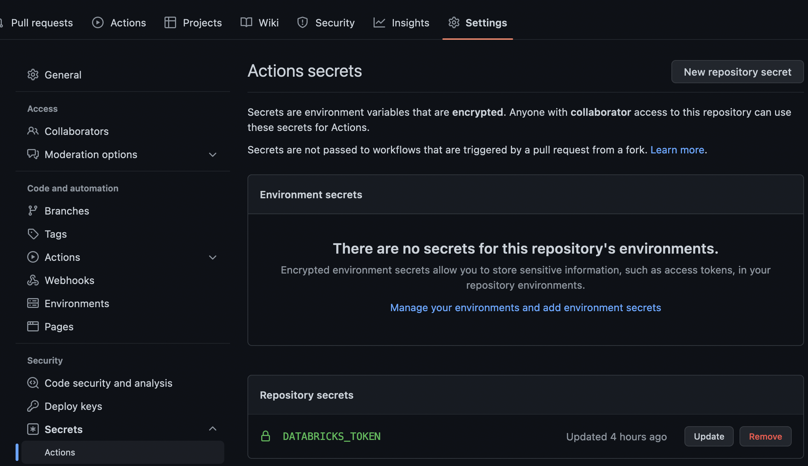

## [Example GitHub Repo](https://github.com/prophecy-samples/external-cicd-template)

## Integrate with GitHub Actions

PBT can be integrated with your own CI/CD solution to build, test, and deploy Prophecy code. The steps for setting up PBT with GitHub Actions on your repository containing a Prophecy project are mentioned below.

### Pre-requisite

- A Prophecy project that is currently hosted in a GitHub repository

### Set up environment variables and secrets

PBT requires environment variables **DATABRICKS_URL** and **DATABRICKS_TOKEN** to be set for complete functionality.

The **DATABRICKS_TOKEN** that needs to be used can be set as a secret inside the GitHub repository of the project.
Steps:

- Go to Settings > Secrets > Actions from the GitHub repository menu
- Click ‘New Repository secret’
- Add the secret with name DATABRICKS_TOKEN and value of the Databricks token to be used by PBT.

Screenshot after setting DATABRICKS_TOKEN secret:


The environment variables can also be set within the GitHub actions YML file as follows:

```yaml
env:
DATABRICKS_HOST: "https://sample_databricks_url.cloud.databricks.com"
DATABRICKS_TOKEN: ${{ secrets.DATABRICKS_TOKEN }}
```

The complete YML file definition is discussed in the next section.

### Set up a GitHub Actions Workflow on every push to prod branch

We’re now ready to setup CI/CD on the Prophecy project.
To setup a workflow to build, run all unit tests and then deploy the built jar (Scala)/ whl (Python) on Databricks on every push to the `prod` branch automatically:

- Create a .YML file in the project repository at the below location (relative to root):

  ```
  .github/workflows/exampleWorkflow.yml
  ```

- Add the below contents to `exampleWorkflow.yml`:

  ```yaml
  name: Example CI/CD with GitHub actions
  on:
  push:
  branches: - "prod"

  env:
  DATABRICKS_HOST: "https://sample_databricks_url.cloud.databricks.com"
  DATABRICKS_TOKEN: ${{ secrets.PROD_DATABRICKS_TOKEN }}
  # replace with your fabric id:
  FABRIC_ID: "4004"

  jobs:
  build:
  runs-on: ubuntu-latest
      steps:
        - uses: actions/checkout@v3
        - name: Set up JDK 11
          uses: actions/setup-java@v3
          with:
            java-version: "11"
            distribution: "adopt"
        - name: Set up Python 3.9.13
          uses: actions/setup-python@v4
          with:
            python-version: "3.9.13"
        # Install all python dependencies
        # prophecy-libs not included here because prophecy-build-tool takes care of it by reading each pipeline's setup.py
        - name: Install dependencies
          run: |
            python3 -m pip install --upgrade pip
            pip3 install build pytest wheel pytest-html pyspark==3.3.0  prophecy-build-tool
        - name: Run PBT validate
          run: pbt validate --path .
        - name: Run PBT build
          run: pbt build --path .
        - name: Run PBT test
          run: pbt test --path .
        - name: Run PBT deploy
          run: pbt deploy --path . --release-version 1.0 --project-id example_project_id
  ```

The above workflow does the following in order:

1. Triggers on every change that is pushed to the branch `prod`.
2. Sets the environment variables required for PBT to run: DATABRICKS_HOST and DATABRICKS_TOKEN.
3. Sets up JDK 11, Python 3 and other dependencies required for PBT to run.
4. Validate that the pipeline code is free of syntax errors.
5. Builds all the pipelines present in the project and generates a .jar/.whl file. If the build fails at any point a non-zero exit code is returned which stops the workflow from proceeding further and the workflow run is marked as a failure.
6. Runs all the unit tests present in the project using FABRIC_NAME(optional) as the configuration. If any of the unit tests fail a non-zero exit code is returned which stops the workflow from proceeding further and the workflow run is marked as a failure.
7. Deploys the built .jar/.whl to the Databricks location mentioned in `databricks-job.json`, located in the `jobs` directory of the project. If the Job already exists in Databricks it is updated with the new .jar/.whl.
8. Deploys pipeline configurations, if present, to the DBFS path mentioned in `databricks-job.json`.
9. If this process fails at any step, a non-zero exit code is returned which stops the workflow from proceeding further and the workflow run is marked as a failure.
