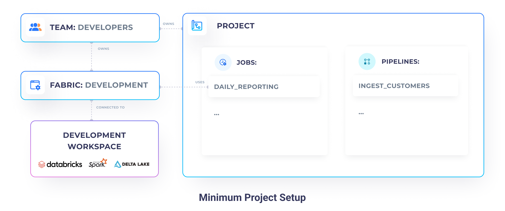
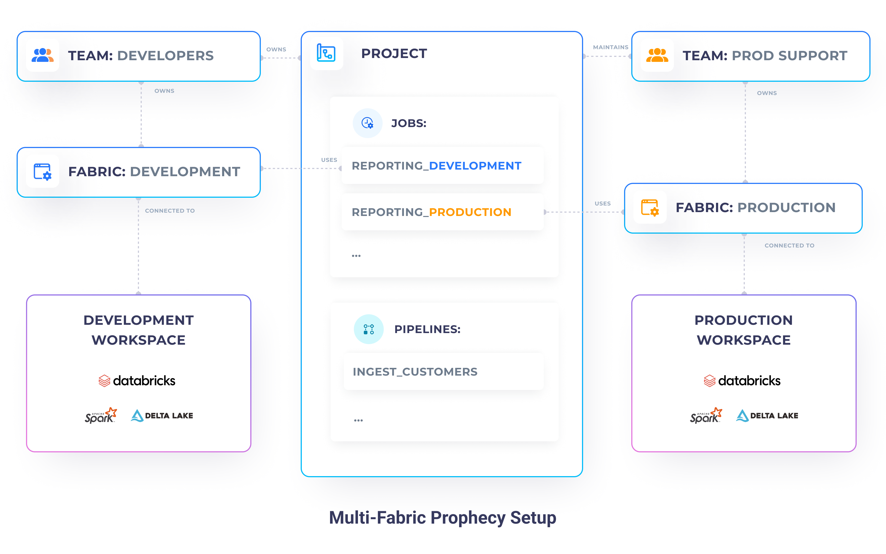

**Continuous Integration and Continuous Delivery (CI/CD)** streamlines software development by automating testing and deployment. With **CI**, code changes are frequently integrated and tested to catch issues early. **CD** ensures that once approved, tested code is automatically deployed to production, enabling fast and reliable releases. Continue reading to learn about how to implement CI/CD in Prophecy.

## Single-fabric development

Consider a simple scenario in which you have a single execution environment (like one Databricks workspace). One team works in this environment for both development and productionization. To accommodate this in Prophecy, you will have:

- **Multiple projects**: your Git repositories which store all the Spark, Airflow, and metadata code
- **Multiple data pipelines**: various ETL / ELT tasks written in Spark
- **Multiple jobs**: the orchestration of your data pipelines written in Databricks jobs or Airflow
- **A single team**: all your teammates in the same place, with the same access
- **A single fabric**: the connection to your Databricks workspace

This is great for simple setups and very small teams, but can quickly lead to many problems. In such a setup, it's very easy for you and your teammates to make mistakes and **accidentally affect production** pipelines. There's also **lack of data separation**, so any PII information becomes visible to everyone!

## Multi-fabric Deployment with Prophecy

Let's consider a better alternative to a single environment development. The simplest alternative involves adding just one more execution environment called **production**.

By separating your **development** or QA use-cases from your **production** use-cases, you get:

- PII safety (by using mock or anonymized data)
- Faster development (by using smaller data samples)
- Reduced development costs (by using smaller cluster sizes)
- Increased data quality confidence (by only pushing code after tests and validations pass)

You can push your code to the **production environment** only after you're confident it's going to work well. The production environment has access to your real data, uses large optimal clusters, and has significantly restricted access. In some cases, only the operational support teams should have access to your production environment.

If you'd like to involve more stages, to even further increase the reliability of your development process, you can add a **QA environment**. That environment should have data, hardware, and software that closely simulates the Production environment (e.g. data slices directly taken from production), and should serve as a holding area. Using QA, your engineers make sure that the jobs are going to run smoothly in the production environment, without actually potentially breaking production, if some code is wrong.

### Development and Production

For our example, however, let's focus on a setup with two environments: **Development** and **Production**. Our **Development environment** is accessible to our whole organization (developers, analysts, support) and is connected to our development Databricks workspace, which contains only dummy customer data. Whereas, our **Production environment** is only accessible to our production support team and is connected to our production Databricks workspace, which has real customer data.

#### Entities setup

1. Create two **teams**:

   - `developers` - a superset of all the teams, which contains your developers and members of the `prod_support` team
   - `prod_support` - team composed of members who have privileged production access permissions

2. Create two **fabrics**:

   - `development` - owned by the `developers` team
   - `production` - owned by the `prod_support` team

3. Set up your **Projects**: create your projects, as you would before. Projects should be owned by the `developers` _team_.

4. Set up your **jobs**: for every single set of pipelines you'd like to schedule, create two jobs.
   - **Job_development**: Jobs built by the `developers` for integration and testing purposes
   - **Job_production**: Jobs built by the `prod_support` team, based on the development jobs - they will run in the production environment

   <iframe src="https://www.loom.com/embed/b9669f374f504e469b2f88374bcf35d3" frameborder="0" webkitallowfullscreen mozallowfullscreen allowfullscreen
      style={{position: 'absolute', top: 0, left: 0, width: '100%', height: '100%'}}></iframe>

#### Development and Testing

Phew, that was a lot of work! But the biggest chunk is behind us 💪.

Now that we have set up our fabrics and Teams, built some pipelines, it's time to test the whole data flow on our development environment.

Testing your pipelines and jobs is very simple. Simple click on the play button and watch your code run!

:::info
Currently, we're spinning up a new cluster for each of the tasks, therefore your job might take a few minutes
to complete.
:::

#### Deployment to Production

Once we're confident that our job works correctly, and we have tested it well, we can start deploying it to our **production** environment. In our setup, only a production support engineer can do that. Therefore, login as them,
duplicate your job on the production fabric, set appropriate pipeline configurations and enable it.

That's it! Now you can commit any remaining changes and release your pipeline. Prophecy automatically takes care of the release process, by building your pipelines, running unit tests, and finally deploying the pipeline JARs/wheels alongside the job definition directly to Databricks (or AirFlow).

If you're new to this process, check out, our [Git](/engineers/git) and jobs deployment documentation.

   <iframe src="https://www.loom.com/embed/28153636876f409184e6ba2dcbc8f273" frameborder="0" webkitallowfullscreen mozallowfullscreen allowfullscreen
      style={{position: 'absolute', top: 0, left: 0, width: '100%', height: '100%'}}></iframe>

## Multi-fabric Deployment with GitHub

So far, we looked at how Prophecy makes it really easy to deploy our jobs to multiple environments, directly using the CI / CD system built into it. However, it is often the case that you want to deploy your pipelines from your Git instead. This enables you to have a more secure production environment, where it doesn't have to connect to directly Prophecy itself.

As we know, Prophecy publishes all the entities (pipelines, jobs, metadata, etc) directly on your Git. That means you can very easily deploy that code to whatever Databricks environment you'd like - very easily.

### Deploy with Prophecy Build Tool

[Prophecy Build Tool (PBT)](/engineers/prophecy-build-tool) is a cli tool that can be used to build, test, and deploy projects created by Prophecy. PBT integrates with either [github actions](/engineers/github-actions-prophecy-build-tool) or [Jenkins](/engineers/jenkins-prophecy-build-tool) to facilitate deploying your code from your Git repository. Make use of the `--fabric-ids` option to deploy using the Multi-fabric approach.
