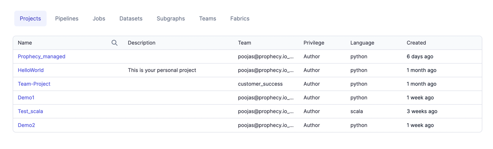
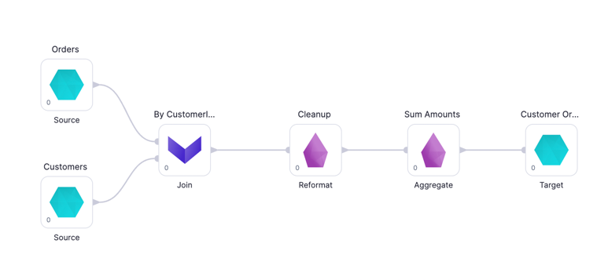
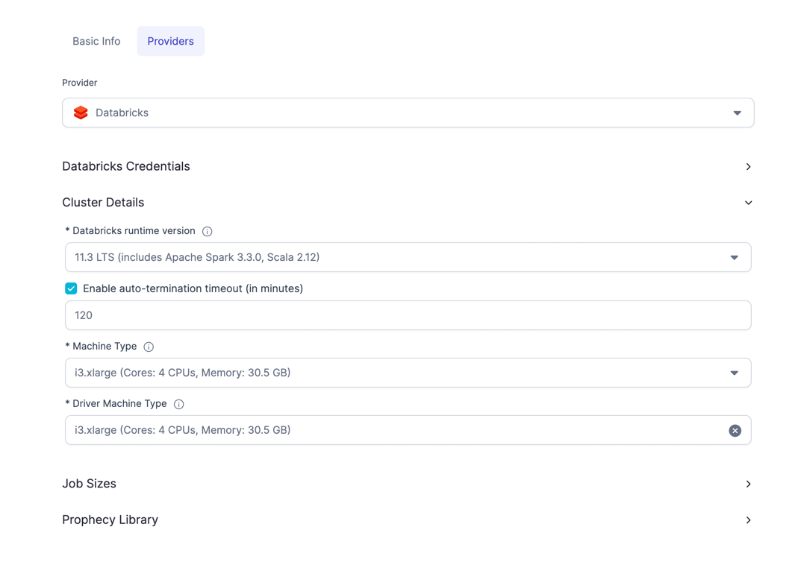
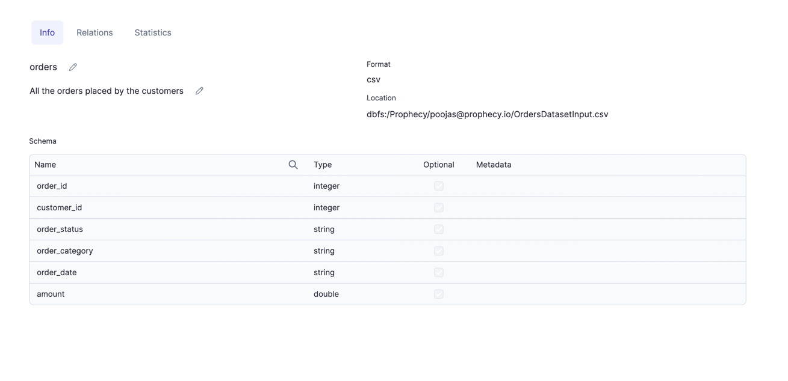
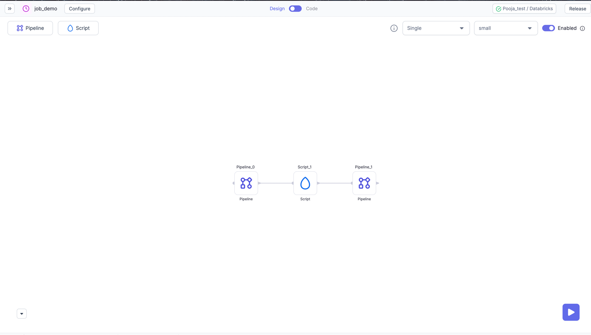
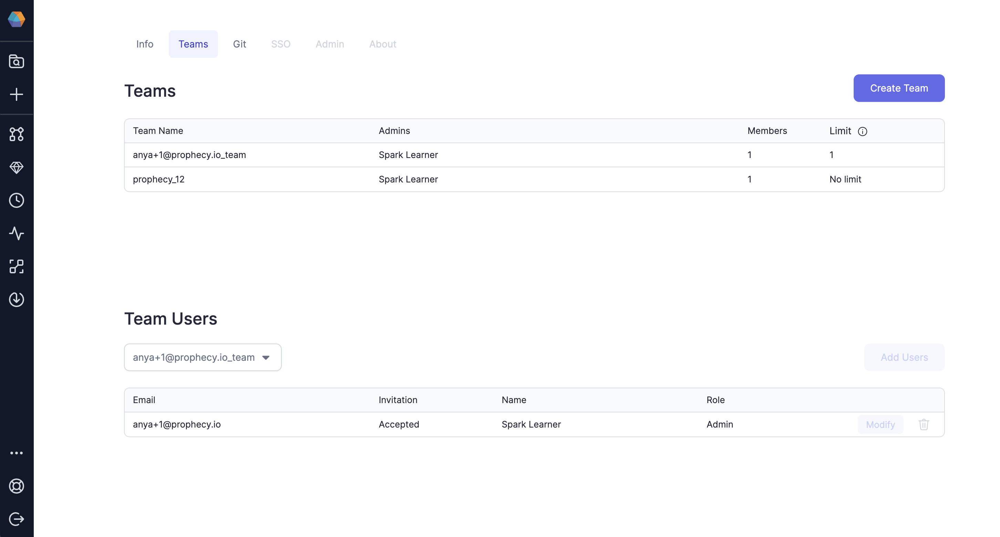

Advance your productivity by becoming familiar with these key Prophecy concepts.

## Projects

The Project is the primary unit of development and deployment to production in Prophecy.

A **project** contains

- **Pipelines** (Spark) or **Models** (SQL) which read, transform and write data.
- **Datasets** point to the data that is read and written to by the _Data Pipelines_ or _Data Models_.
- **Jobs** run _Data Pipelines_ and _Data Models_ individually or together based on a schedule.

### Project is Code on Git

A **project** is **code** on **Git**. This means that within a project, the business logic of all the assets including _Pipelines_/_Models_, _Datasets_, and _Jobs_ is stored as code on Git. This might be a repository on Github or a folder in a repository.

## Metadata

Metadata is how you access and configure all entities in Prophecy. You can go to metadata page to view, edit, delete any of your entities like Pipelines, Projects, Jobs, Fabrics etc.

## Pipelines and Models

`Pipelines` and `Models` within Prophecy are used to represent the flow of data. They are similar to a map you might use on a road trip: You have a **_Start_** and **_Finish_** (Datasets) and the **_stops_** to make along the way (Gems).

### Pipelines (for Spark)

Pipelines are based on Spark-native code. Therefore, Prophecy users can leverage all of the powers of Spark to build their transformations. Spark can handle virtually any complexity and scale transformation.

You will want to create pipelines when you’re running on a Spark environment, like Databricks or EMR. They’re particularly useful for more complex ingestion (e.g. loading data from Salesforce or JDBC), data transformations (e.g. working with complex data types) and machine learning use-cases.

Learn more [here](../low-code-spark) about Prophecy’s Data Transformation Copilot for Spark and checkout this [guide](/docs/getting-started/getting-started-with-low-code-spark.md).

### Models (for SQL)

Models are based on SQL-native code and are backed by the dbt Core™️ build system. Models define a single Dataset (most commonly a table or a view) and they’re stored as a select statement in a SQL file. Models are used for SQL where Pipelines are used for Spark.

You will want to create models if you’d like to transform data directly on your data warehouse or you’re an existing dbt user. They’re best suited for data analytics and data transformation use-cases.

Learn more [here](../SQL/copilot-for-sql) about Prophecy’s Data Transformation Copilot for SQL and get started with SQL on Databricks with [this guide](/docs/getting-started/getting-started-with-low-code-sql.md) or Snowflake with [this guide](/docs/getting-started/getting-started-sql-snowflake.md).

## Fabrics

A Fabric is a logical execution environment. Teams organize their data engineering into multiple environments such as _development_, _staging_, and _production_.
As an example, if you have a Databricks Workspace, that would map to one Fabric in Prophecy.

## Datasets

Datasets (not to be confused with a [Spark Dataset](https://spark.apache.org/docs/3.1.3/api/scala/org/apache/spark/sql/Dataset.html)) in Prophecy are the union of two concepts:

- **_WHAT_** your data looks like
- **_HOW_** to read it or write it.

To define a dataset, all you need is

- **Type**: The type of data you are reading/writing like CSV, Parquet files or catalog tables.
- **Location**: The location of your data. It could be a file path for CSV or a table name.
- **Properties**: Properties consists of Schema which is the _shape_ of the data and some other attributes specific to the file format. For example, in case of CSV, you can give Column delimiter in additional attributes. User can also define Metadata for each column here like description, tags and mappings.

## Gems

If a Pipeline is a roadmap of the journey that your data will take from Start to Finish, the Gems are the stops to make along the way. Each Gem instance can be seen as just another Spark Transformation you perform on your data like Reformat, Join, Limit or Filter.
Gems are categorised as below:

| 
Gem
   | Category                                                     | Description                                                                                                |
| ------------------------------------------ | ------------------------------------------------------------ | ---------------------------------------------------------------------------------------------------------- |
|  | [**Source and Target**](/low-code-spark/gems/source-target/) | The set of Gems that help with loading and saving data.                                                    |
|             | [**Transform**](/low-code-spark/gems/transform/)             | The set of Gems that help with transforming data.                                                          |
|        | [**Join and Split**](/low-code-spark/gems/join-split/)       | The set of Gems that help with the process of merging or splitting DataFrame(s) to create new DataFrame(s) |
|                   | [**Custom**](/low-code-spark/gems/custom/)                   | Set of Gems that do not fall into the other categories.                                                    |
|               | [**Subgraph**](/low-code-spark/gems/subgraph/)               | A Gem that can contain many other Gems within it.                                                          |

Each Gem _instance_ comes with their own configuration and each produces its own block of output code.

## Jobs

Once you have developed a Spark data Pipeline using Prophecy, you will want to schedule it to run at some frequency. You can schedule just a single Pipeline or create a DAG of Pipelines. You can also add scripts to run in between these Pipelines.

To support Jobs, Prophecy provides you with an easy to use interface to develop, using two different schedulers:

- **[Databricks Jobs](../low-code-jobs/databricks-jobs)** - for simpler data-Pipeline use-cases, where you just
  orchestrate multiple data-Pipelines to run together. Databricks Jobs is a **recommended** scheduler, if you're
  Databricks Native.

- **[Airflow](/docs/low-code-jobs/airflow/airflow.md)** - for more complex use-cases, where you have to use various operators, or need
  any additional data pre-and-post-processing, you can design your Jobs using Prophecy's interface for Airflow.

Alternatively, since Prophecy provides you native Spark code on Git, you can easily integrate with any other scheduler.

## Teams And Users

Teams are the primary mechanism of ownership. Each Team represents a group of users who work together.

- **Teams own Projects** where Pipelines, Datasets and Jobs live
- **Teams own Fabrics** that provide the execution and storage resources for execution including Spark clusters

Users get access by being added to a team

- **Personal Teams** For every user, a default team in created that only contains one user. If only one user is to be given access to a project, it can be done via this team
- **Personal Projects** Users can put personal projects in their _personal team_ and not share it with others

