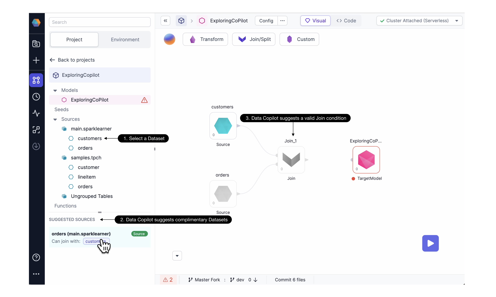

## About Data Copilot

:::caution
Prophecy Data Copilot is a Public Beta release and is constantly evolving to meet the needs of our customers. As with all applications that interface with Large Language Models (LLMs), Data Copilot can generate results which are incorrect and/or misleading.
:::

### Building Models and Pipelines with Prophecy’s Data Copilot

<iframe src="https://fast.wistia.net/embed/iframe/t7m3boc575?seo=false?videoFoam=true" title="Design a Pipeline Video" allow="autoplay; fullscreen" allowtransparency="true" frameborder="0" scrolling="no" class="wistia_embed" name="wistia_embed" msallowfullscreen width="100%" height="100%"></iframe>

Prophecy’s low-code platform makes data Pipeline development faster and accessible to more users. Starting now, you’ve got an AI assistant to boost that productivity even further.

We are open to feedback! Please send us an email (contact@Prophecy.io) or reach out in our Slack [community.](https://join.slack.com/t/prophecy-io-support/shared_invite/zt-moq3xzoj-~5MSJ6WPnZfz7bwsqWi8tQ)

## Capabilities

Prophecy Data Copilot provides suggestions from an AI model as you develop your data Pipelines. You can view and incorporate suggestions directly within the Prophecy visual editor and code editor. Data Copilot makes suggestions for your entire Pipeline, for a single Gem (transformation,) and even for individual expressions within each Gem.

### Text to build Pipelines

Get started quickly by typing your query into the text box. Prophecy Data Copilot can generate a new Pipeline or edit an existing Pipeline.

#### Start a Pipeline

Data Copilot can assist with starting a Pipeline. Just **(1) type a prompt with English text,** such as “Which customers shipped the largest orders this year?” **(2) Data Copilot will use metadata** from the accessible Datasets, seeds, models, Pipelines, etc. to create a Knowledge Graph. Using the Knowledge Graph, text prompt, and a selected LLM, **(3) Data Copilot creates a Pipeline.** This Pipeline is accessible in the visual editor as well as the code editor. The user can explore the individual components, **(4) keep or reject the Pipeline,** and interactively execute.

#### Modify an existing Pipeline

The user can also call Data Copilot to modify an existing Pipeline. Select which Gem should be the starting point for modifications downstream, and type a new text prompt. Data Copilot will suggest a new sequence of data transformations following from the selected starting point.

### Next-transformation suggestions

#### Suggest Gems

Data Copilot can suggest the next transformation in a series. Here, the user **(1) selects a Dataset** of interest, then **(2) Data Copilot suggests Datasets** which are frequently used with the selected Dataset. **(3) Data Copilot then suggests a next transformation,** in this case a Join Gem.

#### Suggest Expressions

At the more granular level, Data Copilot can suggest expressions within Gems. Simply **(1) type an English text prompt** and **(2) Data Copilot generates a code expression** for a particular column. **(3) Click to accept** the code expression or try again with a different prompt. Data Copilot’s returns are non-deterministic, so a retry can return a different expression. **(4) Run** the Pipeline upto and including this Gem, and observe the resulting **data preview sample.**

### Auto Documentation - Coming soon

<iframe src="https://fast.wistia.net/embed/iframe/rec6bcdwet?seo=false?videoFoam=true" title="Design a Pipeline Video" allow="autoplay; fullscreen" allowtransparency="true" frameborder="0" scrolling="no" class="wistia_responsive_wrapper" name="wistia_embed" msallowfullscreen width="100%" height="100%"></iframe>

Understanding data assets is much easier with Data Copilot’s auto documentation, to be offered in an upcoming release. Data Copilot will deliver summary documentation suggestions for all Datasets, Pipelines, and orchestrations. How did a Dataset change? Data Copilot will recommend a description of the change for every edit you make. How was a column computed? Data Copilot suggests a description that explains how every column generated for analytics was computed and what it represents.

### Data Tests and Quality Checks - Coming soon

<iframe src="https://fast.wistia.net/embed/iframe/i1bjyf2zae?seo=false?videoFoam=true" title="Design a Pipeline Video" allow="autoplay; fullscreen" allowtransparency="true" frameborder="0" scrolling="no" class="wistia_embed" name="wistia_embed" msallowfullscreen width="100%" height="100%"></iframe>

Unit tests and data quality checks are crucial for Pipeline and model productionization, yet many teams leave little time to develop these tests or worse, don’t build them at all. With Data Copilot, you’ll have a suggested unit test - with code provided - for Prophecy to run on every committed change. Data Copilot also suggests data quality checks based on the data profile and expectations.

### Settings

1. Data Copilot is available for all customers using Prophecy’s managed, Public SaaS offering. For companies who run Prophecy within their own VPC (link), admins may choose to enable or disable Data Copilot across their Prophecy Platform at deployment time.
2. Coming soon, Prophecy Administrators will have the option to connect Prophecy Data Copilot to their private subscription OpenAI.
3. Data Co-pilot is designed with simplicity in mind, with minimal configurations for the user. If there’s a setting you’d like to see, let us know!

| Project Type  | Code Suggested by Copilot | Orchestration   | Features coming soon for Data Copilot                                |
| :------------ | :------------------------ | :-------------- | -------------------------------------------------------------------- |
| Spark (Scala) | Spark SQL                 | Databricks Jobs | Airflow, Private LLM options, AutoDoc, Data Tests and Quality Checks |
| PySpark       | Spark SQL                 | Databricks Jobs | Airflow, Private LLM options, AutoDoc, Data Tests and Quality Checks |
| SQL           | SQL                       | Databricks Jobs | Airflow, Private LLM options, AutoDoc, Data Tests and Quality Checks |

For Spark and PySpark projects, Data Copilot suggests code written in Spark SQL, which is Apache Spark’s module for working with structured data (link). Data co-pilot currently supports Databricks jobs, and Airflow support is coming soon.

## Architecture

### Knowledge Graph

Briefly, Data Copilot works by enhancing the user’s prompt using a knowledge graph.

In particular, the knowledge graph includes metadata for the Project’s entities (eg Datasets, schemas, seeds, models, and Pipelines) and statistical usages of these entities. We built the knowledge graph intentionally to include metadata but not data. Individual Dataset records, for example, are not included in the knowledge graph.

Prophecy sends the enhanced Prompt to OpenAI (or the user’s preferred LLM). The model will return a set of SQL or SparkSQL code, and Prophecy will verify whether this code is valid. Once Prophecy fixes the code, Prophecy generates a visual Pipeline and displays this Pipeline to the user for review.

### Data Privacy

The Prophecy team employs top-notch industry practices to safeguard the security of their application and maintain the privacy of customer data. Below are just a few components of our comprehensive security strategy and system structure:

- Prophecy IDE is hosted on secure servers on AWS. All storage systems are encrypted, and all servers are tightly access controlled and audited. Data is encrypted in-transit at all times.
- Alternatively, Prophecy’s IDE can be installed within an Enterprise network as desired.
- Prophecy’s IDE accesses your environment through a single IP address dedicated to you, allowing you to protect access to your data resources at the network level. The credentials are stored per-user, and only a fully authenticated user can access their environment.
- Prophecy does not store or send any data to any third party LLM providers. Instead, Prophecy makes use of rich metadata to construct the knowledge graph. As a result, Data Copilot can interface with LLM providers while maintaining privacy of the data itself.
- An annual penetration test is performed to validate Prophecy’s posture and identify vulnerabilities. Our latest penetration test report was issued in November 2022.
- Prophecy maintains SOC-2 compliance as audited by PrescientAssurance.
- Read more details on Prophecy’s security and compliance posture at our Security Portal [here](https://security.Prophecy.io/)

## FAQ

###

#### How is Prophecy Copilot different than Github Co-pilot

Github Copilot is a great tool to boost productivity and extend the reach for the coding community. However, not every problem is solved with direct coding. More importantly, users need a Copilot with some context of the interesting data.

For teams of analysts, data platform providers, or line-of-business users, the pain points are not resolved by teaching every team member how to code. Data Copilot empowers less technical users because they don’t have to code. Importantly, technical and coding users benefit from Data Copilot because visual Pipelines are easier to understand, explain, and leverage. Prophecy’s Data Copilot boosts the productivity of the low-code user and the more technical coding team members.

When all of these data practitioners reach for an AI assistant, they’ll need one specific to the data space. The assistant should collect metadata from the Databricks Workspace, for example. Prophecy Data Copilot has the context of your data. Data Copilot can guide Pipeline and model development by suggesting which Datasets to use and how to use them.

Github Copilot and Prophecy Data Copilot are both excellent tools to boost productivity, but Prophecy Data Copilot is accessible to a larger user base and can make data suggestions because it maintains data context.

#### Which Datasets are accessible to Prophecy Data Copilot?

In Prophecy’s 3.1 release, any Dataset, source, or seed within a Project are accessible when Data Copilot is called from that project. In an upcoming release this behavior will change as follows: The assets need only to be part of the linked (Databricks, Snowflake, etc) catalog. That is, if the user can access the Datasets with their token, the Datasets should appear in the Environment tab and Copilot can access them.

#### How much will I pay for use of Prophecy Copilot?

Copilot features are included with Prophecy’s Low-Code Spark and Low-Code SQL offerings. There would be an additional cost if you chose to use a private subscription Large Language Model (LLM) service. In this case, the cost depends on (1) the number of tokens sent to the LLM provider, (2) the size of the Datasets, and (3) the number of iterations Prophecy sends requests to the LLM provider.
