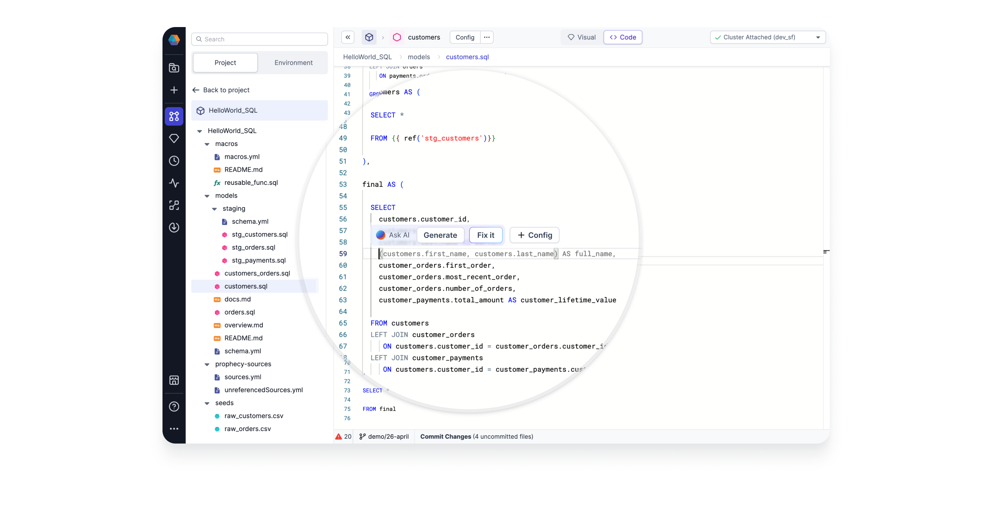

### Building Models and Pipelines with Prophecy’s Copilot

<iframe src="https://fast.wistia.net/embed/iframe/t7m3boc575?seo=false?videoFoam=true" title="Design a Pipeline Video" allow="autoplay; fullscreen" allowtransparency="true" frameborder="0" scrolling="no" class="wistia_embed" name="wistia_embed" msallowfullscreen width="100%" height="100%"></iframe>

Prophecy’s end-to-end platform makes data Pipeline development faster and accessible to more users. Starting now, you’ve got an AI assistant to boost that productivity even further.

We are open to feedback! Please send us an email (contact.us@Prophecy.io) or reach out on our Slack [community.](https://join.slack.com/t/prophecy-io-support/shared_invite/zt-moq3xzoj-~5MSJ6WPnZfz7bwsqWi8tQ)

## Capabilities

Prophecy Data Copilot provides suggestions from an AI model as you develop your data Pipelines. You can view and incorporate suggestions directly within the Prophecy visual editor and code editor. Data Copilot makes suggestions for your entire Pipeline, for a single Gem (transformation), and even for individual expressions within each Gem.

### Text to Pipelines

Get started on a new Pipeline quickly by typing your query into the text box and Data Copilot will generate a new Pipeline or modify an existing one.

#### Start a new Pipeline

Data Copilot can assist with starting a Pipeline. For example:

1. Type a prompt with English text, such as `Which customers shipped the largest orders this year?`
2. Data Copilot will use metadata from the accessible Datasets, Seeds, Models, Pipelines, etc. to create a Knowledge Graph.
3. Data Copilot uses OpenAI's language model to create the Pipeline based on the text prompt, with the Knowledge Graph as the context. This Pipeline is accessible in the visual editor as well as the code editor.
4. The user can keep or reject the suggested Pipeline and interactively execute it to see the results.
5. View Data Copilot's suggested changes in the visual editor.

#### Modify an existing Pipeline

The user can also call Data Copilot to modify an existing Pipeline. Select which Gem should be the starting point for modifications downstream, and type a new text prompt. Data Copilot will suggest a new sequence of data transformations after the selected starting point.

### Next-transformation suggestions

#### Suggest Gems

Data Copilot can suggest the next transformation in a series. In this example:

1. The User selects a Dataset of interest
2. Data Copilot suggests Datasets which are frequently used with the selected Dataset.
3. Data Copilot then suggests a next transformation, in this case, a Join Gem.

#### Suggest Expressions

At the more granular level, Data Copilot can suggest expressions within Gems. Within our [advanced Expression Builder](/docs/Spark/expression-builder.md) a User can:

1. Type an English text prompt
2. Data Copilot generates a code expression for a particular column.
3. Click to accept the code expression or try again with a different prompt. Data Copilot’s returns are non-deterministic, so a retry can return a different expression.
4. Run the Pipeline up to and including this Gem, and observe the resulting data sample.

In addition to the visual editor above, coming soon, you'll also see code suggestions in the code editor as below.

### Fix with AI

<iframe src="https://fast.wistia.net/embed/iframe/17q9stsz6n?videoFoam=true" title="Drag and Drop Model Graph Video" allow="autoplay; fullscreen" allowtransparency="true" frameborder="0" scrolling="no" class="wistia_embed" name="wistia_embed" msallowfullscreen width="100%" height="100%"></iframe>

If your model has some errors, perhaps introduced upstream without your knowledge, Prophecy's Copilot will suggest fixes automatically. The Fix with AI option appears at any point where you see an error message.

### Auto Documentation

Understanding data assets is much easier with Data Copilot’s auto-documentation. Data Copilot delivers summary documentation suggestions for all Datasets, Pipelines, and Orchestrations.

<iframe src="https://fast.wistia.net/embed/iframe/9r86rl0lbz?videoFoam=true" title="Edit Code Video" allow="autoplay; fullscreen" allowtransparency="true" frameborder="0" scrolling="no" class="wistia_embed" name="wistia_embed" msallowfullscreen width="100%" height="100%"></iframe>

How did a Dataset change? Data Copilot recommends a description of the change for every edit you make. How was a column computed? Data Copilot suggests a plain English description that explains how every column is generated and what it represents.

<iframe src="https://fast.wistia.net/embed/iframe/rec6bcdwet?seo=false?videoFoam=true" title="Design a Pipeline Video" allow="autoplay; fullscreen" allowtransparency="true" frameborder="0" scrolling="no" class="wistia_responsive_wrapper" name="wistia_embed" msallowfullscreen width="100%" height="100%"></iframe>

This is a big time saver! You can edit the documentation suggestions and commit them to your repository.

### Data Tests and Quality Checks

<iframe src="https://fast.wistia.net/embed/iframe/i1bjyf2zae?seo=false?videoFoam=true" title="Design a Pipeline Video" allow="autoplay; fullscreen" allowtransparency="true" frameborder="0" scrolling="no" class="wistia_embed" name="wistia_embed" msallowfullscreen width="100%" height="100%"></iframe>

Unit tests and data quality checks are crucial for Pipeline and Job productionalization, yet many teams leave little time to develop these tests or worse, don’t build them at all. With Data Copilot, you’ll have one or more suggested [unit tests](/docs/Spark/tests.md) that can be seamlessly integrated into your CICD process. Data Copilot also suggests data quality checks based on the data profile and expectations.

## Architecture

### Knowledge Graph

Data Copilot works by enhancing the user’s prompt using a knowledge graph.

Our knowledge graph includes metadata for a Project’s entities (eg Datasets, Schemas, Seeds, Models, and Pipelines) and the statistical usages of these entities. We built the knowledge graph intentionally to include metadata but not data. The Dataset structure is included in the knowledge graph but individual Dataset records are not.

Prophecy sends the enhanced Prompt to OpenAI. The model will return SQL or Spark code, and Prophecy will verify whether this code is valid. Once Prophecy fixes the code, Prophecy generates a visual Pipeline and displays this Pipeline to the user for review.

### Deployment

Data Copilot is available for all customers using Prophecy’s managed Public SaaS offering and uses the public SaaS version of OpenAI's Language model. Customers using the Private SaaS or on-prem offerings can enable Data Copilot as a flag in the deployment / upgrade configuration.

See [here](/architecture/deployment/enable-data-copilot) for more details.

### Data Privacy

The Prophecy team employs top-notch industry practices to safeguard the security of their application and maintain the privacy of customer data. Below are just a few components of our comprehensive security strategy and system structure:

- Prophecy **does not** store or send _anything_ from your data plane to any third-party LLM providers. Instead, Prophecy makes use of rich metadata to construct the knowledge graph. As a result, Data Copilot can interface with LLM providers while maintaining the privacy of the data itself.
- Prophecy IDE is hosted on secure servers on AWS. All storage systems are encrypted, and all servers are tightly access controlled and audited. Data is encrypted in transit at all times.
- Alternatively, Prophecy’s IDE can be installed within an Enterprise network as desired.
- Prophecy’s IDE accesses your environment through a single IP address dedicated to you, allowing you to protect access to your data resources at the network level. The credentials are stored per user, and only a fully authenticated user can access their environment.
- An annual penetration test is performed to validate Prophecy’s posture and identify vulnerabilities. Our latest penetration test report was issued in November 2022.
- Prophecy maintains SOC-2 compliance as audited by PrescientAssurance.
- Read more details on Prophecy’s security and compliance posture at our Security Portal [here](https://security.Prophecy.io/).

## FAQ

###

#### How is Prophecy Copilot different than Github Copilot?

Github Copilot is a great tool to boost productivity and extend the reach of the coding community. However, not every problem is solved with direct coding. More importantly, users need a Copilot with some context of the interesting data.

For teams of analysts, data platform providers, or line-of-business users, the pain points are not resolved by teaching every team member how to code. Data Copilot empowers less technical users because they don’t have to code. Importantly, technical and coding users benefit from Data Copilot because visual Pipelines are easier to understand, explain, and leverage. Prophecy’s Data Copilot boosts the productivity of the business user and the more technical coding team members.

When all of these data practitioners reach for an AI assistant, they’ll need one specific to the data space. The assistant should collect metadata from the Databricks Workspace, for example. Prophecy Data Copilot has the context of your data. Data Copilot can guide Pipeline and model development by suggesting which Datasets to use and how to use them.

Github Copilot and Prophecy Data Copilot are both excellent tools to boost productivity, but Prophecy Data Copilot is accessible to a larger user base and can make data suggestions because it maintains data context.

#### Which Datasets are accessible to Prophecy Data Copilot?

In Prophecy’s 3.1 release, any Dataset, Source, or Seed within a Project are accessible when Data Copilot is called from that Project. In an upcoming release, this behavior will change as follows: The assets need only to be part of the linked (Databricks, Snowflake, etc) catalog. That is, if the user can access the Datasets with their personal access token, then Datasets should appear in the Environment tab and Copilot can access them.

#### How much will I pay for Prophecy Copilot?

Copilot features are included with Prophecy’s Spark and SQL offerings. There would be an additional cost if you chose to use a private subscription Large Language Model (LLM) service. In this case, the cost depends on (1) the number of [word tokens](https://help.openai.com/en/articles/4936856-what-are-tokens-and-how-to-count-them) sent to the LLM provider, (2) the size of the Datasets, and (3) the number of iterations Prophecy sends requests to the LLM provider.

#### Can I use Data Copilot on my Private SaaS or On-Premise installation of Prophecy?

Yes! Data Copilot is enabled or disabled at deployment time. Admins who run Prophecy within their [own VPC](/docs/architecture/deployment/deployment.md#private-saas-customer-vpc) set the flag in the deployment or upgrade configuration. To learn more about how to connect Prophecy Data Copilot to private OpenAI endpoints, see [here](/architecture/deployment/enable-data-copilot). Speak to your Prophecy account owner with questions.

#### Can I disable this feature for my users?

For companies who run Prophecy within their [own VPC](/docs/architecture/deployment/deployment.md#private-saas-customer-vpc), admins may choose to enable or disable Data Copilot across their Prophecy Platform at deployment time.

#### Can I use my own private OpenAI instance?

In a future release, Administrators will have the option to connect Prophecy Data Copilot to their private subscription OpenAI.

#### Does Prophecy Data Copilot support text prompts in languages other than English?

While Prophecy does not actively test prompt languages other than English, the LLM providers do provide such support. Explorations of this area would be at the user discretion.

## Try Data Copilot

Learn more about Prophecy [here](https://www.prophecy.io/), where you can sign up for a free trial account or schedule a demo. We'd love to hear your feedback!
