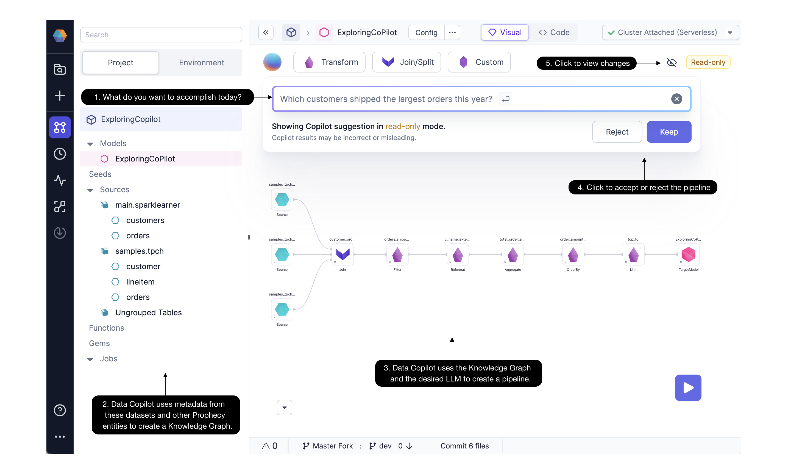
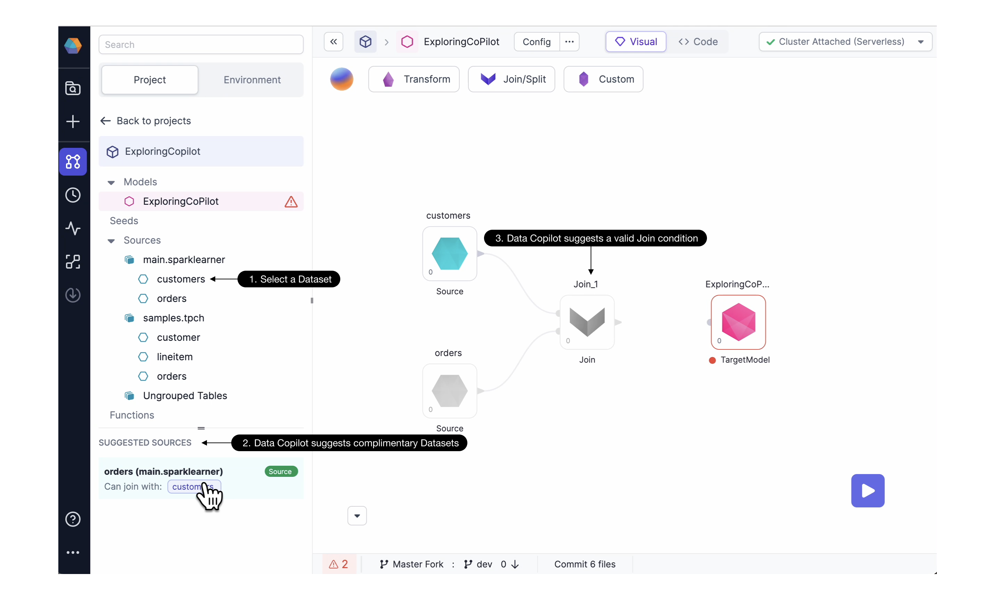
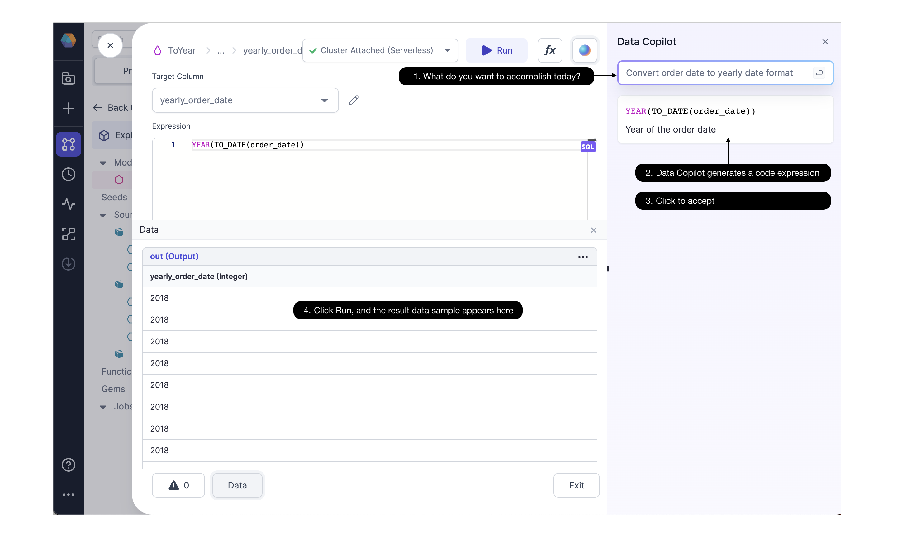
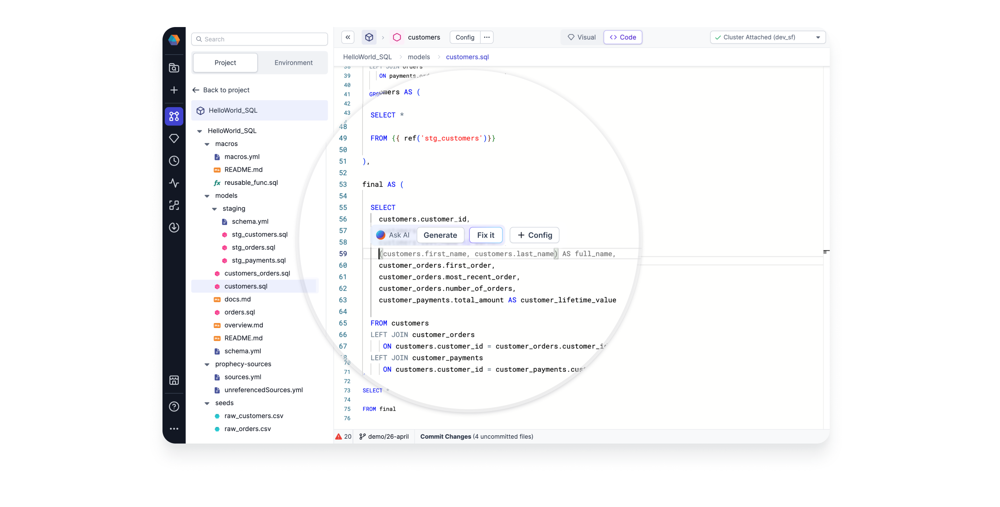

Prophecy Data Copilot provides suggestions from an AI model as you develop your data Pipelines. You can view and incorporate suggestions directly within the Prophecy visual editor and code editor. Data Copilot makes suggestions for your entire Pipeline, for a single Gem (transformation), and even for individual expressions within each Gem.

## Text to Pipelines

Get started on a new Pipeline quickly by typing your query into the text box and Data Copilot will generate a new Pipeline or modify an existing one.

### Start a new Pipeline

The following example uses Data Copilot to help start a Pipeline:

1. Type a prompt with English text, such as `Which customers shipped the largest orders this year?`
2. Data Copilot uses metadata from the accessible Datasets, Seeds, Models, and Pipelines, to create a Knowledge Graph.
3. Data Copilot uses OpenAI's language model to create the Pipeline based on the text prompt, with the Knowledge Graph as the context. This Pipeline is accessible in the visual editor as well as the code editor.
4. You can keep or reject the suggested Pipeline and interactively execute it to see the results.
5. View Data Copilot's suggested changes in the visual editor.

### Modify an existing Pipeline

You can also call Data Copilot to modify an existing Pipeline. Select which Gem should be the starting point for modifications downstream, and type a new text prompt. Data Copilot will suggest a new sequence of data transformations after the selected starting point.

## Next-transformation suggestions

Data Copilot can suggest the next transformation in a series or the next expression within a Gem.

### Suggest Gems

Data Copilot can suggest the next transformation in a series.

See the following example:

1. Select a Dataset of interest.
2. Data Copilot suggests Datasets which are frequently used with the selected Dataset.
3. Data Copilot then suggests a next transformation, in this case, a Join Gem.

### Suggest Expressions

At the more granular level, Data Copilot can suggest expressions within Gems.

Within our [advanced Expression Builder](/docs/spark/expression-builder.md) you can:

1. Type an English text prompt
2. Data Copilot generates a code expression for a particular column.
3. Click to accept the code expression or try again with a different prompt. Data Copilot’s returns are non-deterministic, so a retry can return a different expression.
4. Run the Pipeline up to and including this Gem, and observe the resulting data sample.

In addition to the visual editor above, you'll also see code suggestions in the code editor as below.

## Code with AI

## Map with AI

## Fix with AI

If your model has some errors, perhaps introduced upstream without your knowledge, Prophecy's Copilot will suggest fixes automatically.

<iframe src="https://fast.wistia.net/embed/iframe/17q9stsz6n?videoFoam=true" title="Drag and Drop Model Graph Video" allow="autoplay; fullscreen" allowtransparency="true" frameborder="0" scrolling="no" class="wistia_embed" name="wistia_embed" msallowfullscreen width="100%" height="100%"></iframe>

The Fix with AI option appears at any point where you see an error message.

## Auto Documentation

Understanding data assets is much easier with Data Copilot’s auto-documentation. Data Copilot delivers summary documentation suggestions for all Datasets, Pipelines, and Orchestrations.

<iframe src="https://fast.wistia.net/embed/iframe/9r86rl0lbz?videoFoam=true" title="Edit Code Video" allow="autoplay; fullscreen" allowtransparency="true" frameborder="0" scrolling="no" class="wistia_embed" name="wistia_embed" msallowfullscreen width="100%" height="100%"></iframe>

How did a Dataset change? Data Copilot recommends a description of the change for every edit you make.
How was a column computed? Data Copilot suggests a plain English description that explains how every column is generated and what it represents.

<iframe src="https://fast.wistia.net/embed/iframe/rec6bcdwet?seo=false?videoFoam=true" title="Design a Pipeline Video" allow="autoplay; fullscreen" allowtransparency="true" frameborder="0" scrolling="no" class="wistia_responsive_wrapper" name="wistia_embed" msallowfullscreen width="100%" height="100%"></iframe>

This is a big time saver! You can edit the documentation suggestions and commit them to your repository.

## Data Tests and Quality Checks

Unit tests and data quality checks are crucial for Pipeline and Job productionalization, yet many teams leave little time to develop these tests or worse, don’t build them at all. With Data Copilot, you’ll have one or more suggested [unit tests](/docs/spark/tests.md) that can be seamlessly integrated into your CICD process.

<iframe src="https://fast.wistia.net/embed/iframe/i1bjyf2zae?seo=false?videoFoam=true" title="Design a Pipeline Video" allow="autoplay; fullscreen" allowtransparency="true" frameborder="0" scrolling="no" class="wistia_embed" name="wistia_embed" msallowfullscreen width="100%" height="100%"></iframe>

Data Copilot also suggests data quality checks based on the data profile and expectations.
