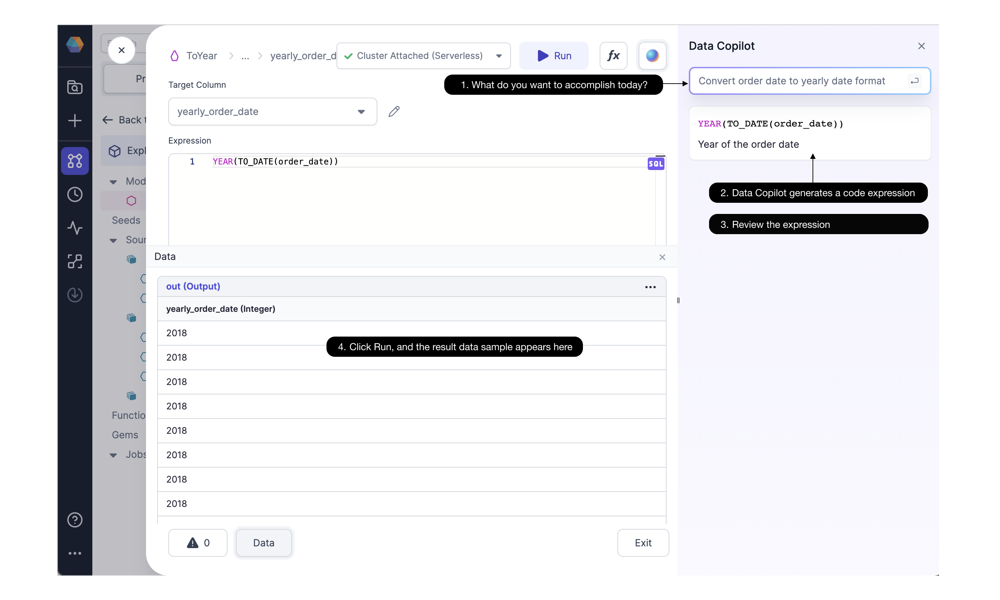

Prophecy Data Copilot provides suggestions from an AI model as you develop your data Pipelines and Models. You can view and incorporate suggestions directly within the Prophecy visual editor and code editor. Data Copilot makes suggestions for your entire Pipeline, for a single Gem (transformation), and even for individual expressions within each Gem.

## Supported AI capabilities by engine

Data Copilot supports the following capabilities for the Spark and SQL engines:

| AI Capability                                      | Spark                    | SQL                      |
| -------------------------------------------------- | ------------------------ | ------------------------ |
| Start a new Pipeline (Spark) or Model (SQL)        |   |   |
| Modify an existing Pipeline (Spark) or Model (SQL) |  |   |
| Suggest Gems                                       |   |   |
| Suggest Expressions                                |   |   |
| Generate with AI, Scripts                          |   |  |
| Generate with AI Functions                         |   |   |
| Map with AI                                        |  |   |
| Code with AI                                       |  |   |
| Fix with AI, Gems                                  |  |   |
| Fix with AI, Expressions                           |   |   |
| Auto Documentation                                 |   |   |
| Data Tests and Quality Checks                      |   |   |

## Text to Pipelines

Get started on a new Pipeline quickly by typing your prompt into the text box and Data Copilot will generate a new Pipeline or modify an existing one.

### Start a new Pipeline

The following example uses Data Copilot to help start a Pipeline:

1. Type a prompt with English text, such as `Which customers shipped the largest orders this year?`
2. Data Copilot uses metadata from the accessible Datasets, Seeds, Pipelines, and Models, to create a Knowledge Graph.
3. Data Copilot uses OpenAI's language model to create the Pipeline based on the text prompt, with the Knowledge Graph as the context. This Pipeline is accessible in the visual editor as well as the code editor.
4. If you'd like, review the suggested changes before you decide to keep or reject the suggested Pipeline. Then interactively execute it to see the results.
5. View Data Copilot's suggested changes in the visual editor.

### Modify an existing Pipeline

You can also call Data Copilot to modify an existing Model. Type a new text prompt, and Data Copilot will suggest a new sequence of data transformations. You don't necessarily have to select where you want to make your modification for Data Copilot to make its suggestion.

<iframe src="https://fast.wistia.net/embed/iframe/a2x6kkzy8y?videoFoam=true" title="Modify an existing Pipeline" allow="autoplay; fullscreen" allowtransparency="true" frameborder="0" scrolling="no" class="wistia_embed" name="wistia_embed" msallowfullscreen width="100%" height="100%"></iframe>

## Next-transformation suggestions

Data Copilot can suggest the next transformation in a series or the next expression within a Gem.

### Suggest Gems

Data Copilot can suggest the next transformation in a series as long as there is an open Tail node.

See the following Join suggestion example:

1. Select a Dataset of interest.
2. Data Copilot suggests Datasets which are frequently used with the selected Dataset.
3. Data Copilot then suggests a next transformation, in this case, a Join Gem.

### Suggest Expressions

At the more granular level, Data Copilot can suggest expressions within Gems.

Within our [advanced Expression Builder](/Spark/expression-builder) you can:

1. Type an English text prompt.
2. Data Copilot generates a code expression for a particular column.
3. Review the code expression, and if you'd like, try again with a different prompt.
4. Run the Pipeline up to and including this Gem, and observe the resulting data sample.

## Generate with AI

Data Copilot can generate scripts, user-defined functions, or functions for macro within a Gem.

<iframe src="https://fast.wistia.net/embed/iframe/vhf63tjnun?videoFoam=true" title="Modify an existing Pipeline" allow="autoplay; fullscreen" allowtransparency="true" frameborder="0" scrolling="no" class="wistia_embed" name="wistia_embed" msallowfullscreen width="100%" height="100%"></iframe>

## Map with AI

You don't have to worry about mapping the schema across your Model. Data Copilot will map the target schema with the existing Gems and datasets.

<iframe src="https://fast.wistia.net/embed/iframe/p5ab7sgfdw?videoFoam=true" title="Modify an existing Pipeline" allow="autoplay; fullscreen" allowtransparency="true" frameborder="0" scrolling="no" class="wistia_embed" name="wistia_embed" msallowfullscreen width="100%" height="100%"></iframe>

## Code with AI

In addition to the visual editor above, you'll also see code suggestions in the code editor.

Data Copilot helps you build your Model in the code interface by making predictions as you type your code. And when you go back to the visual interface, you'll see your code represented as a Model.

<iframe src="https://fast.wistia.net/embed/iframe/7lff0jpqnm?videoFoam=true" title="Modify an existing Pipeline" allow="autoplay; fullscreen" allowtransparency="true" frameborder="0" scrolling="no" class="wistia_embed" name="wistia_embed" msallowfullscreen width="100%" height="100%"></iframe>

## Fix with AI

If your model has some errors, perhaps introduced upstream without your knowledge, Prophecy's Copilot will suggest fixes automatically.

The Fix with AI option appears at any point where you see an error message.

<iframe src="https://fast.wistia.net/embed/iframe/17q9stsz6n?videoFoam=true" title="Drag and Drop Model Graph Video" allow="autoplay; fullscreen" allowtransparency="true" frameborder="0" scrolling="no" class="wistia_embed" name="wistia_embed" msallowfullscreen width="100%" height="100%"></iframe>

## Auto Documentation

Understanding data assets is much easier with Data Copilot’s auto-documentation. Data Copilot delivers summary documentation suggestions for all Datasets, Pipelines, Models, and Orchestrations.

Here Data Copilot provides a high-level summary of a Pipeline and more detailed description of each Gem.

<iframe src="https://fast.wistia.net/embed/iframe/9r86rl0lbz?videoFoam=true" title="Edit Code Video" allow="autoplay; fullscreen" allowtransparency="true" frameborder="0" scrolling="no" class="wistia_embed" name="wistia_embed" msallowfullscreen width="100%" height="100%"></iframe>

How did a Dataset change? Data Copilot recommends a description of the change for every edit you make.
How was a column computed? Data Copilot suggests a plain English description that explains data sources and how every column is generated and what it represents.

<iframe src="https://fast.wistia.net/embed/iframe/rec6bcdwet?seo=false?videoFoam=true" title="Design a Pipeline Video" allow="autoplay; fullscreen" allowtransparency="true" frameborder="0" scrolling="no" class="wistia_responsive_wrapper" name="wistia_embed" msallowfullscreen width="100%" height="100%"></iframe>

This is a big time saver! You can edit the documentation suggestions and commit them to your repository.

In addition to data sources and column summaries, Data Copilot also auto-documents your Project description, as well as your Git Commit Message and Release Note. And it can auto-label your Gems.

## Data Tests and Quality Checks

Unit tests and data quality checks are crucial for Pipeline and Job productionalization, yet many teams leave little time to develop these tests or worse, don’t build them at all. With Data Copilot, you’ll have one or more suggested [unit tests](/Spark/tests) that can be seamlessly integrated into your CICD process.

<iframe src="https://fast.wistia.net/embed/iframe/i1bjyf2zae?seo=false?videoFoam=true" title="Design a Pipeline Video" allow="autoplay; fullscreen" allowtransparency="true" frameborder="0" scrolling="no" class="wistia_embed" name="wistia_embed" msallowfullscreen width="100%" height="100%"></iframe>

Data Copilot also suggests data quality checks based on the data profile and expectations.
