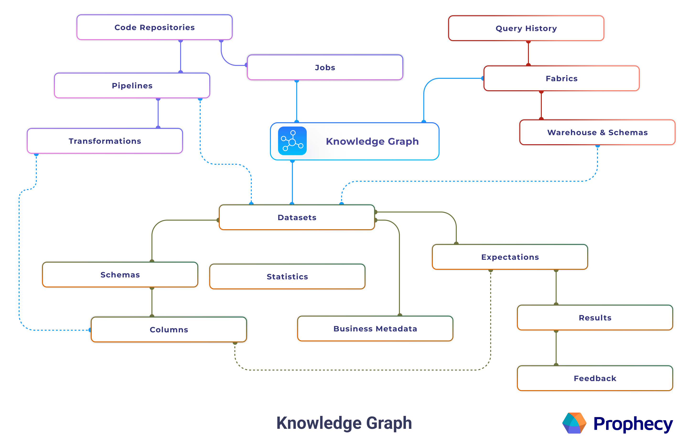
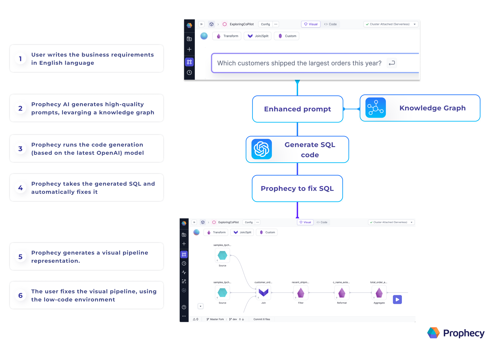

Prophecy’s end-to-end platform makes data Pipeline development faster and accessible to more users. On top of that, you have an AI assistant to boost that productivity even further.

## Building Models and Pipelines with Prophecy’s Data Copilot

<iframe src="https://fast.wistia.net/embed/iframe/t7m3boc575?seo=false?videoFoam=true" title="Design a Pipeline Video" allow="autoplay; fullscreen" allowtransparency="true" frameborder="0" scrolling="no" class="wistia_embed" name="wistia_embed" msallowfullscreen width="100%" height="100%"></iframe>

## Knowledge Graph

Data Copilot works by enhancing the user’s prompt using a knowledge graph.

Our knowledge graph includes metadata for a Project’s entities (such as Datasets, Schemas, Seeds, Models, and Pipelines) and the statistical usages of these entities. We built the knowledge graph intentionally to include metadata but not data. The Dataset structure is included in the knowledge graph but individual Dataset records are not.

Prophecy sends the enhanced Prompt to OpenAI. The model returns SQL or Spark code, and Prophecy verifies whether this code is valid. Once Prophecy fixes the code, Prophecy generates a visual Pipeline and displays this Pipeline to you for review.

## Deployment

Data Copilot is available for all customers using Prophecy’s managed Public SaaS offering and uses the public SaaS version of OpenAI's Language model. Customers using the Private SaaS or on-prem offerings can enable Data Copilot as a flag in the deployment / upgrade configuration.

See [Enable Data Copilot](/concepts/copilot/enable-data-copilot) for more details.

## FAQ

###

#### How is Prophecy Copilot different than Github Copilot?

Github Copilot is a great tool to boost productivity and extend the reach of the coding community. However, not every problem is solved with direct coding. More importantly, users need a Copilot with some context of the interesting data.

For teams of analysts, data platform providers, or line-of-business users, the pain points are not resolved by teaching every team member how to code. Data Copilot empowers less technical users because they don’t have to code. Importantly, technical and coding users benefit from Data Copilot because visual Pipelines are easier to understand, explain, and leverage. Prophecy’s Data Copilot boosts the productivity of the business user and the more technical coding team members.

When all of these data practitioners reach for an AI assistant, they’ll need one specific to the data space. For example, the assistant should collect metadata from the Databricks Workspace. Prophecy Data Copilot has the context of your data, and it can guide Pipeline and model development by suggesting which Datasets to use and how to use them.

Github Copilot and Prophecy Data Copilot are both excellent tools to boost productivity, but Prophecy Data Copilot is accessible to a larger user base and can make data suggestions because it maintains data context.

#### Which Datasets are accessible to Prophecy Data Copilot?

In Prophecy’s 3.1 release, any Dataset, Source, or Seed within a Project are accessible when Data Copilot is called from that Project. In an upcoming release, this behavior may change as follows: The assets need only to be part of the linked (Databricks, Snowflake, etc.) catalog. That is, if the user can access the Datasets with their personal access token, then Datasets should appear in the Environment tab and Copilot can access them.

#### How much will I pay for Prophecy Copilot?

Copilot features are included with Prophecy’s Spark and SQL offerings. There would be an additional cost if you chose to use a private subscription Large Language Model (LLM) service. In this case, the cost depends on the following:

- the number of [word tokens](https://help.openai.com/en/articles/4936856-what-are-tokens-and-how-to-count-them) sent to the LLM provider
- the size of the Datasets, and
- the number of iterations Prophecy sends requests to the LLM provider

#### Can I use my own private OpenAI instance?

In a future release, Administrators will have the option to connect Prophecy Data Copilot to their private subscription OpenAI.

#### Does Prophecy Data Copilot support text prompts in languages other than English?

While Prophecy does not actively test prompt languages other than English, the LLM providers do provide such support. Explorations of this area would be at the user discretion.

## Try Data Copilot

Learn more about Prophecy [here](https://www.prophecy.io/), where you can sign up for a free trial account or schedule a demo. We'd love to hear your feedback!

We are open to feedback! Please send us an email (contact.us@Prophecy.io) or reach out on our Slack [community.](https://join.slack.com/t/prophecy-io-support/shared_invite/zt-moq3xzoj-~5MSJ6WPnZfz7bwsqWi8tQ)
