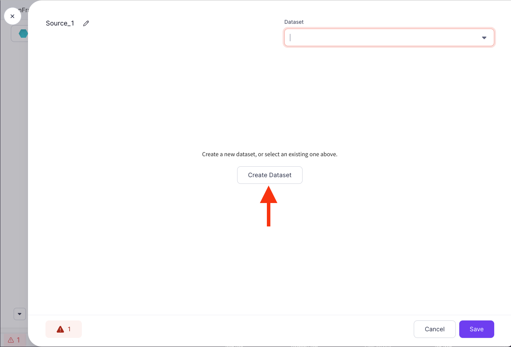
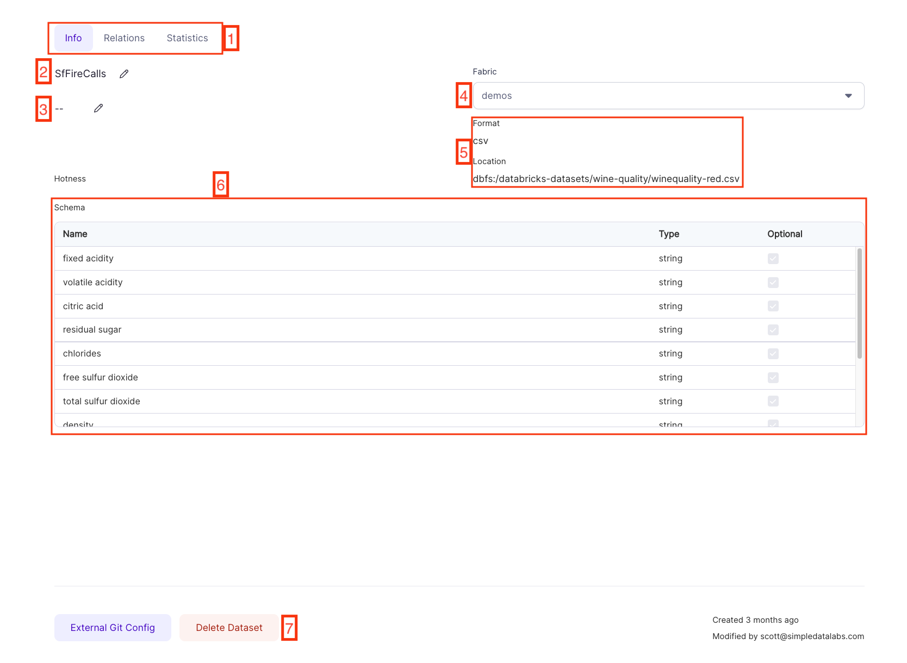
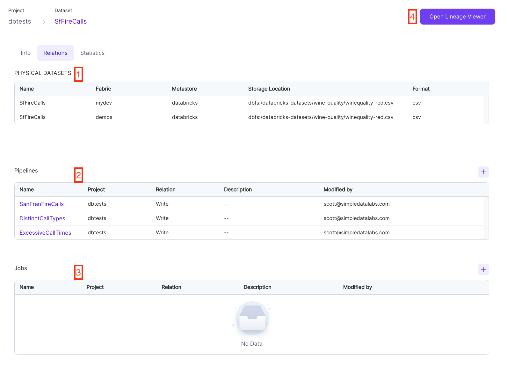
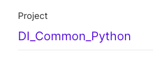
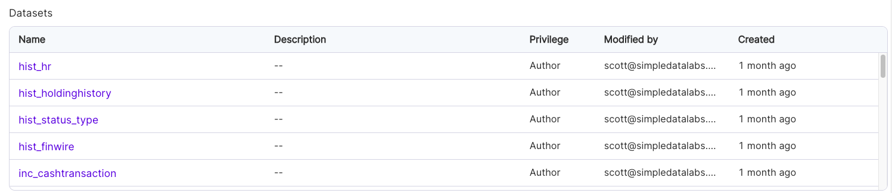

Datasets in Prophecy are the union of two concepts:

1. **Schema**: Schema, in this case, is the _shape_ of the data. Column names, their types and _how_ to read and write the data that fits this schema
2. **Fabric**: The [Fabric](fabrics/fabrics.md) is the execution environment in which this data resides.

In short: **_WHAT_** your data looks like and **_HOW_** to read it or write it in a given Fabric. Datasets are grouped together in [Projects](project).

## Creating a Dataset

Datasets are created where they're first used: When creating `Source`s or `Target`s. Opening a `Source` or `Target` Gem will show a screen where you can either pick from an existing Dataset, or create a new one.

The screens that follow will depend on what _kind_ of [Source or Target](../low-code-spark/gems/source-target/source-target.md) in question. Once you finish configuring the Dataset, give it a name and click `Save`. This Dataset can now be used by Pipelines within this project, and in some cases can even be used by other projects _within the same Team_. This makes defining common `Source`s and `Target`s super easy!

## Viewing project Datasets

There's two places to see Datasets: The [Dataset list](https://app.prophecy.io/metadata/entity/user/datasets), which displays all Datasets across all of your Projects, and the [Project Metadata](project/#project-metadata) section of a Project page, which is scoped to the Datasets of that given project.

## Dataset Metadata

If you navigate to the Metadata page for one of the Datasets you'll see the following:

|     | Name                | Description                                                                                                     |
| :-: | ------------------- | --------------------------------------------------------------------------------------------------------------- |
|  1  | Metadata views      | Switch between the different views of the Metadata page                                                         |
|  2  | Dataset name        | The name of this Dataset. Clicking the pencil icon to edit the name                                             |
|  3  | Dataset description | Description of this Dataset                                                                                     |
|  4  | Fabric dropdown     | Switch between the various Fabrics available to your account to see how this Dataset is defined for that Fabric |
|  5  | Dataset properties  | A small subset of the properties used for Reading or Writing to this Dataset                                    |
|  6  | Dataset schema      | This Dataset's Columns and their types                                                                          |
|  7  | Delete Dataset      | Delete this Dataset. Use with caution.                                                                          |

## Dataset Relations

On the [Dataset Metadata](#dataset-metadata) page, you'll find the `Relations` tab.

|     | Name                | Description                                                                                                                                   |
| :-: | ------------------- | --------------------------------------------------------------------------------------------------------------------------------------------- |
|  1  | Physical Datasets   | Each _Physical Dataset_ represents a variation of this Dataset in a particular Fabric.                                                        |
|  2  | Pipelines           | This is a list of Pipelines that use this Dataset in some way. The `Relation` column will indicate if this is for `Read` or `Write` purposes. |
|  3  | Jobs                | This is a list of Jobs that use this Dataset in some way. The `Relation` column will indicate if this is for `Read` or `Write` purposes.      |
|  4  | Open Lineage Viewer | Opens this Dataset in the [Lineage](../metadata/lineage.md) Viewer, showing column-level lineage for this Dataset.                            |

## Publishing/Sharing Datasets

As part of the [Project Release](project/#release) process, Datasets within that Project are _published_ to other Projects within the same Team, and can be published to other Teams in read-only mode. This allows you to share your Dataset configurations with other Teams without allowing them to make changes to the original Dataset definitions. Let's see this in action:

1. `DI_TEAM` is the central Data Infrastructure team. They have defined a common Project named `DI_Common_Python`:
   
2. `DI_Common_Python` has a number of Datasets defined within it:
   
3. The `DI_Team` merges and releases (following [this](project/#development-and-deployment) development pattern) the `DI_Common_Python` Project, tagging it `0.1`:
   
4. As you can see, the `DI_Team` has published the `DI_Common_Python` project to the `DE_Team`, the Data Engineering Team.
5. Now, whenever the `DE_Team` builds Pipelines, they can see the following:
   

We can see the `DI_Common_Python` Project's Datasets, and the fact that they're listed as `Read-only`. This means that `DE_Team` can _use_ the Datasets, but cannot _edit_ them.
