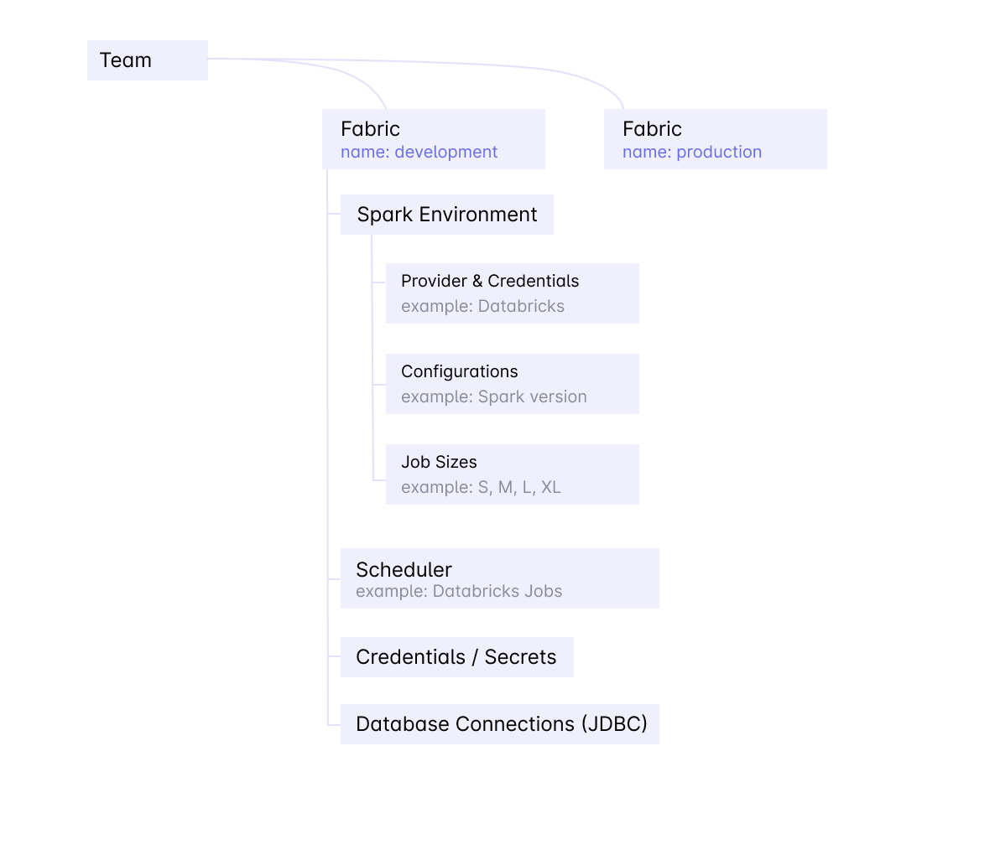

Fabric is a logical execution environment. Teams organize their data engineering into multiple environments such as _development_, _staging_, and _production_.

## Common Usage Pattern

- Admin sets up a Prophecy account and creates a `dev` Fabric for _development_, and `prod` Fabric for _production_
- Admin adds a team for Marketing Decision Support System (`Marketing_DSS`)
- Users in the `Marketing_DSS` Team have access to
  - `dev` Fabric for development
  - `prod` Fabric for production Pipelines

## What's in a Fabric

Fabric includes everything required to run a data Pipeline

- **Spark Environment**
  - This is a named Spark environment, owned by one team and used by _one or more_ teams
  - It contains
    - **Connection Credentials** - for Databricks this includes the _Workspace URL_ and the _Access Token_
    - **Cluster Configuration** - for Databricks this includes the _Databricks Runtime Version_, _Machine Type_, and _Idle Timeout_
    - **Job Sizes** - for convenience Prophecy enables you to create commonly used cluster sizes and name them. For example an XL cluster might be 10 servers of `i3.xlarge` instance type that will have 40 CPUs and 70GB memory
- **Scheduler**
  - Scheduler runs one more Spark data Pipelines based on a schedule (e.g. every weekday at 9am)
  - Databricks workspaces come with a default scheduler that is always available
  - Enterprise environments have the Airflow Scheduler option as well
- **Database Connections**
  - Data Pipelines will often read operational databases such as MySql or Postgres, and read/write Data Warehouses such as Snowflake
  - JDBC or other connections to these databases can be stored on the Fabric
- **Credentials and Secrets**
  - Prophecy enables you to store credentials safely in the Databricks environment. You can store key-value pairs as secrets that are made available for reading to the running workflows.
  - Please note that after a secret is created it is only readable by a running Job. Prophecy does not have access to this value.

## How to create a Fabric

Prophecy provides you with three different types of fabrics.

### **Prophecy Managed** -

Using this option, you can create a 14-Day Free Trial Fabric, On Prophecy Managed Databricks. This you can use when trying out Prophecy and when you don't want to spawn your own Spark Execution Environment. We already have some sample data and tables created to try out the different functionalities.
Please refer below video for step-by-step example

<iframe src="https://user-images.githubusercontent.com/121796483/217787623-1cf01df2-54d6-4338-bd59-bd921e101ce9.mp4" title="Databricks Fabric" allow="autoplay;fullscreen" allowtransparency="true" frameborder="0" scrolling="no" class="wistia_embed" name="wistia_embed" msallowfullscreen width="100%" height="100%"></iframe>

In this Fabric you can only change the [Databricks Runtime version](https://docs.databricks.com/runtime/dbr.html#databricks-runtime). The auto-termination timeout, Executor and Driver Machine Type and Job sizes in uneditable.

### **Databricks**

If using Databricks, to manage your Spark execution environment, you can use this option to create a Fabric. Think of a fabric as connection to your [Databricks workspace](https://docs.databricks.com/workspace/index.html#navigate-the-workspace).
Please refer below video for step-by-step example

<iframe src="https://user-images.githubusercontent.com/121796483/217735090-41853091-ef2e-4d60-bdf6-62fe31a7ee3b.mp4" title="Databricks Fabric" allow="autoplay;fullscreen" allowtransparency="true" frameborder="0" scrolling="no" class="wistia_embed" name="wistia_embed" msallowfullscreen width="100%" height="100%"></iframe>

- **Databricks Credentials** - Here you will provide your Databricks Workspace URL and the [Personal Access token](https://docs.databricks.com/dev-tools/api/latest/authentication.html#generate-a-personal-access-token)
- **Cluster Details** - Here you would need to provide the [Databricks Runtime version](https://docs.databricks.com/runtime/dbr.html#databricks-runtime), Executor and Drive Machine Types and Termination Timeout if any. These cluster details will be used when creating a cluster for Interactive and Scheduled Job runs.
- **Job sizes** - By default, you will see a Small Job size pre created. You can edit or add more Job sizes.Here you can provide total number of the Executors and Core and Memory for them.
- **Prophecy Library** - These are some Scala and Python libraries written by Prophecy to provide additional functionalities on top of Spark. These need to be installed in you Spark execution environment when you spawn a new Session. These are publicly available on Maven central and Pypi respectively.

### **Livy**

[Apache Livy](https://livy.apache.org/) is a service that enables easy interaction with a Spark cluster over a REST interface. If you're running Spark-on-hadoop, most Hadoop distributions (CDP/MapR) come with livy bundled, you just need to enable it. For Spark-on-k8s, you can put a livy in the k8s cluster which exposes Spark over rest API.

Please refer below video for step-by-step example

<iframe src="https://user-images.githubusercontent.com/121796483/217732038-d01bbfbe-a140-4661-a279-1b4858ab2285.mp4" title="Livy Fabric" allow="autoplay;fullscreen" allowtransparency="true" frameborder="0" scrolling="no" class="wistia_embed" name="wistia_embed" msallowfullscreen width="100%" height="100%"></iframe>

- **Spark Connection** - Here you will provide the Livy URL, Authentication, Spark version and Scala version. If Spark and Scala version are not given, the values are 2.3.0 for Spark and 2.11 for Scala by default.

- **Job sizes** -
  By default, you will see a Small Job size pre created. You can edit or add more Job sizes. A Job sie consists off

  - Size of the Driver: Driver Core and Memory
  - Size of the Executor: Core and Memory for each executor
  - Total number of Executors

- **Prophecy Library** -
  These are some Scala and Python libraries written by Prophecy to provide additional functionalities on top of Spark. These need to be installed in you Spark execution environment when you spawn a new Session. These are publicly available on Maven central and Pypi respectively.

- **Spark Config** -
  These are additional [Spark Properties](https://spark.apache.org/docs/latest/configuration.html#available-properties) you can set which are applied at startup of session.
  For example if your Spark installation is configured to have dynamic allocation enabled, you can disable it for sessions created through Prophecy.
