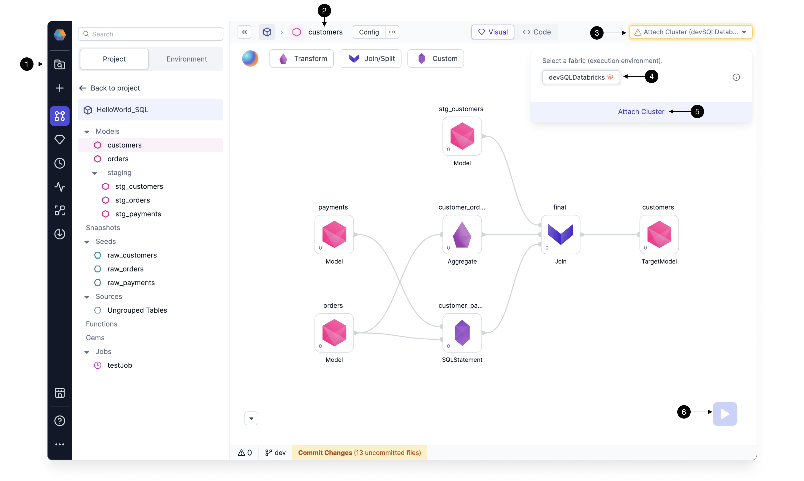

Prophecy helps you develop data pipelines in high-quality Spark or SQL code—but what does Prophecy use to compute these pipelines? The first thing to understand before building any pipeline is that your pipeline must be connected to an **execution environment**.

This is why **fabrics** exist in Prophecy. Fabrics let Prophecy connect to specific execution environments and data storage.

## Use case

Here is one way you might set up your fabrics. First, the team admin creates:

- A team named Marketing_DSS for the Marketing Decision Support System users.
- A `dev` fabric for development activities that specifies the Marketing_DSS team.
- A `prod` fabric for production pipelines that specifies the Marketing_DSS team.

In this example, all users in the Marketing_DSS Team will have access to the `dev` and `prod` fabrics.

## Components

Fabrics include everything required to run a data pipeline. As an example, the following table describes the components of a Databricks Spark fabric.

| Component              | Description                                                                                                                                                                                                                               |
| ---------------------- | ----------------------------------------------------------------------------------------------------------------------------------------------------------------------------------------------------------------------------------------- |
| Connection Credentials | Includes details like _Workspace URL_ and _Access Token_ for Databricks.                                                                                                                                                                  |
| Cluster Configuration  | Defines settings such as _Databricks Runtime Version_, _Machine Type_, and _Idle Timeout_.                                                                                                                                                |
| Job Sizes              | Lets you define reusable cluster sizes (e.g., an XL cluster with 10 i3.xlarge servers, 40 CPUs, and 70GB memory).                                                                                                                         |
| Scheduler              | Executes Spark data pipelines on a defined schedule, such as weekdays at 9:00 AM. Databricks provides a default scheduler, and an Airflow Scheduler is available for enterprise users.                                                    |
| Database Connections   | Supports connections to databases (MySQL, Postgres) and data warehouses (Snowflake) via JDBC or other protocols. Credentials are securely stored on the fabric for reuse.                                                                 |
| Metadata Connection    | Enhances fabric management for large datasets, useful for users handling hundreds or thousands of tables. [Learn more](/docs/administration/metadata-connections.md).                                                                     |
| Credentials & Secrets  | Securely stores credentials in Databricks using Personal Access Tokens (PAT) or [Databricks OAuth](/docs/administration/authentication/databricks-oauth.md). Secrets are stored as key-value pairs, accessible only to running workflows. |

## Fabric creation

A team admin typically sets up fabrics. Detailed steps for fabric creation can be found in the [Set up Spark fabrics](/administration/Spark-fabrics/Fabrics) and [Set up SQL fabrics](/administration/sql-fabrics/Fabrics) sections of the documentation.

Even though teams share fabrics, **each user must add their individual credentials** to be able to use the fabric in their projects.

:::info
Prophecy provides a trial Prophecy-managed fabric that can get you started with building your pipelines. However, you will need to connect to external execution environments for your production workflows.
:::

## Fabric usage

When you create a fabric, you define the team that owns the fabric. If you are a member of that team, you will be able to use the fabric. To attach a fabric to a project:

1. Open a project from the Prophecy metadata page.
1. Open a pipeline or model that you want to work on.
1. Expand the **Attach Cluster** menu. This menu will differ slightly between Spark and SQL projects.
1. Select a fabric. You will be shown fabrics that have the same data provider as your project (e.g., Databricks).
1. Attach to a cluster or create a new cluster.
1. Run your pipeline or model. This executes the data transformation on the environment defined in the fabric!

## Fabric metadata

A list of all fabrics available to you can be found in the **Fabrics** tab of the **Metadata** page.

You can click into each fabric to access the fabric settings. These will resemble the settings that appear during fabric creation.

## Hands-on

Get started with hands-on guides. Learn step by step how to connect to your execution engine by creating a fabric:

1. Create a SQL fabric with a JDBC or Unity Catalog connection following [this guide](docs/getting-started/tutorials/sql-with-databricks.md).
2. Create a Databricks fabric following [these steps](/docs/administration/Spark-fabrics/databricks/databricks.md).
3. Create an EMR fabric with Livy step by step [here](/docs/administration/Spark-fabrics/emr.md).
