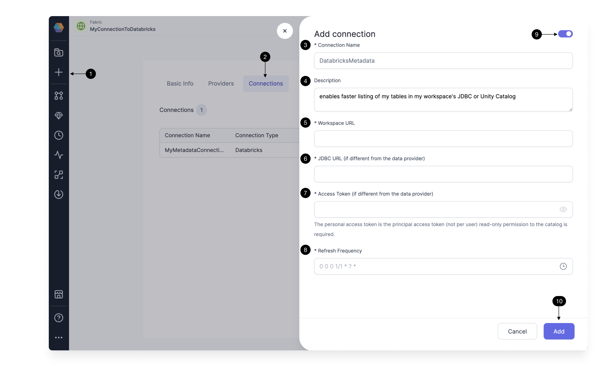

At Prophecy we're always looking to make your development faster. For teams that manage hundreds or thousands of tables, listing data catalogs, tables, and schemas can take precious minutes. In order to make this easier, Prophecy introduced Metadata Connections in release 3.2. The major benefit to Metadata Connections: you can list and view your data directly in the [Prophecy UI](/docs/concepts/project/project.md#Environment-tab).

Let's get down to basics by [defining](#definition-of-entities) the relevant entities in Prophecy, setup the relevant data resource, then we'll walk through how to [setup](/#setup-resources) Metadata Connections in Prophecy.

## Definition of entities

### Metadata Connection

A Metadata Connection is a user-defined link between Prophecy and a data provider. Its purpose is to establish communication between Prophecy and external systems. For instance, a Metadata Connection can be established between Prophecy and platforms like Databricks (Catalog or JDBC). Different from Metadata Connections, Prophecy also supports Airflow Connections which perform a similar function for Airflow jobs.

### Fabric

A Fabric represents a logical grouping of Connections. For Prophecy 3.2, each Fabric will enable only one Metadata Connection. Fabrics contain the user credentials for a data provider, whereas Metadata Connections have the added benefit of syncing metadata from the data provider at a defined interval.
:::info
The Fabric token should provide the user's personal permissions to read / write data.
The Metadata Connection token, optionally provided to enhance performance, should be a service principal with read-only permissions on the appropriate catalog and JDBC tables.
:::

### Cluster/Warehouse

A Cluster, also referred to as a Warehouse, represents a collection of resources that a Metadata Connection can utilize. Clusters are specific to certain data platforms or systems. For instance, a Snowflake Metadata Connection can access different warehouses that are available to the user. By associating a Metadata Connection with a workspace or warehouse, users can leverage the resources defined by the data providers.

## Setup Resources

### Setup Provider Tokens

Prophecy Metadata Connections will use APIs to make calls to your data provider accounts. For this access, a Service Principal is recommended. For Databricks providers, follow these [instructions](https://docs.databricks.com/en/dev-tools/service-principals.html#provision-a-service-principal-for-databricks-automation---databricks-ui) to create a service principal and associated token. If you are unable to setup a Service Principal, use a standard Personal Access Token.

The Service Principal will need access to the [Workspace](https://docs.databricks.com/en/security/auth-authz/access-control/enable-access-control.html#enable-access-control-for-workspace-objects) and, if you're using a cluster for the metadata connection, the Service Principal will need access to create clusters. If you're not using Unity Catalog for the Metadata Connection, the Service Principal will need access to [Databricks SQL.](https://docs.databricks.com/en/sql/admin/index.html#grant-user-access-to-databricks-sql)

### Grant permissions

The service principal must be able to collect metadata from any desired catalog or metastore in the workspace.

To grant the needed permissions on Unity Catalog, grant permissions to the service principal to read the catalogs, which by default grants the same permission on all schemas within that catalog:

```
GRANT SELECT ON CATALOG <catalog> TO <service_principal>;
```

To grant the needed permissions on a Hive Metastore, grant usage, read, and select on the catalog, which by default applies these same permissions to the catalog's schemas. These permissions would be needed for any relevant metastore catalog in addition to the default Hive Metastore catalog.

```
GRANT USAGE, READ_METADATA, SELECT ON CATALOG <hive_metastore> TO <service_principal>;
```

### Setup SQL Warehouse or Cluster

Prophecy supports metadata collection through SQL Warehouses and Clusters on Databricks and Snowflake. In general, we recommend to create a [SQL Warehouse](https://docs.databricks.com/en/sql/admin/create-sql-warehouse.html#create-a-sql-warehouse) or cluster dedicated to the Metadata Connection. Using this approach, the recurring metadata syncs can have a cluster defined with appropriate resources, whereas execution clusters defined in the [Fabric](/docs/concepts/fabrics/fabrics.md) `Provider` would have a separate resource profile.

Alternatively, the Metadata Connection can use the same Warehouse or Cluster which is being used for execution. In that case, the resources would be shared.

## Setup Prophecy Entities

### User Permissions

System Admins can define and monitor Metadata Connections for platform users. Then, Data Practitioners can use Metadata Connections within their Pipelines.

### Add a Metadata Connection

Once a [Fabric](/docs/administration/spark-fabrics/databricks/databricks.md) is **(1)created**, a **(2)Metadata Connection** is an optional step to enable syncing metadata for a particular cluster or warehouse accessible via the Data Provider. Add a Metadata Connection by providing the following details.



Define a **(3)Connection Name**, and add an optional **(4)Description** for your team's understanding. Define the **(5)Workspace URL**, which could be a Databricks workspace. Within that Workspace, all the accessible Data Catalogs will be included in the syncing. If you choose to define a **(6)JDBC URL** different than that defined in the Fabric, the Metadata Connection JDBC will be the only JDBC included in the syncing. Now define the **(7)Access Token** for the Metadata Connection. Like the JDBC URL, the Access Token is only required if different from that defined in the Fabric. The Access Token created for the workspace must have read permission for the Catalogs or JDBC databases, tables, and schemas of interest. The access token should be a [service principle token](https://docs.databricks.com/en/administration-guide/users-groups/service-principals.html#manage-service-principals-in-your-account) (recommended) or a personal access token.

Define the **(8)Refresh Frequency** for Prophecy to sync the metadata from the workspace catalogs and JDBC warehouses accessible to the access token. **(9)Enable** the Metadata Connection to proceed with the sync and **(10)Add** the Metadata Connection.

Once a Connection is configured, the Connection details will be used to display data in the [Project Browser](/docs/concepts/project/project.md#project-browser) `Environment` tab.


Inside a Project, **(1)Attach a Fabric** which has a Metadata Connection. Now the **(2)Environment** tab lists the data accessible in the provider **(3)Workspace** synced at the frequency defined in the Metadata Connection. So thousands of tables should be visible more quickly as the data is synced regularly. Browse the catalogs, databases, and tables. Add a **(4)table** to the canvas as a Dataset, and define whether your Dataset should be a **(5)Source or Target**. Now the Dataset **(6)appears** on the canvas, ready for transformations.

:::caution
Only one Metadata Connection can be enabled per Fabric at once.
:::
