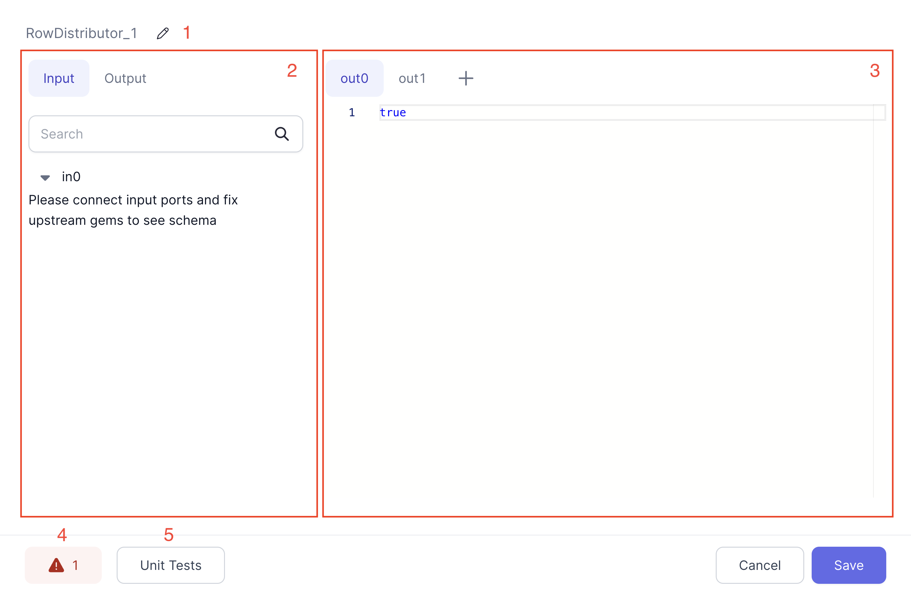
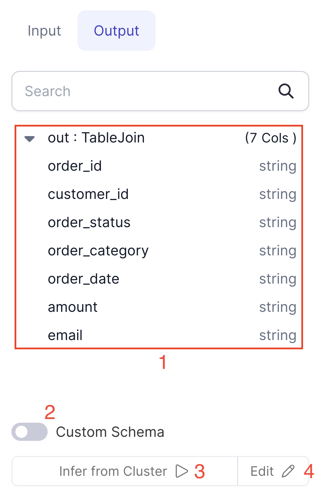

If a [Pipeline](./pipelines.md) is a roadmap of the journey that your data will take from Start to Finish, the Gems are the stops to make along the way. Each Gem _instance_ comes with their own configuration and each produces its own block of output code. Each Gem instance can be seen as just another Spark DataFrame.

## Gem UI

Since Gems are so integral to working with Prophecy, there are a number of UI components that are related to working with them.

### Gem Drawer


In the pipeline editor you'll find the _Gem Drawer_. This organizes the Gems into one of several categories:

:::info
The Gem list will depend on two factors: Your project language (Python/Scala) and if you are using SaaS Prophecy or have it deployed in your own architecture.
:::

| Gem category      | Definition                                                                                                     |
| ----------------- | -------------------------------------------------------------------------------------------------------------- |
| **Source/Target** | Gems related to [Sources/Targets](../low-code-spark/gems/source-target/source-target.md) and Lookups           |
| **Transform**     | Gems related to the [transformation](../low-code-spark/gems/transform/transform.md) of your data               |
| **Custom**        | [Custom](../low-code-spark/gems/custom/custom.md) gems and other gems that don't fit into the other categories |
| **Join/Split**    | Gems related to [splitting or joining](../low-code-spark/gems/join-split/join-split.md) datasets together.     |
| **Subgraph**      | Use [published subgraphs](../low-code-spark/gems/subgraph.md) in your pipeline                                 |

### Gem Instance

Once you've selected which Gem you want to use in your pipeline from the Drawer, an _Instance_ of the Gem will appear in the Pipeline Editor.


|     | UI element name   | Description                                                                                                                                                                       |
| :-: | ----------------- | --------------------------------------------------------------------------------------------------------------------------------------------------------------------------------- |
|  1  | Gem Instance name | The name of this particular instance. It must be unique within a given Pipeline. You can click this label to edit it.                                                             |
|  2  | Gem Type name     | The type of gem                                                                                                                                                                   |
|  3  | Error Indicator   | The error state of the Gem. If there's something wrong with the configuration of the gem this indicator will appear.                                                              |
|  4  | Input Ports       | [Input ports](./gems.md#inputsoutputs) that will accept connections from upstream Gems. If this Gem type supports multiple or editable inputs, more connections will appear here. |
|  5  | Output Ports      | [Output ports](./gems.md#inputsoutputs) that can be used with downstream Gems. If this Gem type supports multiple or editable outputs, more connections will appear here.         |
|  6  | Gem Phase         | The [Phase](#phase) for this instance. Used to define the order in which Gem instances are executed                                                                               |
|  7  | Open              | Open the UI for this Gem Instance                                                                                                                                                 |
|  8  | Run Button        | Runs this Gem, including all upstream Gems that are required.                                                                                                                     |
|  9  | Action menu       | Shows the Quick Action menu which allows you to change the [Phase](#phase), [Caching](#caching) or to Delete the instance.                                                        |

### Gem Configuration

Gem instances can be configured by hovering over their icons in the Pipeline Editor and clicking `Open`.



|     | UI element name   | Description                                                                                                                            |
| :-: | ----------------- | -------------------------------------------------------------------------------------------------------------------------------------- |
|  1  | Gem Instance name | The name of this particular instance. It must be unique within a given Pipeline.                                                       |
|  2  | Inputs/Outputs    | Inputs and outputs for this Gem instance. See [here](#inputsoutputs) for more information                                              |
|  3  | Gem Configuration | Configuration for this instance. Each Gem Type will have a different UI. See the documentation for each Gem type for more information. |
|  4  | Diagnostics       | If there's a problem with the configuration for this Gem instance, clicking here will show a list of configuration errors.             |
|  5  | Unit Tests        | Each Gem instance can have its own set of Unit tests. See [here](../low-code-spark/tests.md) for more details                          |

## Input/Output ports {#inputsoutputs}

Inputs and outputs define the connections going in to and coming out from a particular Gem Instance. Some Gem types support multiple inputs or multiple outputs, depending on their configuration.

### Inputs

Inputs define the incoming connections accepted by the Gem. Most Gem types only accept one connection, but some (Such as [Join](../low-code-spark/gems/join-split/join.md)) allow for as many inputs as you want.


|     | UI element name | Description                                                                                                                                                                                                                                                                  |
| :-: | --------------- | ---------------------------------------------------------------------------------------------------------------------------------------------------------------------------------------------------------------------------------------------------------------------------- |
|  1  | Search          | Filter fields across all inputs                                                                                                                                                                                                                                              |
|  2  | Add Input       | If the Gem Type supports it, you can click this button to add more input ports to this instance                                                                                                                                                                              |
|  3  | Input name      | If the Gem Type supports it, you can click the pencil icon to rename this port. Some Gem Types will use this name as part of its configuration. For example, a port named `input0` can be used in [Join](../low-code-spark/gems/join-split/join.md) for the join conditions. |
|  4  | Port schema     | The fields and schema types of the port. Will only appear when an upstream Gem instance is connected                                                                                                                                                                         |

### Outputs

Outputs define the outgoing schema(s) that will be available to downstream Gem instances. In some cases the Prophecy compiler can't infer the output schema automatically, so we've provided an option to try inferring the schema using your connected Fabric or just specifying it manually.



|     | UI element name    | Description                                                                                                     |
| :-: | ------------------ | --------------------------------------------------------------------------------------------------------------- |
|  1  | Output schema      | Output schema for this Gem instance. This will be the schema of the data that downstream Gem instances will use |
|  2  | Custom schema      | Toggle this to enable custom output schema editing                                                              |
|  3  | Infer from cluster | Run the Gem code on the connected cluster and infer the schema from the result                                  |
|  4  | Edit schema        | Edit the output schema manually                                                                                 |

### Port renaming

Most Gem types allow Inputs and Outputs to be renamed, which will have at least two effects: Renaming the input variable in the generated code and change the port name in the Pipeline Editor.


```python
  def Join_1(spark: SparkSession, input_one: DataFrame, in1: DataFrame, ) -> DataFrame:
    ...
```

## Phase

## Caching
