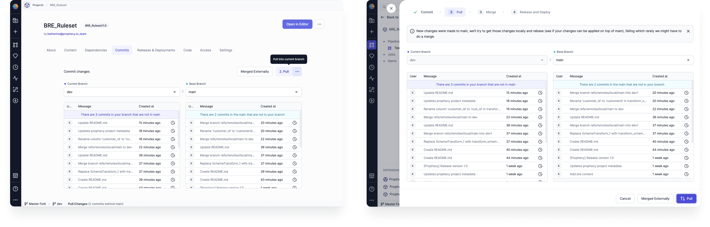
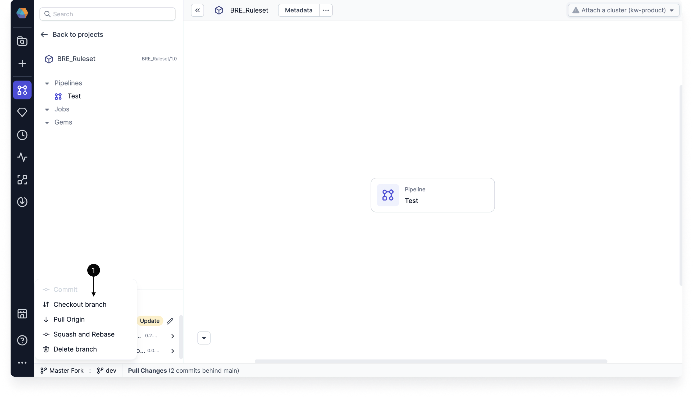
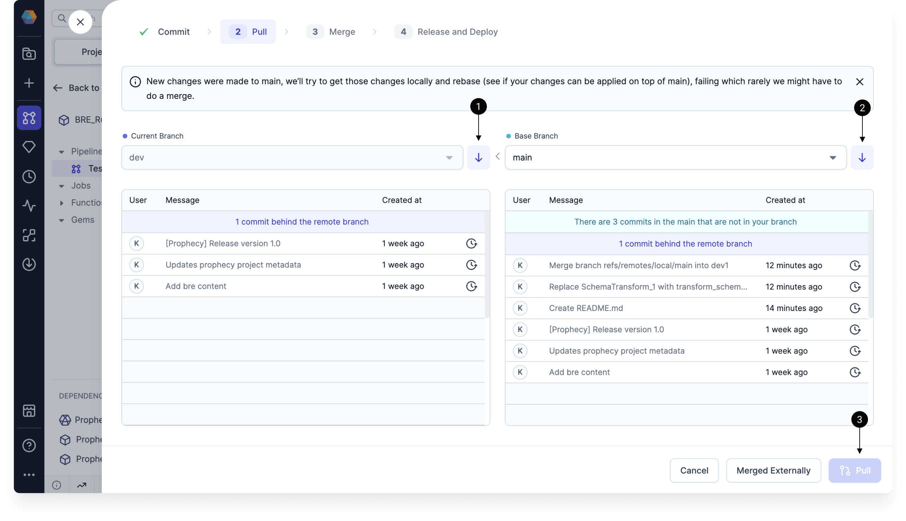

Prophecy utilizes [Git](https://git-scm.com/book/en/v2/Getting-Started-About-Version-Control) to align with DevOps practices. Git lets you:

- Store your visual pipelines as code.
- Track your project metadata, including workflows, schedules, datasets, and computed metadata.
- Collaborate on your projects and perform code reviews.
- Track changes across time.

## Projects and Git repositories

When you create a project in Prophecy, you must choose an empty Git repository or a path in a repository to host the underlying project code. This way, Prophecy can keep track of any changes to the project (including pipelines, models, datasets, and jobs) in a systematic way.

If you're unfamiliar with Git, or you don't need to connect to an external Git repository, you can connect your projects to **Prophecy-managed** repositories. To leverage the full functionality of Git, however, you need to connect your projects to external Git repositories. To do so, you need to add external Git credentials to Prophecy.

## Add Git credentials to Prophecy {#Git-credentials}

When you create a project in Prophecy, You can either choose a Prophecy-managed repository, or connect an external repository.

To add an external Git account to your Prophecy environment:

1. Open **Settings** from the ellipses menu in the left sidebar.
1. Select the **Git** tab. You will see any existing Git credentials here.
1. Click **Add new**.
1. Choose the relevant **Git Provider** and provide the following details:
   - An alias for your Git credentials.
   - Your Git email.
   - Your Git username.
   - Your Git personal access token (PAT). You should be able to find instructions on accessing your personal access token in each external provider's documentation.
1. Click **Connect** to save the credentials.

You can also enter new Git credentials directly when creating a new project.

### GitHub Oath

If you choose GitHub as your external Git provider, you can add your Git credentials using GitHub Oauth.

To use GitHub Oauth, a GitHub admin will need to [authorize Prophecy](https://docs.github.com/en/apps/oauth-apps/using-oauth-apps/authorizing-oauth-apps) to access the APIs required to access your organization's repositories. Follow the [approval steps](https://docs.github.com/en/organizations/managing-oauth-access-to-your-organizations-data/approving-oauth-apps-for-your-organization) to set this up.

## Git workflow

You can interact with a project's Git workflow from the project metadata page or within the project editor.

### Checkout

In Prophecy, you cannot make edits directly on the `main` branch of your project. Instead, you have to make changes on a development branch and merge those changes into the main branch.

Therefore, the Git workflow begins by creating and checking out a new branch.

When you are selecting a branch to checkout, you might be able to select branches that have been created remotely. Once you checkout a remote branch, it will be cloned locally, and it will no longer show up in the list of remote branches.

### Commit

When you make changes to your pipeline, you need to commit these changes to save them. You can view these changes either visually, or using the **Code changes** view.

| **Feature**          | **View** | **Description**                                                                              |
| -------------------- | -------- | -------------------------------------------------------------------------------------------- |
| Branch history       | Visual   | Shows previous commits on the branch.                                                        |
| Entities changed     | Visual   | Explains which entities were modified.                                                       |
| Code changes toggle  | Code     | Allows you to view the code differences, with highlighted lines for additions and deletions. |
| Code changes tab     | Code     | Displays all of the files with changes.                                                      |
| Metadata changes tab | Code     | Displays all of the Prophecy metadata files with changes.                                    |
| Reset                | Both     | Reverts the changes.                                                                         |
| Commit Message       | Both     | Explains the changes that will be saved in this commit.                                      |

### Pull

Sometimes, you will be able to go straight from committing your changes to merging your changes. However, there are a few steps you might need to complete before merging your changes:

1. Pull **remote** changes into the **local** current branch.
1. Pull **remote** changes into the **local** base branch. Note that the base branch will be `main` by default.
1. Pull changes from the **local** base branch into the **local** current branch. You will not be able to complete this step before pulling remote commits.

Once you complete these steps, you might run into merge conflicts. If that happens, you can [use the Prophecy interface](git-resolve) to resolve them.

:::note
Before you pull remote changes into local branches, you will have to commit (or discard) your local changes.
:::

### Merge

Once you have committed your changes, you have the ability to **merge** them to a different branch. If you merged your branch in your external repository, you can tell Prophecy that you did so.

### Release and Deploy

Once the changes are merged, you can [release](/ci-cd/deployment/) a branch from the Prophecy user interface.

## Fork per User

When you create a project, you have the option to choose a single repository shared among users, or to **Fork per User**. When you Fork per User, every user gets their own [fork](https://docs.github.com/en/pull-requests/collaborating-with-pull-requests/working-with-forks/fork-a-repo) of the repository.

When you fork a repository, you must already have both the upstream repository and a Fork per User repository present.

:::note

1. Changes made in forked repository do not effect the upstream repository.
2. Please follow the normal Git flow for raising pull requests to the original repository from the forked repository.

:::

## What's next

Learn more about how to integrate Git in your project lifecycle in [Develop and deploy a project](docs/ci-cd/deployment/deployment.md).
