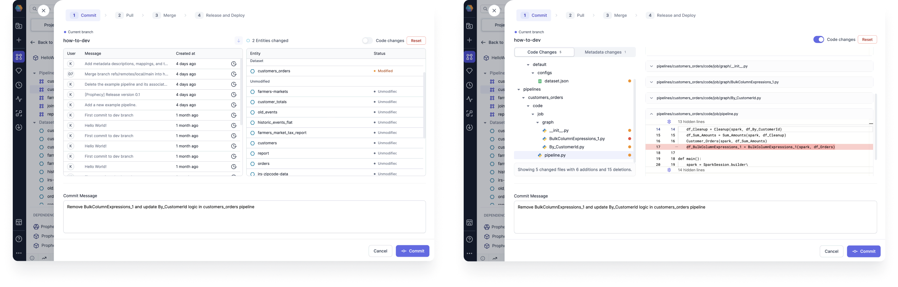

Prophecy utilizes Git to align with DevOps practices. Git lets you:

- Store your visual pipelines as code.
- Track your Project metadata, including workflows, schedules, datasets, and computed metadata.
- Collaborate on your Projects and perform code reviews.
- Track changes across time.

## Connect a Git repository

When you create a Project in Prophecy, you must choose an empty Git repository or a path in a repository to host the Project code. You can either choose a Prophecy-managed repository, or connect an external repository.

To add a Git account to your Prohecy environment:

1. Open **Settings** from the more options menu in the left sidebar.
1. Select the **Git** tab. You will see any existing Git credentials here, including the Prophecy Managed Git Credentials.
1. Click **Add new**.
1. Choose the revelant Git Provider and provide your login details.

You can also enter new Git credentials directly in the Project creation page.

:::info

If you are a member of a GitHub Organization, you may need to [authorize our application](https://docs.github.com/en/apps/oauth-apps/using-oauth-apps/authorizing-oauth-apps) to access your organization. This authorization step is necessary to ensure that our application can authenticate the APIs required to access the repositories. Follow the [approval steps](https://docs.github.com/en/organizations/managing-oauth-access-to-your-organizations-data/approving-oauth-apps-for-your-organization) to do so.

If you encounter any issues during the authorization process or have any questions regarding organization access, please reach out to us at [contact us](mailto:success@Prophecy.io) for assistance.

:::

## Git workflow

### Commit

When you make changes to your Pipeline, you need to commit these changes to save them. You can view these changes either visually, or using the **Code changes** view.

| **Feature**          | **View** | **Description**                                                                              |
| -------------------- | -------- | -------------------------------------------------------------------------------------------- |
| Branch history       | Visual   | Shows previous commits on the branch.                                                        |
| Entities changed     | Visual   | Explains which entities were modified                                                        |
| Code changes toggle  | Code     | Allows you to view the code differences, with highlighted lines for additions and deletions. |
| Code changes tab     | Code     | Displays all of the files with changes.                                                      |
| Metadata changes tab | Code     | Displays all of the Prophecy metadata files with changes.                                    |
| Reset                | Both     | Reverts the changes.                                                                         |
| Commit Message       | Both     | Explains the changes that will be saved in this commit.                                      |

### Merge

Once you have commited your changes, you have the ability to **merge** them to a different branch. If you merged your branch in your external repository, you can tell Prophecy that you did so.

Before merging, if your main branch is ahead of your working branch, you can pull changes from main into your working branch.

If you run into merge conflicts, you can [use the Prophecy interface](git-resolve) to resolve them.

### Release and Deploy

Once the changes are merged, we can `release` a branch straight from the UI itself.

<iframe src="https://user-images.Githubusercontent.com/103921419/174550916-7d8beb20-2013-401d-be30-67c02983958f.mp4" title="How to release a branch" allow="autoplay;fullscreen" allowtransparency="true" frameborder="0" scrolling="no" class="wistia_embed" name="wistia_embed" msallowfullscreen width="100%" height="100%"></iframe>

## Fork per User

When you create a project, you have the option to choose a single repository shared among users, or to **Fork per User**. When you Fork per User, every user gets their own [fork](https://docs.github.com/en/pull-requests/collaborating-with-pull-requests/working-with-forks/fork-a-repo) of the repository.

When you fork a repository, you must already have both the upstream repository and a Fork per User repository present.

:::note

1. Changes made in forked repository do not effect the upstream repository.
2. Please follow the normal Git flow for raising pull requests to the original repository from the forked repository.

:::

## What's next

Learn more about how to integrate Git in your Project lifecycle in [Develop and deploy a Project](https://docs.prophecy.io/deployment/project).
