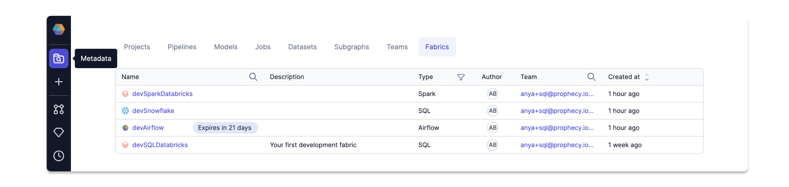
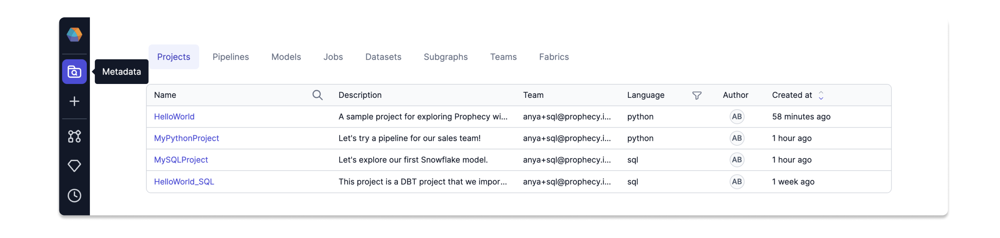

The [Metadata](https://app.prophecy.io/metadata/entity/user) page in Prophecy provides a searchable directory of projects and project components including pipelines, models, and jobs. We can also see Teams and importantly [fabrics](/docs/concepts/fabrics/fabrics.md).

Typically a Team Administrator will setup fabrics and each user will enter their own token to use the fabric. Once your Administrator has setup [Spark fabrics](/docs/administration/Spark-fabrics/fabrics.md), SQL fabrics, or [Airflow fabrics](/Orchestration/airflow/setup/setup.md), then each project can access data sources via the relevant fabric. Notice the language Type is shown for each fabric. SQL projects can use SQL and Airflow fabrics. Python (and Scala) projects can use Spark and Airflow fabrics. Clicking on the projects tab reveals all the projects my user has permission to view. Notice the **Language** is shown for each project; this is the language for the output code on that project.

Projects are owned by Teams. A user would be a member of their own personal team as well as any Teams to which they have been added. The image above shows projects owned by the user's personal team because the user has not been added to any other teams. There are Python and SQL projects shown here, and Prophecy also supports Scala projects. Clicking on a project reveals Metadata specific to that project.

### Project Content

The **About** tab displays the project's language and description. Switch between the various Metadata views available for these projects. Let's take a look at the **Content** tab.

Here we can search for the entities within this project. Where SQL projects capture a series of Data Transformation steps using **models**, Python and Scala projects use **Pipelines**. All projects contain jobs for scheduling the models or pipelines. SQL projects have a few more items, including **seeds** for defining starter datasets.

### Project Dependencies

Each project can re-use logic from other projects and avoid code duplication. The Dependencies tab shows the Packages that the current project is re-using. Read more about Packages and Dependencies, including how to [Use a package](/docs/extensibility/package-hub/package-hub.md#use-a-package) or even [build your own](/docs/extensibility/package-hub/package-hub.md#build-a-package)!

### Project Commits

The `Commits` tab on the [Project Metadata](#project-metadata) page shows the current Git state of the project and allows you to step through the process of committing, merging, and releasing your chanages. For a walkthrough of the different phases of comitting a project, see [this page](/docs/concepts/project/project.md#3-integrate-changes).

### Project Releases and Deployments

This tab displays the history of released projects and deployed jobs. Click [here](docs/ci-cd/deployment/deployment.md) to learn more.
