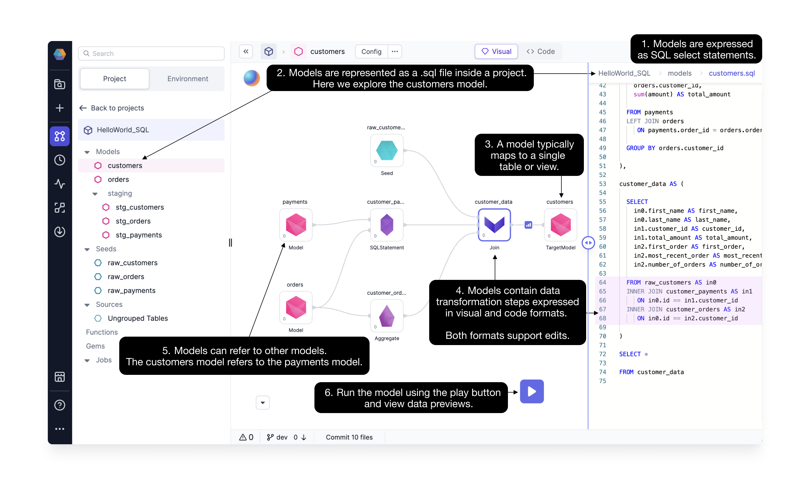

Prophecy has forever transformed the way data engineers and analysts will interact and interface with their data manipulations. But we didn't need to invent a data modeling concept - Prophecy adopts the well-defined dbt Core™ data [models](https://docs.getdbt.com/docs/build/models).

### What is a model, and how do I use a model in Prophecy?

Models are **(1)expressed** as `select` statements and **(2)stored** as `.sql` files within a project. Each model defines a **(3)single** table or view.

For example, the `customers` model is a SQL statement stored in the `customers.sql` file and defines the `customers` table. Models contain data transformations which are expressed in **(4)both visual and code** formats. Importantly, the visual and code formats are editable interchangeably, as illustrated [here.](/docs/low-code-sql/low-code-sql.md)

Model names are inherited from the `.sql` filename. Models can be nested within subdirectories. One model can **(5)refer** to another model; here the `customers` model refers to the `payments` model. The `payments` model defines a table, like an input datasource.

### Models vs Pipelines

If you’re already familiar with Prophecy Pipelines, models are very similar. Like Pipelines, Models can be **(6)run** using the play buttons. The major difference is that each Pipeline can create an arbitrary number of outputs, whereas a model only defines one output. Where Pipeline’s can exist only within Spark-based projects, models’ can exist within SQL-based ones.

Like Pipelines, Models can be configured, committed and released to [Git](/docs/metadata/git.md), according to software engineering best practices. More details on Model configuration coming soon!

### dbt Core™ models

Prophecy uses dbt Core™ as the underlying build system for SQL projects. Therefore, our concept of a model is equivalent to dbt’s. You can read more about dbt’s models and their properties [here.](https://docs.getdbt.com/docs/build/models) dbt supports two primary types of models: SQL-based and Python-based. Today, Prophecy’s visual interface supports SQL models only, however, Python support is coming out soon. If you’d like to define Python models you can still use them within the code interface.
