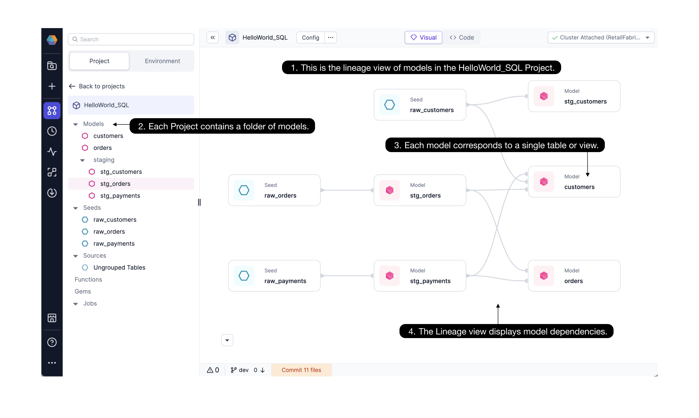

**Data Modeling** refers to the shaping of your data from the raw state all the way to a transformed final state. Data engineers are typically responsible for building tables that represent source data, transforming the data and saving as intermediate tables/views, and building final tables that can be queried by a BI tool and drive decision making for an organization.

Typically business logic is stored as SQL files.

````mdx-code-block
import Tabs from '@theme/Tabs';
import TabItem from '@theme/TabItem';

<Tabs>

<TabItem value="py" label="myFile.sql">

```
SELECT column1, column2, ...
FROM table_name;
```

</TabItem>
</Tabs>

````

But defining the business logic in a SQL file is only the first step. Data-ready teams know that data Modeling with ad-hoc SQL statements is error-prone. How are the SQL files stored? How can the relationships between SQL files be understood? Or the relationships between tables? How is this logic shared? Can the business logic evolve as many team members contribute?

**Teams shouldn't have to puzzle through storing, sharing, and understanding which tables rely on which others. Business logic should be reusable and referenceable in subsequent work.**

In Prophecy and dbt, **Data Models** are SQL statements that build a single table or view - and allow for better management.

Data models incorporate the step-by-step logic to transform raw data to some intermediate or final state. Each Model, stored as a `.sql` file on Git, is managed as software - with best practices like peer review and version control. The Model can include Common Table Expressions (CTEs) and [refer](https://docs.getdbt.com/docs/build/sql-models#building-dependencies-between-models) to other Models. Importantly, SQL statements with Prophecy and dbt are re-usable. When a Model is updated, any reference to that Model is likewise updated.

Here we explore how to use Models in Prophecy, adopting the concept and vernacular from dbt Core™. Later, we'll see how to import dbt projects to Prophecy, or you can create a new Project and Models using Prophecy's drag-and-drop interface. After you've read this page, get hands on with Models in this getting-started [guide](/docs/getting-started/getting-started-with-low-code-sql.md#44-Develop-your-first-model).

### Using Models in Prophecy

Prophecy displays Models using a lineage view, a visual view, and a code view.


Open the HelloWorld_SQL Project. See the **(1)Lineage** for the HelloWorld_SQL Project pictured above. Each **(2)Project** contains folders of Models, [seeds](/docs/getting-started/getting-started-with-low-code-sql.md#431-create-seeds), and sources. The Lineage provides a high level view of the Project's **(3)Models** with **(4)dependencies** displayed from left to right. The `customers` Model depends on seed `raw_customers` and Models `stg_orders` and `stg_payments`. Click to open the `customers` Model as shown in the figure below.


Now we can explore the `customers` Model more closely. The Model is easy to understand with interchangable **(1)visual** and **(2)code** views. The visual view depicts each small step needed to move from the referenced tables/seeds/Models to the final `customers` Model. Each transformation step or Common Table Expression (CTE) is called a **(3)Gem** in Prophecy.

The **(4)`Aggregate`** step is represented visually as an `Aggregate` Gem and in code as the highlighted CTE code fragment. By popular demand, the visual and code formats are editable interchangeably, as illustrated [here.](/docs/low-code-sql/low-code-sql.md) Visual developers and SQL coders can work together in the same project, and both types of edits are incorporated to the project when [committed and merged](/docs/metadata/git.md#how-to-commit-changes).

### Models vs Pipelines

If you’re already familiar with Prophecy Pipelines, Models are very similar. The major difference is that each Pipeline can create an arbitrary number of outputs, whereas a Model only defines one output. Where Pipelines can exist only within Spark-based projects, Models can exist within SQL-based ones.

Like Pipelines, Models can be configured, committed and released to [Git](/docs/metadata/git.md), according to software engineering best practices. More details on Model configuration coming soon!

### dbt Core™ Models

Prophecy uses dbt Core™ as the underlying build system for SQL projects. Therefore, our concept of a Model is equivalent to dbt’s. You can read more about dbt’s Models and their properties [here.](https://docs.getdbt.com/docs/build/models) dbt supports two primary types of Models: SQL-based and Python-based. Today, Prophecy’s visual interface supports SQL Models only, however, Python support is coming out soon. If you’d like to define Python Models you can still use them within the code interface.

#### What's next?

Now that you have an understanding of data Models as defined by Prophecy and dbt, get hands on with Models in this getting started [guide](/docs/getting-started/getting-started-with-low-code-sql.md#44-develop-your-first-model).
