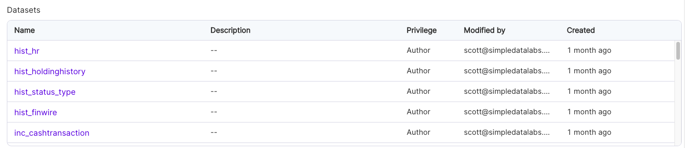
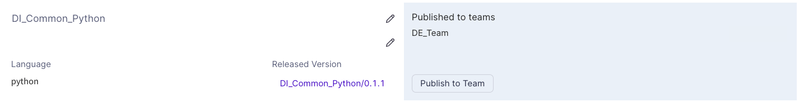

In Prophecy, Datasets are grouped by [Projects](docs/concepts/project/project.md) and rely on the following:

- **Schema**: The structure or shape of the data, including column names, data types, and the method for reading and writing the data in this format.
- **[Fabric](docs/concepts/fabrics/fabrics.md)**: The execution environment in which the data resides.

## Create Datasets

Datasets are created where they are first used in a [Source or Target gems](docs/Spark/gems/source-target/source-target.md). A Dataset definition includes its:

- **Type**: The type of data you are reading/writing like CSV, Parquet files or catalog tables.
- **Location**: The location of your data. It could be a file path for CSV or a table name.
- **Properties**: Properties consists of Schema and some other attributes specific to the file format. For example, in case of CSV, you can give Column delimiter in additional attributes. You can also define Metadata for each column here like description, tags, and mappings.

Datasets can be used by any pipeline within the same Project, and in some cases by other Projects within the same team.

## View Datasets

There are two ways to view a list of Datasets:

- To see all Datasets, navigate to **Metadata > Datasets**.
- To see only one Project's Datasets, navigate to **Metadata > Projects**. Then, open a Project. Click on the **Content** tab, and then the **Datasets** subtab.

## Dataset Metadata

If you open the metadata page for one of the Datasets, you'll find the following information:

| Name                | Description                                                         |
| ------------------- | ------------------------------------------------------------------- |
| Dataset name        | The name of this Dataset, which is editable.                        |
| Dataset description | The description of this Dataset, which is editable.                 |
| Dataset properties  | A subset of properties used for reading or writing to this Dataset. |
| Dataset schema      | The columns of this Dataset and their data types.                   |
| Delete Dataset      | The option to delete this Dataset. Use with caution.                |

In the **Relations** tab, there is additional information about where and how this Dataset is used.

| Name                | Description                                                                                                                      |
| ------------------- | -------------------------------------------------------------------------------------------------------------------------------- |
| Physical Datasets   | Location of the Dataset in relation to a Fabric.                                                                                 |
| Pipelines           | A list of pipelines that use this Dataset, with the `Relation` column indicating if it is for `Read` or `Write` purposes.        |
| Jobs                | A list of Jobs that use this Dataset, with the `Relation` column indicating if it is for `Read` or `Write` purposes.             |
| Open Lineage Viewer | The option to open this Dataset in the [Lineage](docs/lineage/lineage.md) viewer, showing column-level lineage for this Dataset. |

## Publishing/Sharing Datasets

As part of the Project Release process, Datasets within that Project are _published_ to other Projects within the same Team, and can be published to other Teams in read-only mode. This allows you to share your Dataset configurations with other Teams without allowing them to make changes to the original Dataset definitions. Let's see this in action:

1. `DI_TEAM` is the central Data Infrastructure team. They have defined a common Project named `DI_Common_Python`.
2. `DI_Common_Python` has a number of Datasets defined within it:
   
3. The `DI_Team` merges and releases the `DI_Common_Python` Project, tagging it `0.1`.
   
4. As you can see, the `DI_Team` has published the `DI_Common_Python` project to the `DE_Team`, the Data Engineering Team.
5. Now, whenever the `DE_Team` builds pipelines, they can see the following:
   

We can see the `DI_Common_Python` Project's Datasets, and the fact that they're listed as `Read-only`. This means that `DE_Team` can _use_ the Datasets, but cannot _edit_ them.

:::info

For regular usage, we suggest having only one instance of a particular Dataset within a pipeline, as the Dataset's properties and underlying data can change each time the dataset is read or written.

:::
