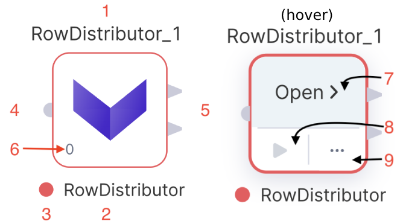
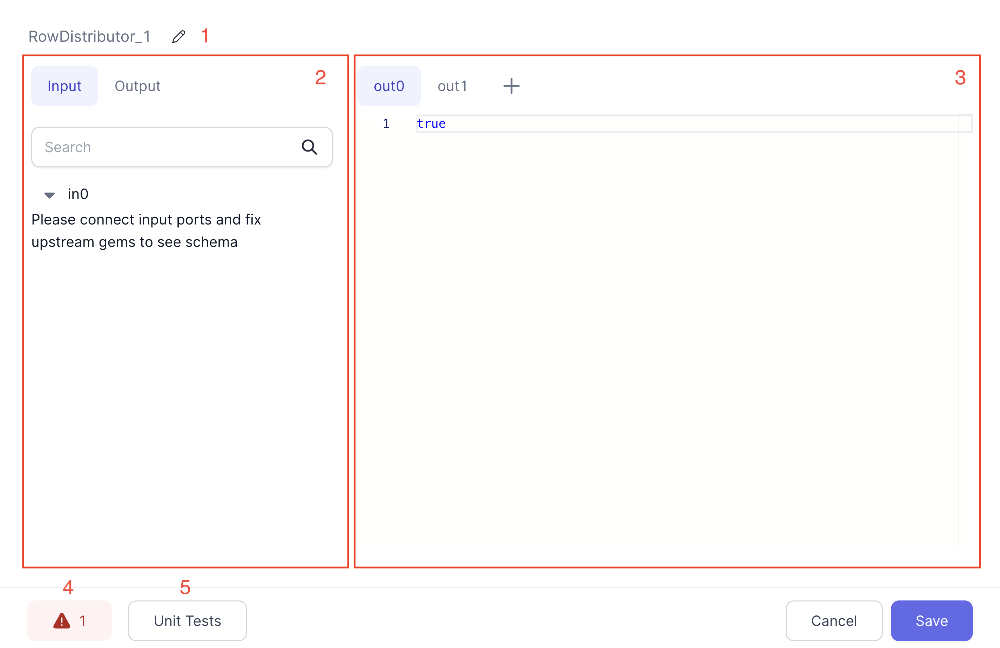

A gem is a reusable component or transformation step in a data pipeline that performs a certain operation on the data. Each gem has its own configuration and produces its own block of output code.

## Gem categories

Gems are grouped by their category. The table below will help you understand this grouping.

| Category      | Definition                                                                                           |
| ------------- | ---------------------------------------------------------------------------------------------------- |
| Source/Target | Gems related to [sources, targets,](/docs/Spark/gems/source-target/source-target.md) and lookups.    |
| Transform     | Gems related to the [transformation](/docs/Spark/gems/transform/transform.md) of your data.          |
| Custom        | [Custom](/docs/Spark/gems/custom/custom.md) gems and gems that don't fit into the other categories.  |
| Join/Split    | Gems related to [splitting or joining](/docs/Spark/gems/join-split/join-split.md) datasets together. |
| Subgraph      | Types of [subgraphs](/docs/Spark/gems/subgraph/subgraph.md) to use in your pipeline.                 |

When you open a pipeline, you will find that the **gem drawer** is organized by these categories. The gems in these categories are available to you depending on your project language, project dependencies, and Prophecy version.

## Gem instance

When you click on a gem from the gem drawer, an instance of that gem gets added to your pipeline canvas.

Use the image and the table below to understand the UI of a gem.



| Callout | UI element        | Description                                                                                                              |
| :-----: | ----------------- | ------------------------------------------------------------------------------------------------------------------------ |
|    1    | Gem instance name | The name of this particular gem instance. It must be unique within a given pipeline.                                     |
|    2    | Gem type name     | The type of gem.                                                                                                         |
|    3    | Input ports       | One or more [ports](#inputs) that accept connections from upstream gems.                                                 |
|    4    | Output ports      | One or more [ports](#outputs) that connect to downstream gems.                                                           |
|    5    | Gem phase         | The [phase](#gem-phase) for this gem instance, which defines the order in which gem instances are executed.              |
|    6    | Open              | The button that lets you open the gem configuration.                                                                     |
|    7    | Run button        | A button that runs the pipeline up to and including the gem.                                                             |
|    8    | Action menu       | A menu that includes options to change the [phase](#gem-phase) of the gem, add run conditions, delete the gem, and more. |

## Gem configuration

When you open a gem, you can configure how the gem will work.



|     | UI element         | Description                                                                                                                      |
| :-: | ------------------ | -------------------------------------------------------------------------------------------------------------------------------- |
|  1  | Gem instance name  | The name of this particular gem instance.                                                                                        |
|  2  | Inputs and outputs | The inputs and outputs for this gem instance.                                                                                    |
|  3  | Gem configuration  | The configuration for this instance. Each gem will be different. See the documentation for individual gems for more information. |
|  4  | Run button         | A button that runs the pipeline up to and including the gem.                                                                     |
|  5  | Diagnostics        | A diagnostics window that will show a list of configuration errors if they exist.                                                |
|  6  | Data               | A preview of the output table that is available if you run the gem.                                                              |
|  7  | Unit tests         | A set of unit tests. See [here](/ci-cd/tests) for more details.                                                                  |

## Input ports

The Input tab defines the incoming connections accepted by the gem. Most gem types only accept one connection, but some (such as [Join](/docs/Spark/gems/join-split/join.md)) allow for multiple inputs.


|     | UI element  | Description                                                                                                   |
| :-: | ----------- | ------------------------------------------------------------------------------------------------------------- |
|  1  | Search      | A field that will filter your input columns.                                                                  |
|  2  | Add Input   | If the gem supports multiple inputs, you can click this button to add more input ports to this instance.      |
|  3  | Input       | The name of the input port and the name of the input gem instance.                                            |
|  4  | Port schema | The schema of the port (columns and column types). The schema will only appear when an input port is present. |
|  5  | Edit ports  | A button that lets you edit or delete ports.                                                                  |

## Output ports

The Output tab defines the outgoing schemas that will be available to downstream gems. In some cases, the Prophecy compiler can't infer the output schema automatically, so you have the option to infer the schema using your connected fabric or specify it manually.

|     | UI element         | Description                                                                                                     |
| :-: | ------------------ | --------------------------------------------------------------------------------------------------------------- |
|  1  | Output schema      | Output schema for this gem instance. This will be the schema of the data that downstream gem instances will use |
|  2  | Custom schema      | Toggle this to enable custom output schema editing                                                              |
|  3  | Infer from cluster | Run the gem code on the connected cluster and infer the schema from the result                                  |
|  4  | Edit schema        | Edit the output schema manually                                                                                 |

## Gem phase

A gem's phase in a pipeline controls the order in which a gem will run. This is achieved by reordering the code generated for the pipeline:

```scala
def apply(spark: SparkSession): Unit = {
  val df_my_orders     = my_orders(spark).cache()
  val df_Repartition_1 = Repartition_1(spark, df_my_orders)
  Write_CSV(spark, df_Repartition_1)
  val df_SchemaTransform_1 = SchemaTransform_1(spark, df_my_orders)
}
```

A gem with phase `0` will be put before a gem with phase `1`. The phase can be any integer (positive or negative).

It's important to note that when you run downstream gems, **their upstream gems also must run**. Therefore, if a downstream gem is assigned phase `0` and an upstream gem is assigned phase `1`, the upstream gem will be grouped with phase `0`. Because of this, you might have to pay extra attention when assigning phases to intermediate gems.

## What's next

Prophecy provides specific Spark gems and SQL gems for your pipelines and models. Not only does Prophecy add new gems for your use, but you can also create gems yourself. To learn more, visit our documentation on [Spark gems](/Spark/gems) and [SQL gems](/SQL/gems).
