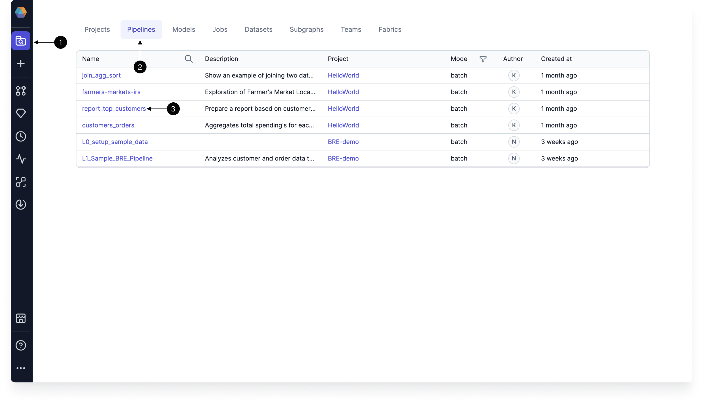

Pipelines are groups of data transformations that you can build from a **visual** or **code** interface. When using the visual interface, each component of a pipeline is automatically compiled into code that you can reuse and customize.

Under the hood, pipelines are based on Spark-native code. pipelines are ideal for Spark environments like Databricks or EMR, particularly for tasks such as complex data ingestion (e.g., loading data from Salesforce or JDBC), handling advanced data transformations (e.g., working with complex data types), and supporting machine learning workflows.

## Pipeline creation

If you want to create a new pipeline, you can do so from the **Create Entity** page in the left sidebar. You can also create pipelines directly within the [Project Editor](/concepts/project/#project-editor).

The following table describes the parameters for pipeline creation.

| Field       | Description                                                                                                                                       |
| ----------- | ------------------------------------------------------------------------------------------------------------------------------------------------- |
| Project     | The project to create the pipeline in. This controls access to the pipeline, groups pipelines together, and lets you use datasets in the project. |
| Branch      | The Git branch to use for pipeline development.                                                                                                   |
| Name        | The name of the pipeline.                                                                                                                         |
| Mode        | Whether the pipeline will be Batch mode or Streaming.                                                                                             |
| Description | A field to describe the purpose of the pipeline.                                                                                                  |

## Pipeline canvas

When you develop a pipeline, you do so from from the [Project Editor](/concepts/project/#project-editor). More specifically, you work inside the **Pipeline canvas**.

The pipeline canvas includes:

- A space to add and connect gems.
- The **gem drawer** from which you select your gems.
- A **run** button to begin interactive execution.
- **Copilot** to help you build your pipeline.

## Pipeline metadata

To view a list of pipelines in Prophecy, navigate to the **Metadata** page from the left sidebar. For more granular metadata, click into a pipeline. Pipeline metadata can also be accessed from the header of the [Project Editor](/concepts/project/#project-editor).

The table below describes the different tabs inside an individual pipeline's metadata.

| Tab       | Description                                                                                                        |
| --------- | ------------------------------------------------------------------------------------------------------------------ |
| Info      | A list of the input and output datasets of the pipeline. You can also edit the pipeline name and description here. |
| Relations | A list of jobs and subgraphs that include the pipeline.                                                            |
| Code      | The code that is stored in the Git repository for the pipeline.                                                    |
| Runs      | A history of pipeline runs per fabric.                                                                             |

## What's next

Visit the [Spark](/Spark) documentation to learn more, or view how to use [Spark with Databricks](docs/getting-started/tutorials/spark-with-databricks.md).
