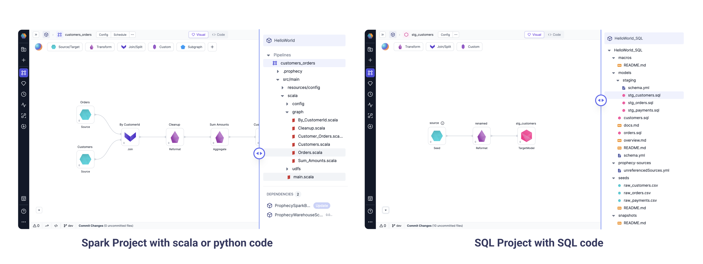

The Project is the primary unit of development and deployment to production in Prophecy.

A **project** contains

- **Pipelines** (Spark) or **Models** (SQL) which read, transform and write data.
- **Datasets** point to the data that is read and written to by the _Data Pipelines_ or _Data Models_.
- **Jobs** run _Data Pipelines_ and _Data Models_ individually or together based on a schedule.

## Projects are Code on Git

A **project** is **code** on **Git**. This means that within a project, the business logic of all the assets including _Pipelines_/_Models_, _Datasets_, and _Jobs_ is stored as code on Git. This might be a repository on Github or a folder in a repository.


Every component of the Project is represented both visually and in code on Git. Prophecy supports Projects in one of three languages: Spark Projects are saved as code in Scala or Python and SQL Projects are saved as code in SQL. Open any Pipeline (left) or Model (right) in your Project. Simply toggle from visual to code to see the underlying code for that Pipeline or Model, as well as the rest of the Project components.



Now that Projects are stored as code on Git, users and teams get a collaboration boost. Users can work on the same project simultaneously because each user has their own branch. Projects are reviewed and released with a version, so every team member can confidently rely on the business logic. Each Project becomes a re-usable package for other teams to use with their own data and configurations. All of these best practices are in place for every Prophecy user from day one.

Click on a tile below to learn about the different Project components, or checkout the [Project Metadata](/docs/metadata/project-metadata.md) page for guidance on finding what you need in an existing Project. Ready to develop your own Project? Click [here](/docs/concepts/project/project.md#1-create-new-project)!

```mdx-code-block
import DocCardList from '@theme/DocCardList';
import {useCurrentSidebarCategory} from '@docusaurus/theme-common';

<DocCardList items={useCurrentSidebarCategory().items}/>
```

## Development and Deployment

### 1. Create new project

Starting from the [Create Entity](https://app.prophecy.io/metadata/create) page, click `Project`. You'll have the option to create a new Project or import an existing Project.


In the `Create Project` pane you can set the name, output language (Python, Scala or SQL) and which team the project belongs to. Visually designed pipelines will generate code in the selected Project output language. Advanced users can design expressions in SQL, Python, or Scala, and the project will _generate code_ in the Project output language.


:::caution

It is not currently possible to switch the output language of a Project after it has been created. Please choose the appropriate language for your environment.

:::

Add [Git credentials](./../../metadata/Git) in [Settings](https://app.prophecy.io/metadata/settings) or connect new Git credentials as below. Specify the desired repository and path accessible to your Git user to store the Project. For new projects, specify an empty repository or an empty path within an existing repository. For imported projects, select a repository, forked repository, or repository path that already contains the relevant project code.


### 2. Create, edit and commit the Pipeline

When you **create a new Pipeline**, you have to choose the **branch** where it will be created - an existing one or a new one.

Then you will **develop** this Pipeline - you will make **changes** and **commit** them in this branch multiple times.
The commit dialog opens when you click the bottom bar - orange color indicates uncommitted changes. When you **commit**, your changes are preserved in Git and are pushed to your **branch**.


### 3. Integrate changes

Prophecy provides a standard and recommended mechanism for using Git based development. The four main phases of integrating your changes are: **_Commit_**, **_Pull_**, **_Merge_**, **_Release_**. A standard development pattern looks like this, though other mechanisms like forking are also supported:


Let's go over each phase in detail.

#### Commit

A **_Commit_** represents changes to one or more files in your Project. They are what allow you to keep and view the history of all the changes that have happened while developing your Pipelines. You can create a commit using either the [Project Commits](#project-commits) page or within the Pipeline editor itself. Committing the files saves the changes you've been working on into your Branch and pushes those changes to your Git repository so that it's safely stored.

When committing from the [Project Commits](#project-commits) page, you'll see the following:


|     | Name           | Description                                                                                  |
| :-: | -------------- | -------------------------------------------------------------------------------------------- |
|  1  | Change log     | This is a log of all the changes that have been made to (or merged into) the Current Branch  |
|  2  | Changed files  | This is a list of all of the changed files that will be committed                            |
|  3  | Reset          | If you need to reset all changes that have happened since the last commit, click this button |
|  4  | Commit message | The message to include as part of the commit                                                 |

#### Pull

**_Pull_** brings changes that have occurred in remote Branches into the Prophecy-local branches. If you have any upstream changes that need to be **_pull_**ed into the local branches you'll see the following:


Click the button to pull the changes and you'll see the **_Pull_** view:


#### Merge

**_Merge_** will take the changes in the _Current Branch_ and merge them into the _Base Branch_. Your changes will become part of the _Base Branch_ and will be available to anyone else who's work is based on the _Base Branch_. It is steps 3 and 5 of [this diagram](#development-and-deployment).


Click the **_Merge_** button to merge the changes and push them back to your Git repository.

#### Release

**_Release_** tags a particular commit in the _Base Branch_ with a user-specified version (step 6 in [this diagram](#development-and-deployment)). This allows you designate a new version as ready for production, or inform users who may be subscribed to Datasets defined within your Project that there might be changes in the published Dataset.


|     | Name             | Description                                                                                                                                                       |
| :-: | ---------------- | ----------------------------------------------------------------------------------------------------------------------------------------------------------------- |
|  1  | Commit selection | Pick which commit will be tagged for release                                                                                                                      |
|  2  | Release notes    | Free-form notes for the release                                                                                                                                   |
|  3  | Version          | Enter whatever you'd like here. Best practices exist such as [Semantic Versioning](https://semver.org/), but you're free to use whatever matches your environment |

## Project Browser

When Opening a project, User can click on the Open project button. This takes you to the Bird's eye view of the entire Project.
Here you can see all the entities in this project and how they are interlinked in various Pipelines/Jobs etc.


When you are already on a Pipeline editor page, you can open the Project browser by clicking on the `>>` icon on Top left corner.


### Environment tab

When click on the Environment tab in the Project browser, User can also browse the `Catalog tables` from the Fabric they are connected to.
Moreover, He can just click on the `+` button to add this table as a Source Gem in any Pipeline.

Please see below video for example.


