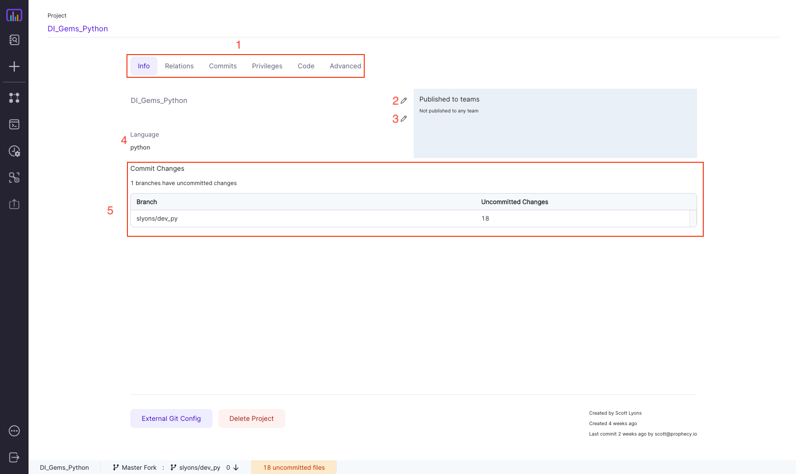

Project is the primary unit of development and deployment to production in Prophecy.

A **project** contains

- **Data Pipelines** that read, transform and write data using Spark
- **Datasets** point to the data that is read and written to by the _Data Pipelines_
- **Jobs** run _Data Pipelines_ based on a **schedule**

## Project is Code on Git

A **project** is **code** on **Git**. This means that within a project, the business logic of all the assets including _Pipelines_, _Datasets_, and _Jobs_ is stored as code on Git. This might be a repository on Github or a folder in a repository.

## Project Metadata

The `Project Metadata` page provides several views about the various aspects of your project. You can get to this view by going to the [Metadata](https://app.prophecy.io/metadata/entity/user) page and clicking the name of your project.

|     | Name                | Description                                                                                                                                            |
| :-: | ------------------- | ------------------------------------------------------------------------------------------------------------------------------------------------------ |
|  1  | Metadata tabs       | Switch between the various metadata views available for this project                                                                                   |
|  2  | Rename project      | Change the name of the project. This only affects the name in the UI, no code directories will be renamed.                                             |
|  3  | Project description | Edit the project description                                                                                                                           |
|  4  | Project language    | Output language for this project                                                                                                                       |
|  5  | Project Git status  | This is a list of branches that you or other users have used while developing this project, as well as the number of uncommitted files in that branch. |

If you hover over any of the branches you'll have the option to commit the changes in that branch or delete the branch altogether.

## Project Relations

The `Relations` tab on the [Project Metadata](#project-metadata) page shows a list of all the component pieces that belong to this Project.

|     | Name         | Description                                                                                   |
| :-: | ------------ | --------------------------------------------------------------------------------------------- |
|  1  | Pipelines    | List of [Pipelines](../pipelines.md) in this project                                          |
|  2  | Add Pipeline | Click this to add a new Pipeline                                                              |
|  3  | Jobs         | List of Jobs in this project                                                                  |
|  4  | Add Job      | Click this to add a new Job                                                                   |
|  5  | Datasets     | List of Datasets in this project                                                              |
|  6  | Subgraphs    | List of published [Subgraphs](/docs/low-code-spark/gems/subgraph/subgraph.md) in this project |

## Project Commits

The `Commits` tab on the [Project Metadata](#project-metadata) page shows the current Git state of the project and allows you to step through the process of committing, merging, and releasing your chanages.

|     | Name              | Description                                                                                                                                                            |
| :-: | ----------------- | ---------------------------------------------------------------------------------------------------------------------------------------------------------------------- |
|  1  | Current Branch    | The branch you're currently working on                                                                                                                                 |
|  2  | Base Branch       | The base (or upstream) branch you're comparing the Current Branch to                                                                                                   |
|  3  | Commit Button     | Click this to commit any uncommitted files in this branch                                                                                                              |
|  4  | Unmerged commits  | The number of commits that are in your Current Branch but are not yet in the Base Branch                                                                               |
|  5  | Uncommitted files | The number of files that are uncommitted in this branch. Use the commit button to save these changes into the Current Branch                                           |
|  6  | Remote commits    | If you or another user has merged their changes into the Base Branch you can see the number here. Use the pull button to bring these changes into your Current Branch. |

For a walkthrough of the different phases of comitting a project, see [this section](#3-integrate-changes).

## Development and Deployment

Prophecy provides a standard and recommended mechanism for using Git based development
(though other mechanisms are possible - including fork based development in our Enterprise product). A standard development pattern looks like this:

Here are the steps explained:

### 1. Create new project

Starting from the [Create Entity](https://app.prophecy.io/metadata/create) page, click `Project`. You'll have the option to create a new Project or import an existing Project.

In the `Create Project` pane you can set the name, output language (Scala or Python) and which team the project belongs to. Visually designed pipelines will generate code in the selected Project output language. Advanced users can design expressions in SQL, Python, or Scala, and the project will _generate code_ in the Project output language.

:::caution

It is not currently possible to switch the output language of a Project after it has been created. Please choose the appropriate language for your environment.

:::

Add [Git credentials](./../../metadata/Git) in [Settings](https://app.prophecy.io/metadata/settings) or connect new Git credentials as below. Specify the desired repository and path accessible to your Git user to store the Project. For new projects, specify an empty repository or an empty path within an existing repository. For imported projects, select a repository, forked repository, or repository path that already contains the relevant project code.

### 2. Create, edit and commit the Pipeline

When you **create a new Pipeline**, you have to choose the **branch** where it will be created - an existing one or a new one.

Then you will **develop** this Pipeline - you will make **changes** and **commit** them in this branch multiple times.
The commit dialog opens when you click the bottom bar - orange color indicates uncommitted changes. When you **commit**, your changes are preserved in Git and are pushed to your **branch**.

### 3. Integrate changes

The four main phases of integrating your changes are: **_Commit_**, **_Pull_**, **_Merge_**, **_Release_**. Let's go over each in detail.

#### Commit

A **_Commit_** represents changes to one or more files in your Project. They are what allow you to keep and view the history of all the changes that have happened while developing your Pipelines. You can create a commit using either the [Project Commits](#project-commits) page or within the Pipeline editor itself. Committing the files saves the changes you've been working on into your Branch and pushes those changes to your Git repository so that it's safely stored.

When committing from the [Project Commits](#project-commits) page, you'll see the following:

|     | Name           | Description                                                                                  |
| :-: | -------------- | -------------------------------------------------------------------------------------------- |
|  1  | Change log     | This is a log of all the changes that have been made to (or merged into) the Current Branch  |
|  2  | Changed files  | This is a list of all of the changed files that will be committed                            |
|  3  | Reset          | If you need to reset all changes that have happened since the last commit, click this button |
|  4  | Commit message | The message to include as part of the commit                                                 |

#### Pull

**_Pull_** brings changes that have occurred in remote Branches into the Prophecy-local branches. If you have any upstream changes that need to be **_pull_**ed into the local branches you'll see the following:

Click the button to pull the changes and you'll see the **_Pull_** view:

#### Merge

**_Merge_** will take the changes in the _Current Branch_ and merge them into the _Base Branch_. Your changes will become part of the _Base Branch_ and will be available to anyone else who's work is based on the _Base Branch_. It is steps 3 and 5 of [this diagram](#development-and-deployment).

Click the **_Merge_** button to merge the changes and push them back to your Git repository.

#### Release

**_Release_** tags a particular commit in the _Base Branch_ with a user-specified version (step 6 in [this diagram](#development-and-deployment)). This allows you designate a new version as ready for production, or inform users who may be subscribed to Datasets defined within your Project that there might be changes in the published Dataset.

|     | Name             | Description                                                                                                                                                       |
| :-: | ---------------- | ----------------------------------------------------------------------------------------------------------------------------------------------------------------- |
|  1  | Commit selection | Pick which commit will be tagged for release                                                                                                                      |
|  2  | Release notes    | Free-form notes for the release                                                                                                                                   |
|  3  | Version          | Enter whatever you'd like here. Best practices exist such as [Semantic Versioning](https://semver.org/), but you're free to use whatever matches your environment |
