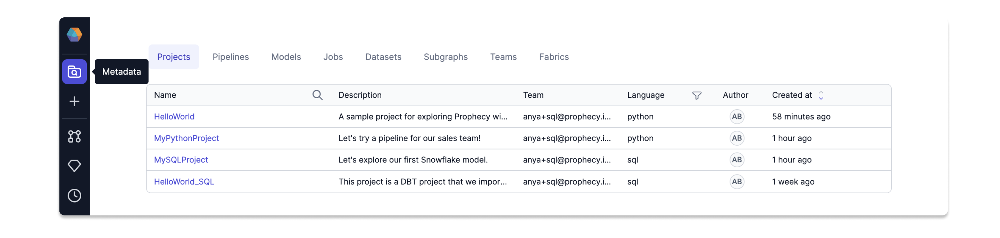

A **Project** in Prophecy is the core unit for developing, organizing, and deploying data workflows to production. It encompasses all the components needed for building and running data processes.

Spark projects contain [pipelines](docs/concepts/project/pipelines.md), [datasets](docs/concepts/project/dataset.md), and [jobs](docs/Orchestration/Orchestration.md). SQL projects contain [models](docs/concepts/project/models.md), [datasets](docs/concepts/project/dataset.md), and [jobs](docs/Orchestration/Orchestration.md).

## Project creation

There are a few things to keep in mind when you create a project.

- **Project type.** A project must be written in Spark/Python, Spark/Scala, or SQL. Visually designed pipelines will generate code in the selected project output language. Note that you cannot change the language after the project has been created.

- **Git repository**. Because all projects are compiled into code, Prophecy leverages Git to version and host that code. You can either choose to host your project on a Prophecy-managed repository, or you can connect your own external repository, like one on GitHub. This lets users and teams collaborate on projects, contribute simultaneously, and reuse code. The image below shows the underlying code of two example projects.

  

- **Project team.** Projects are always assigned a certain [team](docs/administration/teamuser.md). This means that the project will be shared among all users in that team.

  :::note
  When you begin using Prophecy, you are added to your own one-person team. Your team administrator will typically create other team groupings.
  :::

## Project Editor

Once you have created a project, you should get familiar with the Project Editor interface. The following table describes different areas of the Project Editor.

| Callout | Component       | Description                                                                                                                                                                                                       |
| ------- | --------------- | ----------------------------------------------------------------------------------------------------------------------------------------------------------------------------------------------------------------- |
| 1       | Project tab     | A list in the left sidebar that shows all of the project components. When in code view, this project tab shows the file directory with the code components.                                                       |
| 2       | Environment tab | A list in the left sidebar that lets you browse different assets in your connected execution environment. For example, you can browse the Unity Catalog if you are attached to a Databricks fabric.               |
| 3       | Canvas          | The area in the center of the project where you build your pipelines visually.                                                                                                                                    |
| 4       | Header          | A menu that includes various configurations such as project settings, dependency management, cluster attachment, scheduling, and more. It also provides a toggle to switch between the Visual view and Code view. |
| 5       | Footer          | A menu that includes diagnostic information, execution metrics, execution code, and the Git workflow.                                                                                                             |

See these components marked in the image below.


## Project metadata

The [Metadata](https://app.prophecy.io/metadata/entity/user) page in Prophecy provides a searchable directory of projects and project components including pipelines, models, and jobs. Here, you can also find the metadata for teams and [fabrics](/docs/concepts/fabrics/fabrics.md).



All projects that are shared with you are visible in the **Projects** tab of the Metadata page. You can click into each project to access more granular metadata about that project. If you want to change the name of your project, you must do so in the project metadata (not the Project Editor).


The following table describes the information that you can find in each tab of an individual project's metadata.

| Tab                        | Description                                                                                                                                                                                                                                         |
| -------------------------- | --------------------------------------------------------------------------------------------------------------------------------------------------------------------------------------------------------------------------------------------------- |
| **About**                  | Provides a high-level overview of your project, including space for an in-depth description for collaboration and transparency.                                                                                                                     |
| **Content**                | Lets you search for entities within the project, such as pipelines, jobs, datasets, and more depending on your project type.                                                                                                                        |
| **Dependencies**           | Displays the [dependencies](docs/extensibility/dependencies/spark-dependencies.md) that exist in the project, including [packages](docs/extensibility/package-hub/package-hub.md). Dependencies enable projects to reuse logic from other projects. |
| **Commits**                | Shows the current Git state of the project and provides the option for you to commit, merge, and release changes.                                                                                                                                   |
| **Releases & Deployments** | Includes the history of [released projects and deployed jobs](docs/ci-cd/deployment/deployment.md).                                                                                                                                                 |
| **Code**                   | Links to the external Git if present.                                                                                                                                                                                                               |
| **Access**                 | Lets you publish the project to the Package Hub or invite other teams to view your project (read-only).                                                                                                                                             |
| **Settings**               | Provides different configuration options for building, changing, and deploying your project.                                                                                                                                                        |

## What's next

To learn about the project lifecycle, visit [Develop and deploy a project](docs/ci-cd/deployment/deploy-project.md).

To explore different project components, view the following pages:

```mdx-code-block
import DocCardList from '@theme/DocCardList';
import {useCurrentSidebarCategory} from '@docusaurus/theme-common';

<DocCardList items={useCurrentSidebarCategory().items}/>
```
