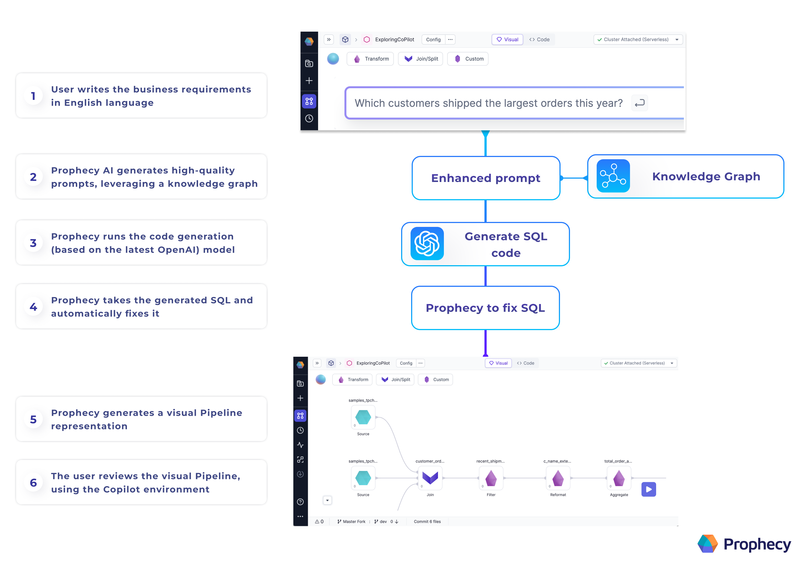

Copilot works by enhancing the user’s prompt using a knowledge graph.

## Metadata

Knowledge graphs are generated per-team in Prophecy. Each knowledge graph includes metadata for a project’s entities (such as datasets, schemas, seeds, models, and pipelines) and the statistical usages of these entities. The knowledge graph only includes metadata—your data itself is never stored. For more details, see [Data privacy with Data Copilot](/docs/copilot/copilot-data-privacy.md).

## Process

Prophecy sends the enhanced prompt to OpenAI. The large language model (LLM) returns SQL or Spark code, and Prophecy verifies whether this code is valid. Once Prophecy fixes the code, Prophecy generates a visual pipeline and displays this pipeline to you for review.

## Which datasets are accessible to Prophecy Data Copilot?

Any dataset, source, or seed that is part of the linked (Databricks, Snowflake, etc.) catalog is accessible. That is, if you can access the datasets with your personal access token, then the datasets should appear in the Environment browser and Copilot can access them.

Add any of these datasets from the Environment browser into your project canvas. Once the dataset is defined in the project, Copilot's AI capabilities will start making recommendations including that data source.
