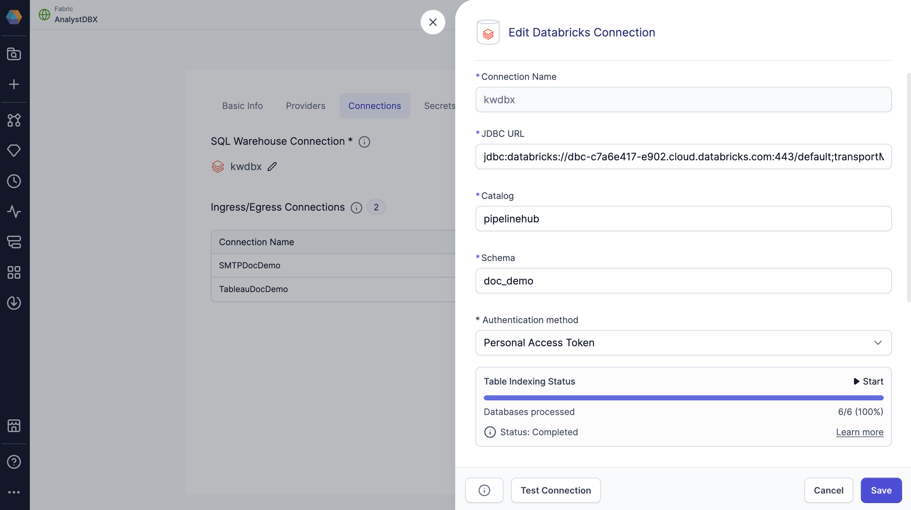

Copilot works by enhancing prompts using a knowledge graph, or an internal map of your data environment. This gives Copilot the context it needs to generate accurate, relevant answers.

:::note
Prophecy generates knowledge graphs for SQL projects only. Knowledge graphs are not used for Spark projects.
:::

## Overview

Knowledge graphs are generated per-team in Prophecy. Each knowledge graph contains information from fabrics and project entities, including the statistical usages of these entities. It also contains computed fields that further refine Copilot's capabilities.

:::info Important
Your data itself is never stored in the knowledge graph. For more details, see [Data privacy with Data Copilot](/docs/copilot/copilot-data-privacy.md).
:::

## Process

When you interact with Copilot, Prophecy follows a multi-step process to generate what you need. First, Copilot enriches your prompt using the knowledge graph. This step adds detailed context about your project’s datasets, schemas, and other entities, which helps the agent understand what you're referring to. The enhanced prompt is then sent to OpenAI’s large language model (LLM), which returns SQL code based on the provided context.

Once the code is generated, Prophecy validates it and automatically corrects any errors when possible. After validation, Prophecy converts the code into a visual pipeline, which is displayed on the canvas for you to review and customize.

## Indexing

When generating the knowledge graph, Prophecy indexes your SQL warehouse connection. To make sure that Copilot and AI agent has the most up-to-date information, you can manually refresh tables to update the knowledge graph index.

:::note
Prophecy only indexes tables from your SQL warehouse. Datasets from external connections are not included in the knowledge graph.
:::

### Refresh tables

If Copilot or the AI agent can't find the tables you reference, or if responses seem outdated, you can manually refresh the table index to pull in the latest information. There are a few ways to do so.

#### SQL Warehouse Connection

To refresh tables from the fabric settings:

1. Open the [SQL Warehouse Connection](/administration/fabrics/prophecy-fabrics/connections/) details in your fabric settings.
1. At the bottom of the connection dialog, you’ll find a **Table Indexing Status**.
1. Click **Start** to reindex the tables and track its progress.

#### Environment tab

To refresh tables from the [Environment tab](/analysts/connections#environment-browser):

1. Open a project in the project editor.
1. Attach to the fabric that you wish to reindex.
1. In the left sidebar, click on the Environment tab.
1. Below your connections, you’ll see a **Missing Tables?** callout.
1. On hover, click **Refresh Tables** to reindex the SQL warehouse.

#### Agent suggestion

If the [agent](/analysts/ai-explore#troubleshooting) can’t locate a table during your conversation, it will prompt you to refresh the index.
