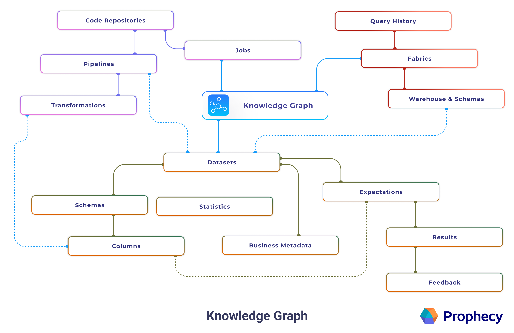

Copilot works by enhancing prompts using a knowledge graph, or an internal map of your data environment. This gives Copilot the context it needs to generate accurate, relevant answers.

:::note
Prophecy generates knowledge graphs for SQL projects only. Knowledge graphs are not used for Spark projects.
:::

## Overview

Knowledge graphs are generated per [fabric](/fabrics) in Prophecy. Each knowledge graph contains information from fabrics and other entities, including the statistical usages of these entities. It also contains computed fields that further refine Copilot's capabilities.

:::info
Your data is never stored in the knowledge graph. For more details, see [Security](/prophecy-ai#security).
:::

## Process

When you interact with Copilot, Prophecy follows a multi-step process to generate what you need. First, Copilot enriches your prompt using the knowledge graph. This step adds detailed context about your project’s datasets, schemas, and other entities, which helps the agent understand what you're referring to. The enhanced prompt is then sent to OpenAI’s large language model (LLM), which returns SQL code based on the provided context.

Once the code is generated, Prophecy validates it and automatically corrects any errors when possible. After validation, Prophecy converts the code into a visual pipeline, which is displayed on the canvas for you to review and customize.

## Crawling

The knowledge graph is built by crawling your SQL warehouse. The crawler scans your warehouse and indexes table names, schemas, column names, data types, and other metadata. This metadata is stored in the knowledge graph and used to enhance AI prompts.

You can trigger crawling manually or configure it to run automatically on a schedule. Manual crawling uses your pipeline development credentials to determine which tables to index. Scheduled crawling uses separate authentication credentials that you configure independently.

:::info
For detailed information about configuring knowledge graph crawling, including authentication setup and scheduling options, see [Knowledge graph crawling](docs/administration/fabrics/prophecy-fabrics/knowledge-graph.md).
:::
