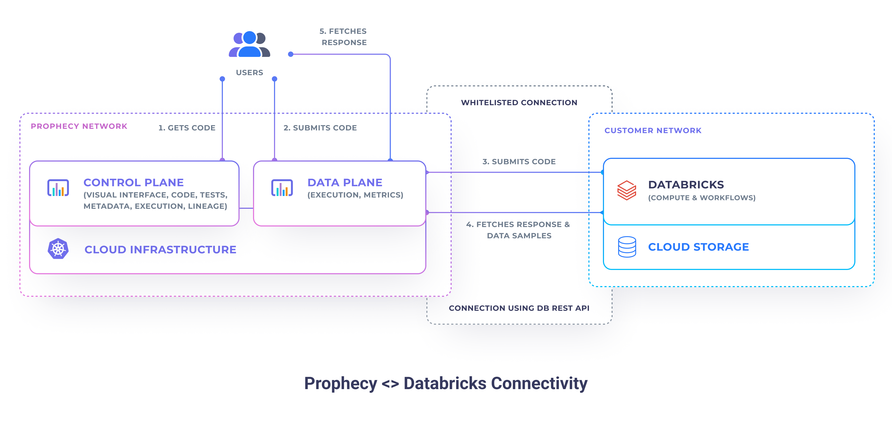

Prophecy deployment is simple and flexible. Prophecy is written as a set of microservices that run on Kubernetes and is
built to be multi-tenant. There are three primary options

## Cloud Deployment

Prophecy in the cloud connects to your existing Spark and Scheduler/Orchestrator. Prophecy does not store any data, however, it does store metadata about your pipelines, datasets and schedules.

### Public SaaS

Public SaaS (Prophecy managed SaaS) is the default option when you connect from **Databricks Partner Connect** and is
free for one user.
This option is heavily used by customers to try Prophecy. Our startup and midsize customers who like the convenience of
a managed service prefer this option. You can also use this by directly going to
the [Prophecy Application](https://app.prophecy.io/)

### Private SaaS (Customer VPC)

Our Enterprise customers and midsize/startup customers in segments which deal with very sensitive data primarily use
this
option. Here, Prophecy runs within the **Customer VPC** and connects to the identity, spark clusters and the scheduler
within the VPC

This is the default option when you go through the cloud marketplaces. You can install the software from the _[Azure
Marketplace](https://azuremarketplace.microsoft.com/en-us/marketplace/apps/simpledatalabsinc1635791235920.prophecy-data-engineering)_
.
The install is very simple, takes about 20 minutes, and billing starts after 30 days (and a confirmation popup)

### On-Premise Deployment

On rare occasions Prophecy will deploy on-premise for the large customers who are moving to the cloud. Often the order
is that the organizations will move pipelines from on-premise legacy ETL tools to Spark, then move it to Spark on the
cloud. For more information read the [on-premise installation documentation](on-premise) or reach out to our team by
using [request a demo](https://www.prophecy.io/request-a-demo).

## Connectivity

Prophecy connects to the following external services:

- [Spark](#spark) - for interactive code execution
- Schedulers - for code orchestration
- [Git](#git) - for code storage
- Identity Providers - for easier user authentication and authorization

### Spark

To allow for interactive code execution Prophecy can connect to either [Databricks](#databricks)
or any other Spark through [Apache Livy](https://livy.apache.org/) (e.g. MapR, CDP, HDP, Spark on Kubernetes).

#### Databricks

Prophecy connects to Databricks using [Rest API](https://docs.databricks.com/dev-tools/api/latest/index.html). Each
[fabric](../../concepts/fabric) defined in Prophecy refers to a
single [Databricks workspace](https://docs.databricks.com/workspace/index.html) and each user is required to
provide a [personal access token](https://docs.databricks.com/dev-tools/api/latest/authentication.html) to authenticate
to it.

Security-conscious enterprises that use Databricks with limited network access have
to additionally [whitelist](https://docs.databricks.com/security/network/ip-access-list.html#add-an-ip-access-list)
the **Prophecy Data Plane IP address** (`3.133.35.237`).

Primarily, Prophecy uses Databricks, for the following functionalities:

- **Interactive Execution** - Prophecy allows its users to spin up new clusters or connect to existing clusters.
  When a
  cluster connection exists, Prophecy allows the user to run their code in the interactive mode. Interactive code
  queries are sent to Databricks using
  the [Databricks Command API 1.2](https://docs.databricks.com/dev-tools/api/1.2/index.html).
- **Scheduling** - Prophecy allows the user to build and orchestrate Databricks Jobs. This works through
  the [Databricks Jobs API 2.1](https://docs.databricks.com/dev-tools/api/latest/jobs.html).

By default, Prophecy does not store any data samples when executing code using Databricks. Data samples can be
optionally stored for observability purposes (execution metrics).

:::note
When using **Active Directory**, Prophecy takes care of auto-generation and refreshing of the Databricks personal access
tokens. Read more about it [here](https://docs.microsoft.com/en-us/azure/databricks/dev-tools/api/latest/aad/).
:::

### Git

Supported Git providers:

- **Prophecy Managed** - Prophecy automatically setups the connectivity between itself and the repositories. Prophecy
  Managed is based on open-source [GitTea](https://github.com/go-gitea/gitea).
- **GitHub** (including GitHub Enterprise) - authenticates using per-user personal access
  tokens. [How to generate PAT?](https://docs.github.com/en/authentication/keeping-your-account-and-data-secure/creating-a-personal-access-token)
- **Bitbucket** (including Bitbucket self-hosted) - authenticates using per-user personal access
  tokens. [How to generate PAT?](https://confluence.atlassian.com/bitbucketserver072/personal-access-tokens-1005335924.html)
- **GitLab** (including GitLab self-hosted) - authenticates using per-user personal access
  tokens. [How to generate PAT?](https://docs.gitlab.com/ee/user/profile/personal_access_tokens.html)
- **Azure DevOps** - authenticates using per-user personal access
  tokens. [How to generate PAT?](https://docs.microsoft.com/en-us/azure/devops/organizations/accounts/use-personal-access-tokens-to-authenticate?view=azure-devops&tabs=Windows)

:::info Coming Soon
The users are going to be able to connect to common Git providers, by leveraging their respective OAuth functionalities.
E.g. [GitHub OAuth](https://docs.github.com/en/developers/apps/building-oauth-apps/authorizing-oauth-apps) or Azure AD.
:::
