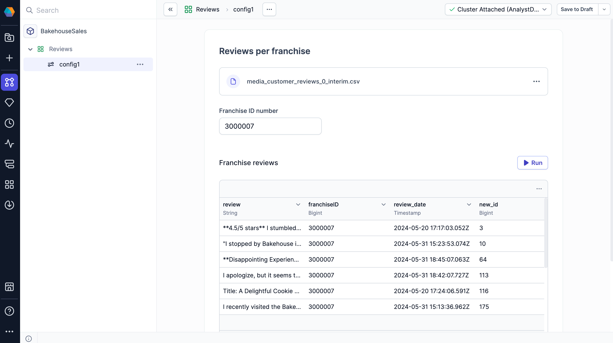
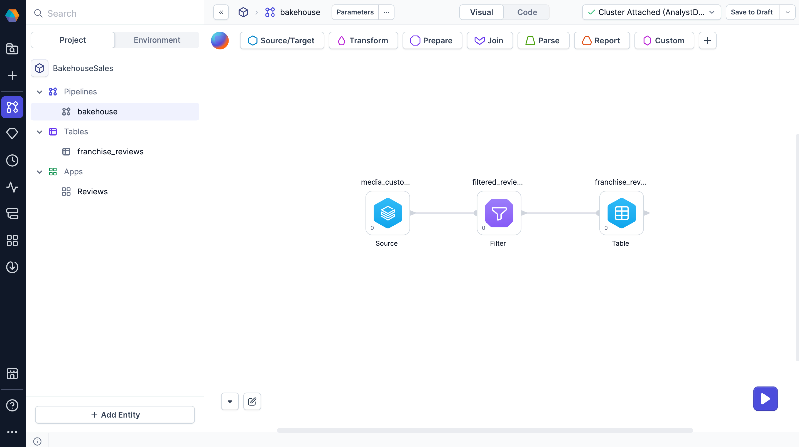
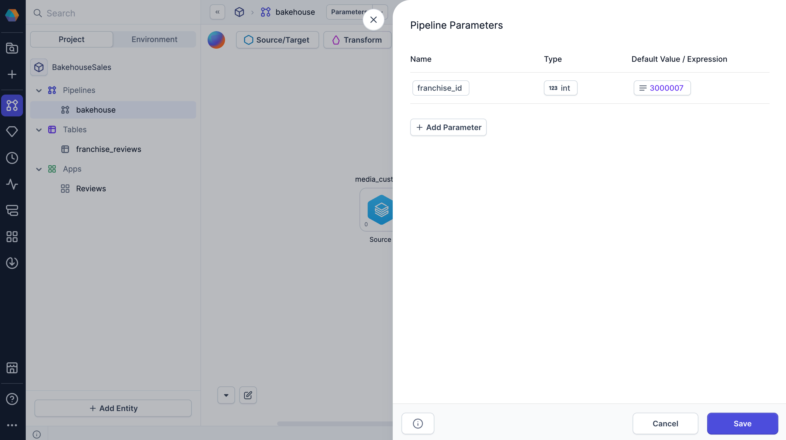
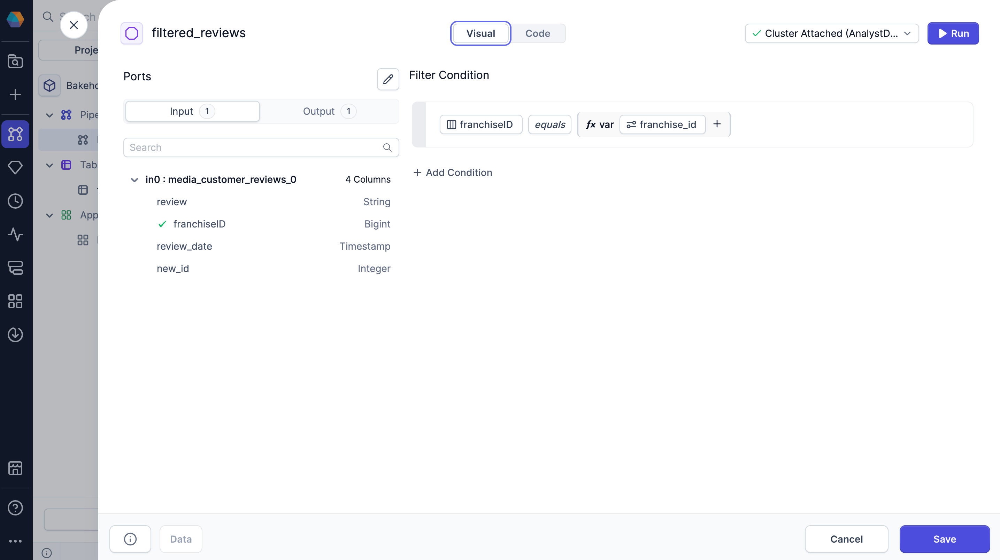
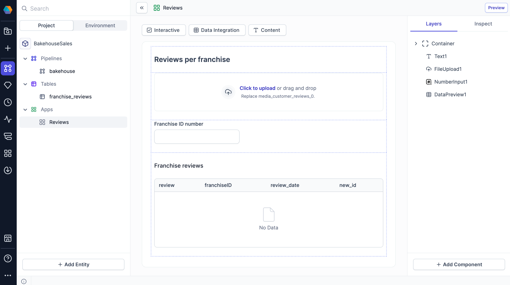

Prophecy Apps enable teams to create interactive and reusable workflows that simplify data processing. These applications allow users to parameterize pipelines, interact with data, and schedule pipeline runs without modifying the underlying pipeline logic.

When creating a Prophecy App, structure it using [pipeline parameters](docs/core/development/pipelines/pipeline-params.md). Pipeline parameters allow applications to dynamically adjust values during execution. By adding [interactive components](/analysts/business-application-components) to your apps, users can define parameter values while keeping the rest of the pipeline unchanged.

## Objectives

In this tutorial, you'll learn how to create a Prophecy App where users can:

- Upload their own data as a pipeline source.
- Filter the data based on custom input.
- Preview and download the output data.

## Prerequisites

To complete this tutorial, you will need:

- Prophecy 4.0 or later.
- A SQL project.
- A Prophecy fabric with a Databricks connection.

:::note
This tutorial uses sample data provided by Databricks.
:::

## Create the pipeline

Before building a Prophecy App, start by creating the pipeline it will run. You'll develop a pipeline that:

- Ingests bakehouse review data from the SQL warehouse.
- Filters the data by franchise location.
- Saves the filtered data to a table.

This pipeline will include parameters that end users can assign values to through the app interface.

### Create a pipeline parameter

[Pipeline parameters](docs/core/development/pipelines/pipeline-params.md) enable dynamic behavior in pipelines by allowing values to be set at runtime. In this case, these values can be driven by inputs from external sources, including user input through a Prophecy App.

In this section, you’ll define a pipeline parameter specifically for use in a Prophecy App. The parameter will capture the franchise ID that the user selects, allowing the pipeline to filter reviews based on the franchise they want to see.

1. Open the pipeline that will be used for the app.
1. Click **Config** in the project header.
1. Select **+ Add Parameter**.
1. Name the parameter `franchise_id`.
1. Set the parameter type to `int`.
1. Click **Select expression > Value**.
1. Enter `3000007` as the default value to be used during [interactive pipeline runs](docs/core/development/pipelines/execution.md). (This is an arbitrary franchise ID.)
1. Click **Save**.

You can choose a new default value when you build the Prophecy App. This overrides the default value assigned in the pipeline parameter settings.

### Add source data

Add a Source gem to your pipeline. The Prophecy App will use this source by default unless the user overrides it with their own data in the app.

1. Open the Environment browser in the left sidebar.
1. Expand the Databricks connection to view your catalogs.
1. Open the **samples > bakehouse** directory.
1. Add the `media_customer_reviews` table to your canvas.

### Add a filter

Next, add a Filter gem to the pipeline. To make the filter condition dynamic, you'll use the pipeline parameter in the gem.

1. Add a **Filter** gem to the canvas.
1. Connect the output of the Source gem to the input of the Filter gem.
1. Open the Filter gem configuration.
1. For the filter condition, build the visual expression to filter the dataset using values from the `franchiseID` column.

:::tip
Find your configured pipeline parameters by clicking on the **Configuration Variable** in the visual expression builder.
:::

If you switch to the code view, you can use the following expression as the filter condition `franchiseID = {{ var('franchise_id') }}`.

### Add a target table

To add a Data Preview component to your Prophecy App, you need to have a target table in the pipeline. Let's create a table to store the filtered results that users will generate in the app.

1. Open the Source/Target gem category.
1. Click **Table** to add a new table to the canvas.
1. Connect the output of the Filter gem to the input of the Table gem.
1. Open the Table gem configuration.
1. Under **Select Type and Format**, select **Table**.
1. In the **Location** tab, assign a location where Prophecy will write the table.
1. Review the remaining tabs and keep the default settings.
1. **Save** the gem.

## Create a new Prophecy App

After you build the pipeline, create a Prophecy App to run it. Apps are created directly within projects as project components.

1. In the project browser, hover over **Apps** and click the **+** icon.
1. Name the app `Reviews`.
1. Add the description `Filter bakehouse reviews by franchise`.
1. Select the pipeline you just created for the app to run on.
1. Define where the app code will be stored. The default `apps` directory is sufficient.
1. Click **Create App** to open the App Builder.

### Add a Text component

First, add the Text component that serves as the page title and helps users understand the purpose of the app.

1. Open the **Content** dropdown and select **Text**.
1. In the **Inspect** tab of the right sidebar, enter `Filter Bakehouse Reviews` as the component text.
1. Choose **Heading 1** as the text format.

### Add a File Upload component

Then, add a File Upload component where users can upload their data. This provides flexibility by allowing users to work with their datasets rather than being limited to the default source.

1. Open the **Data Integration** dropdown and select **File Upload**.
1. In the **Inspect** tab, for the **Source component**, choose the Source gem that the uploaded data will override.

:::info
If no file is uploaded, the pipeline uses the default source data configured in the Source gem.
:::

### Add a Number Input component

Next, add a Number Input component to let the user input how to filter the data. This component will control the value of the pipeline parameter you created earlier.

1. Open the **Interactive** dropdown and select **Number Input**.
1. In the **Inspect** tab, for the **Configuration field**, select `franchise_id`. This is the pipeline parameter.
1. For the **Label**, enter `Franchise ID number`.

### Add a Data Preview component

Finally, add a Data Preview component to display a sample of the result of the pipeline execution. This allows users who run the Prophecy App to view and download the output data.

1. Open the **Data Integration** dropdown and select **Data Preview**.
1. In the **Inspect** tab, select the pipeline's output table.
1. For the **Label**, enter `Franchise reviews`.

The following image shows the complete Prophecy App template in the App Builder.

## Run the app

After building the app, execute it to validate its functionality. This process allows you to verify that all app components function according to specifications.

1. Navigate to the App Browser using the left navigation menu.
1. Review the apps associated with projects owned by your teams.
1. Select your **Review** app.
1. Create a new app configuration. This configuration represents an instance of the app with a set of custom parameter values.
1. Test the app by uploading various datasets and running the app to observe results.

To explore advanced configuration options and scheduling capabilities, refer to the documentation on [running apps](/analysts/run-apps).

:::caution
When you run a Prophecy App, the entire underlying pipeline is executed—not just the components visible in the app. This means any additional transformations, tables, or other components included in the pipeline will also run, even if they’re not exposed in the app interface. Be mindful of how you design the pipeline to ensure app users only trigger the intended logic.
:::

## What's next

To address your specific business requirements, leverage more complex [components](/analysts/business-application-components) to construct robust Prophecy Apps.

<!-- ## Publish

Once the application is complete, publish it to make it accessible.

1. Open any pipeline within the project.
1. In the project header, next to **Save to Draft**, click the dropdown arrow.
1. Select **Publish new version**.
1. Review Copilot's description of your changes and click **Save**.
1. Enter a description for the new published version.
1. Leave the **Select the fabric(s) to publish** field blank, as Prophecy Apps do not require deployment.
1. Click **Publish**.

The application is now available in the App Browser.

### Share with other teams

To grant other teams access to run the Prophecy App:

1. Open the **Metadata** page in the left navigation bar.
1. Locate and open the project metadata.
1. Navigate to the **Access** tab.
1. In the **Teams** dropdown, select the team to share the project with.
1. Click **Send Invitation**.

The selected team can now run the Prophecy App but cannot edit the project. -->
