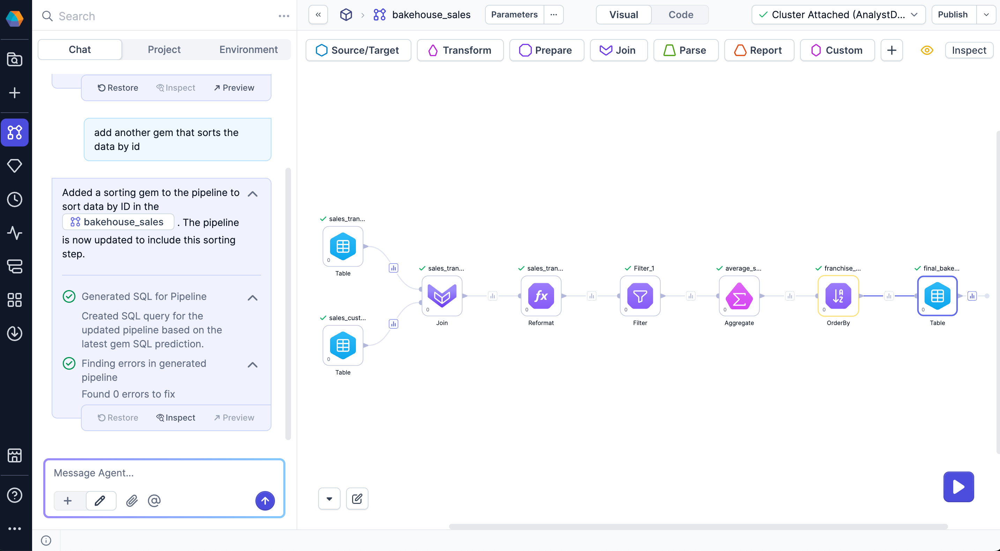

You can use Prophecy's AI agent to generate transformations based on natural language prompts. When you describe a data operation, the agent adds the corresponding gems to the pipeline and provides a summary of the changes in the chat interface.

The following sections describe how to add transformations, review modifications, and restore previous versions of the pipeline.

## Prerequisites

You need at least one [Source gem](/analysts/source-target) in your pipeline to add transformation gems with AI chat.

## Provide a transformation

To generate a transformation, enter a prompt that describes the desired data operation.

The agent returns:

- One or more gems on the pipeline canvas.
- A description of the applied changes.
- Options to restore, inspect, or preview changes.
- A group of SQL execution logs.

## Inspect pipeline changes

To understand the agent changes:

1. Select **Inspect** on the chat that generates a transformation.
1. Review the configuration panel beginning with the first modified gem. Modified gems appear in yellow.
1. Hover over the **Previous** and **Next** button to display a minimap of the pipeline. This shows you the specific gem you are viewing in the context of the pipeline.
1. Use the **Previous** and **Next** controls to move through other modified gems in sequence.
1. Examine both the input and output of each gem to confirm that the transformation produces the expected result.

## Restore a previous state of the pipeline

To revert changes or try another transformation from a previous state, select **Restore** from the reply you want to revert to in the chat history. The pipeline will match the earlier version. You can also manage versions from the main project [version history](/analysts/versioning).

## Create output tables

After adding various data transformations in your pipeline, ask the agent to save the result as a table. The agent writes the data to the default database and schema in your connected fabric. This allows you to persist results and reuse them in downstream workflows.

## Project history

All changes made by the agent are saved in the project [version history](/analysts/versioning). Commits will be clearly marked as authored by the agent.

:::note
If you did not save your project before interacting with the AI agent, Prophecy will automatically save your changes before the agent proceeds.
:::

## Sample prompts

Here are some sample prompts that can produce transformations in your pipeline.

| Scenario           | Prompt                                                 | Expected output   |
| ------------------ | ------------------------------------------------------ | ----------------- |
| Filter records     | "Filter to only include customers from California"     | Filter gem        |
| Add transformation | "Calculate the total order value as quantity \* price" | Reformat gem      |
| Clean data         | "Remove rows where email is null"                      | DataCleansing gem |
| Aggregate data     | "Group by region and calculate average sales"          | Aggregate gem     |
| Rename columns     | "Rename cust_id to customer_id and amt to amount"      | Reformat gem      |
| Save output tables | "Show me and save the final output of the pipeline"    | Table gem         |
