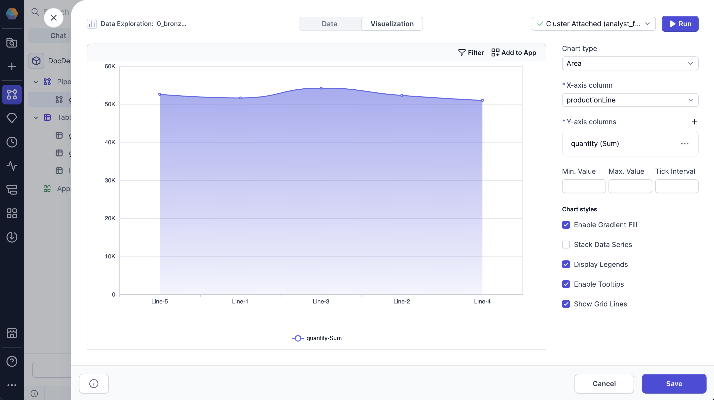

An area chart is a type of line chart that features filled areas under the lines to represent quantitative data over time or across categories.

You can configure the following parameters for the chart:

| Parameter            | Description                                                    |
| -------------------- | -------------------------------------------------------------- |
| X-axis column        | Column used for the X-axis values, typically time or sequence. |
| Y-axis column        | Column with aggregated values used for the Y-axis.             |
| Min. Value           | Minimum value displayed on the Y-axis.                         |
| Max. Value           | Maximum value displayed on the Y-axis.                         |
| Tick Interval        | Interval between tick marks on the Y-axis.                     |
| Enable Gradient Fill | Whether to apply a gradient fill under the area curve.         |
| Stack Data Series    | Whether to stack multiple data series on top of one another.   |
| Display Legends      | Whether to display the legend on the chart.                    |
| Enable Tooltips      | Whether to display tooltips on hover.                          |
| Show Grid Lines      | Whether to display grid lines on the chart.                    |
