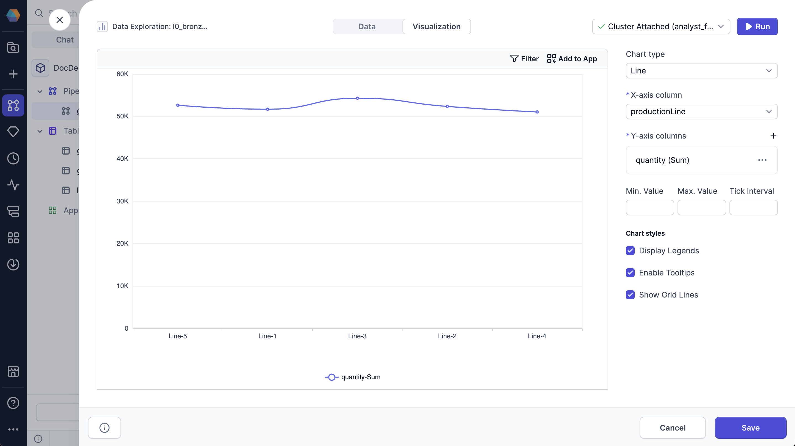

A line chart visually represents data over time or along a continuous range.

You can configure the following parameters for the chart:

| Parameter       | Description                                                    |
| --------------- | -------------------------------------------------------------- |
| X-axis column   | Column used for the X-axis values, typically time or sequence. |
| Y-axis column   | Column with aggregated values used for the Y-axis.             |
| Min. Value      | Minimum value displayed on the Y-axis.                         |
| Max. Value      | Maximum value displayed on the Y-axis.                         |
| Tick Interval   | Interval between tick marks on the Y-axis.                     |
| Display Legends | Whether to display the legend on the chart.                    |
| Enable Tooltips | Whether to display tooltips on hover.                          |
| Show Grid Lines | Whether to display grid lines on the chart.                    |
