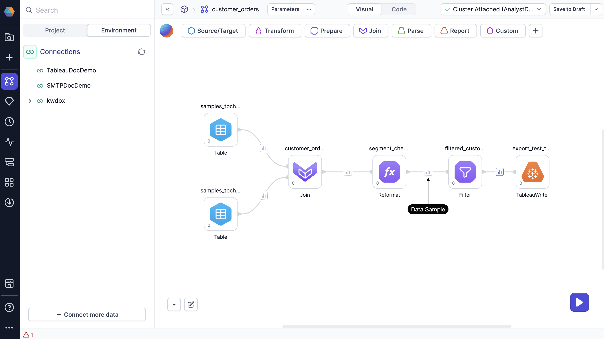
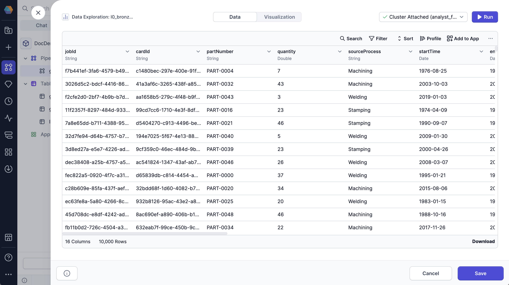

The **Data Explorer** allows you to inspect data samples at each stage of your pipeline. Use it to identify issues early and verify that your transformations are producing the expected output. You can review column structures, data types, and sample values at each step of your workflow.

## Generate data samples

To explore interim data during development:

- [Run](/analysts/pipeline-execution) the relevant pipeline in the project editor.
- Interim icons will appear between nodes in your pipeline. These icons represent sample data at that stage.

When you click a data sample that has loaded data, the Data Explorer opens.

:::info
Data samples fully load only after the last node of SQL transformations. Other data samples appear muted until you click them, then load on-demand.
:::

## Leverage the Data Explorer

In the Data Explorer, you can:

- Sort data by columns
- Filter rows by specific values
- Search across all values
- Show or hide columns
- Export the sample as CSV or JSON file
- View your data as a chart in the [Visualization](/analysts/charts) tab

## View complete dataset

The Data Explorer loads a sample of your data by default. When you sort, filter, or search, these actions apply only to the visible rows in the sample.

To work with the full dataset, do one of the following:

- Click **Load More** at the bottom of the table until all rows are visible.
- Click **Run** in the top-right corner of the preview. This refreshes the view and applies sorting and filtering to the entire dataset.
