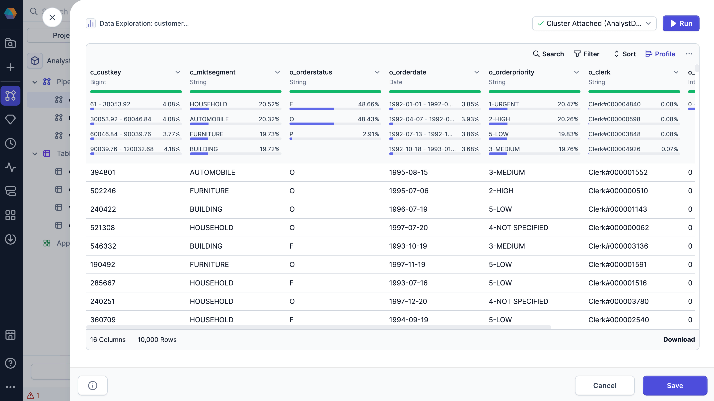
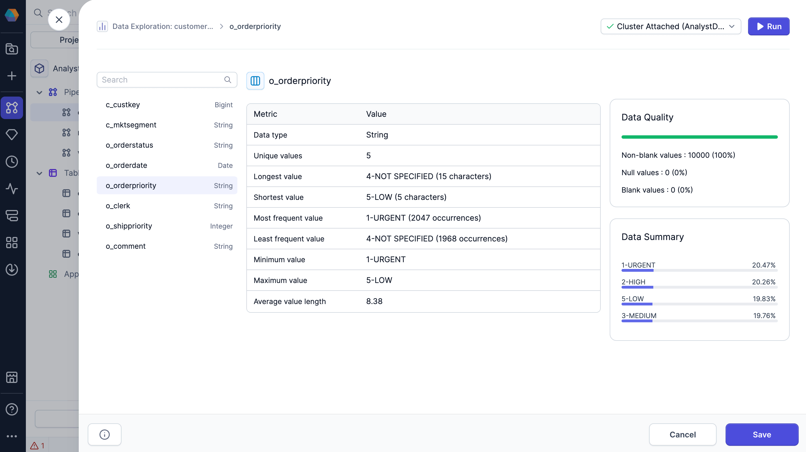
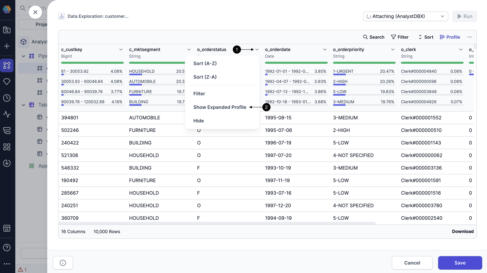

Data profiling allows you to view statistics on interim datasets in your pipeline. When you open a dataset's profile in the [Data Explorer](/analysts/data-explorer), you can visualize value distributions and data completeness to ensure your data matches expectations.

## Quick profile

The Data Explorer includes data profiles that are generated on your sample data. You'll be able to see high-level statistics for each column, including:

- **Percent of non-blank values:** The percentage of values in the column that are not blank.
- **Percent of null values:** The percentage of values in the column that are null.
- **Percent of blank values:** The percentage of values in the column that are blank.
- **Most common values:** Displays the top four most frequent values in the column, along with the percentage of occurrences for each.

To view these statistics for your sample data, click **Profile** in the Data Explorer.

## Expanded profile

When you open the Data Explorer, you'll only see the data profile of the data sample. When you load the expanded data profile, Prophecy generates a more in-depth analysis on **all of the records** in the interim dataset.

The expanded profile displays the following metrics:

| Metric                   | Description                                                       |
| ------------------------ | ----------------------------------------------------------------- |
| **Data type**            | Data type of the column.                                          |
| **Unique values**        | Number of unique values in the column.                            |
| **Longest value**        | Longest value in the column and its length.                       |
| **Shortest value**       | Shortest value in the column and its length.                      |
| **Most frequent value**  | Most frequent value in the column and its number of occurrences.  |
| **Least frequent value** | Least frequent value in the column and its number of occurrences. |
| **Minimum value**        | Minimum value in the column.                                      |
| **Maximum value**        | Maximum value in the column.                                      |
| **Average value length** | Average length of each value in the column.                       |
| **Null values**          | Percent and number of null values in the column.                  |
| **Blank values**         | Percent and number of blank values in the column.                 |
| **Non-blank values**     | Percent and number of non-blank values in the column.             |
| **Data summary**         | Overview of the most common values in the column.                 |

:::tip
You can click between columns in the expanded profile for quick access.
:::

### Open expanded profile

To view the expanded profile:

1. Click the dropdown arrow on the column you want to expand.
1. Select **Show Expanded Profile**.

